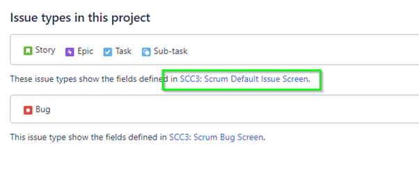
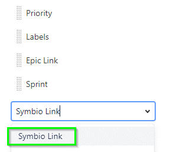
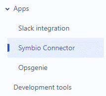
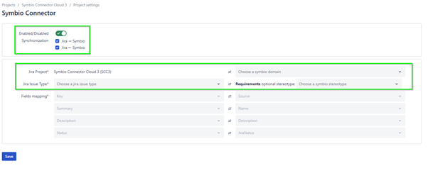

#Jira Project configuration

Create or use an existing Company-managed Jira project. 

(Team-managed project are currently not supported)

Go to Project settings -> Layout and add the **Symbio Link** attribute to the Issue types you will 
synchronize with Symbio.

 
Add the attribute “Sybmio Link”

 

Go to Project settings --> Apps --> Symbio Connector

 

You can configure the synchronization directions:

**Symbio --> Jira:** 	This activates the possibility to manually triggered Symbio Requirements to Jira Issus

**Jira --> Symbio:** 	This activates the automatically updated Symbio Requirements after changing the configured Jira Issues.

**Domain:**		You must select one Symbio domain to store the synchronized objects

**Jira Issue Type:**		You can configure which Jira Issue Type you want to synchronize

**Symbio Stereotype:** 	You can optionally configure that only the selected Stereotypes are configured.

