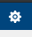
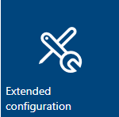
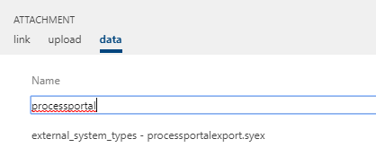
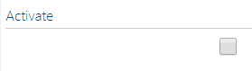
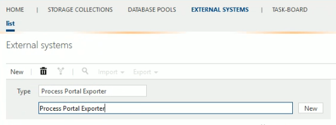
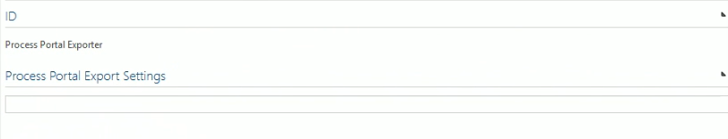
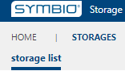
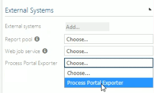

# Process Portal Exporter micro service configuration

The service is currently made available as a service on Azure cloud. It uses an Azure repository for the configuration. If you are unable to access Azure services from your instance of Symbio, please contact your administrator for support.

## Configuration
### Add the External System type to the Extended configuration on the system administration
1. Log on to the **/_sysadmin/_admin** section of Symbio (Requires System Administration access)
1. Switch to "Editor" mode
1. Go to the Admin area 
1. Go to the "Extended configuration" 
1. Select "New" and add a type for an external system named "ProcessPortalExporter"
1. Set the following attributes
   1. **Name:** Process Portal Exporter
   1. **Description:** The exporter is used to make a backup copy of the data in Symbio.
1. Select the SYEX file under the settings "data" group with the Title: "ProcessPortal" 
1. Make the external configuration active 
1. Apply changes 

### Add a configured external system linked to the active service
1. Select "External systems" on the main navigation bar
1. Add a new external system with Type of "Process Portal Exporter" 
   1. Name the External System "Process Portal Exporter"
1. Add the URL for the instance of the micro-service 

### Connect the external system on the storage
*Note: only one storage can be connected to one instance of the service*
1. Go Home -> Select the Storage Collection or create a new one
1. Select "Storages" on the main navigation menu 
1. Choose an existing storage or create a new one
1. Under the external systems group, select the configured external system under the "Process Portal Exporter" drop down items 

### Result after adding the external system
- Adding the external system to your repository will result in the following
    - All the required configuration will be added to Symbio
        - Menu item to initiate the export
        - Navigation elements
        - Authentication token
    - The service connection and the required Authentication token will be stored on the Azure storage

## Remove the external system from the repository

### Remove the external system from the repository

1. Log on to the **/_sysadmin/_admin** area of your Symbio instance
1. Go to Home -> select Storage Collection
1. Select "Storages" to view the list of storages in the Storage Collection from the main navigation bar
1. Select the storage where the external system is loaded
1. Click on the selected external system and set the drop-down to "Choose" 

### Removal result

- If you remove the external system, all of the configuration items created by connecting the service will be removed from your Symbio repository. 
- You will no longer be able to export the data from Symbio using this service.