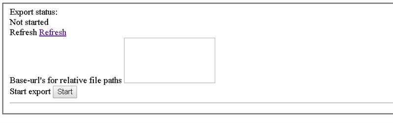

# Process Portal Exporter Service manual

## Installation

### System Requirements for PPES
- OS-Version: Windows Server 2012 or comparable/ higher
- Dot Net Core Versions: 2.2.0 or comparable/ higher
- IIS-Version: 7.5 or comparable/ higher
- Processors: 4 or higher
- Memory: 4 or higher

### Required Software for PPES
- IIS has to be installed, same preliminaries as Symbio
- .NET Core has to be installed (2.2.0 or later)
- .NET Core Windows Server Hosting (2.2.0 or later)

### Other requirements for PPES
- The PPES user set up in the IIS has to own appropriate rights

### Installation
1. Download and install NET Core Windows Server Hosting (2.2.0 or later) [here](https://www.microsoft.com/net/download/dotnet-core/2.2)
1. Download artifact or ask support for package
1. Extract it to the installationfolder of the service
1. Create new site in IIS (bindings depending on server structure)
1. Adjust AppPool Basic Settings: No Managed Code
1. Adjust appsettings.json by removing 3rd argument of serilog, remove Azure block and set AzureAD to false that it looks like this:

```json
{
  "ConnectionString": "",
  "Blob_ContainerName": "process-portal-export",
  "LocalMode": true,
  "Logging": {
    "LogLevel": {
      "Default": "Warning"
    }
  },
  "Serilog": {
    "Using": [ "Serilog.Sinks.Console", "Serilog.Sinks.Debug" ],
    "MinimumLevel": {
      "Default": "Debug",
      "Override": {
        "Microsoft": "Information",
        "System": "Information"
      }
    },
    "WriteTo": [
      { "Name": "Console" },
      { "Name": "Debug" },
      {
        "Name": "AzureAnalytics",
        "Args": {
          "workspaceId": "",
          "authenticationId": "",
          "restrictedToMinimumLevel": "Information"
        }
      }
    ],
    "Enrich": [ "FromLogContext", "WithMachineName", "WithThreadId" ],
    "Properties": {
      "Application": "Symbio.Service.Process.Portal.Export"
    }
  },
  "AzureAd": {
    "Enabled": false,
    "Instance": "",
    "Domain": "",
    "TenantId": "",
    "ClientId": "",
    "CallbackPath": ""
  },
  "DisableAuthorization": false,
  "AllowedHosts": "*"
}
```

1. Restart site in IIS
2. Check if the service / site is working by typing https://localhost:port(e.g. https://localhost:1234) - If all is OK, browser should open: 
3. Service is now ready to be connected like external system... Please continue with [Configuration](configuration.md)

