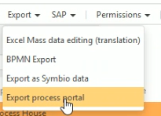
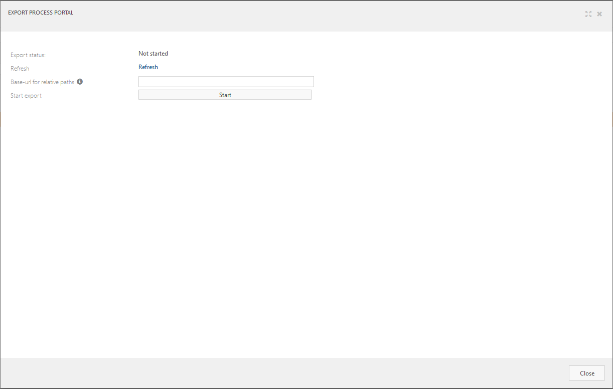
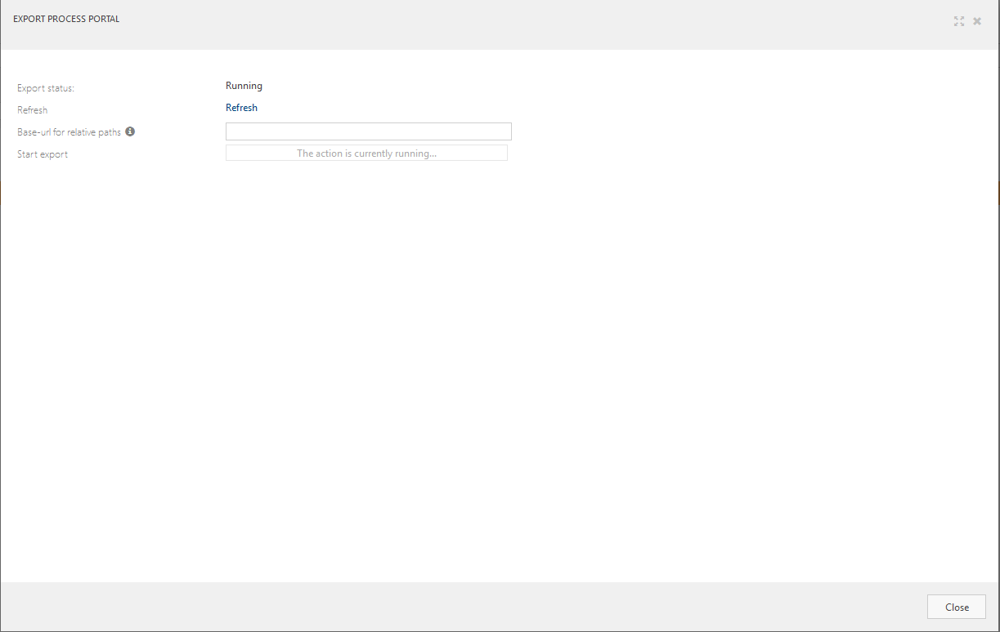
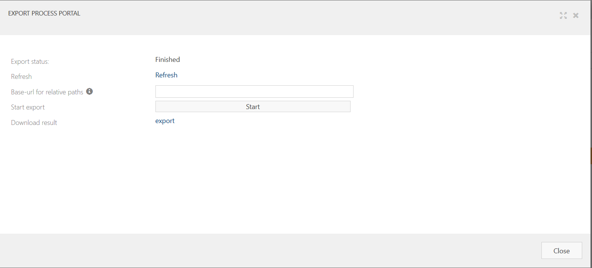
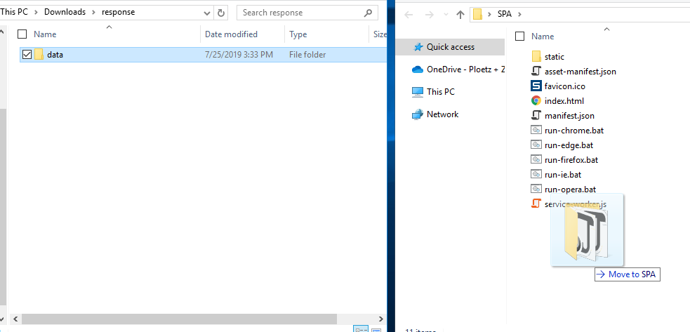
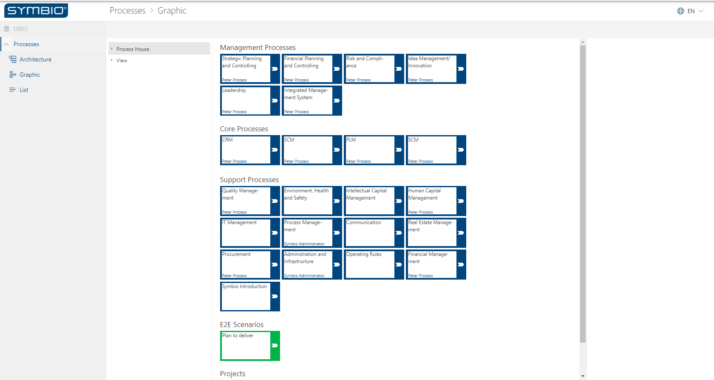

# Using the Process Portal Exporter

## Prerequisites for the Process Portal Exporter
- The micro-service must be accessable
- The configured external system must be loaded on the storage where the system will be used
- Symbio needs to be accessible from the service

If all the configuration items listed above is complete, you will be able to complete the steps below to export your Symbio data. 
See [Process Portal Exporter micro service configuration](configuration.md) for more details.

## Creating an extract of your selected data
Creating an extract of your data, crawls through your entire process facet and extracts the required data. The information is compressed in a ZIP file that can be used within the Single Page Application to view the information outside of the Symbio hosted environment.

1. Go to the "architecture" view of the process facet
1. Select the "Process House"
1. Choose Export -> "Export process portal" from the Toolbar 

1. (Optional) Enter the base URL for the relative paths 
    
    *Replaces url's in links stored in Symbio. This should match the target environment for the Single Page Application.*
1. Start the export using the "Start" button. The window will show that the process has started. 
1. Press the refresh button to update the status of the exporter
1. When the export is complete, you will be able to download the exported content by clicking on the "export" link 

## Using the data in the Single Page Application

After having downloaded the ZIP file, you can extract the file and place into the offline Single Page Application folder structure.

1. [Download](https://...) the current release of the offline Single Page Application.
1. Unzip the SPA package
1. Download the process exporter export
1. Unzip the process exporter export
1. Place the data folder to the SPA folder

    

1. Use one of the .bat files to show the exported process portal archive in a browser. 

    *Currently only Google Chrome, Firefox, Opera and Egde with Chromium support (version 80 +) are supported for displaying the process portal locally. Displaying in browsers requires in general to turn off browser security functionalities, such as open local files.*

    
