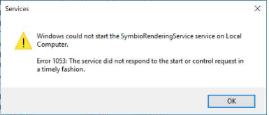

##Troubleshooting

**If the rendering service cannot be started, the following error 1053 in Services message might occur:**

   

**Solution**
1. Go to Start > Run > and type regedit
2. Navigate to: HKEY_LOCAL_MACHINE\SYSTEM\CurrentControlSet\Control
3. With the control folder selected, right click in the pane on the right and select new DWORD Value
4. Name the new DWORD: **ServicesPipeTimeout**
5. Right-click **ServicesPipeTimeout**, and then click Modify
6. Click Decimal, type '180000', and then click OK
7. Go to Start > Run > and type services.msc to run the Services control panel
8. Select the SymbioRenderingService and start it
9. If the service is running now, switch back to verification and export a process manual

**If the rendering service cannot be started after this Registry fix, please check in EventViewer whether FileNotFound exception occurred

**Solution**
1. Install missing Microsoft Visual C++ from https://docs.microsoft.com/en-us/cpp/windows/latest-supported-vc-redist?view=msvc-170
2. Start SymbioRenderingService via Services.msc
