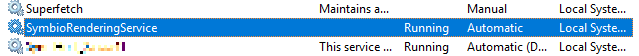

# Verification

1. Verify whether URL for Symbio Rendering Service has been successfully added, on a command line execute:
    ```
    netsh http show urlacl
    ```
    The result should contain the URL, it should look like this
    ```
    Reserved URL            : https://localhost:3334/
    User: \Everyone
        Listen: Yes
        Delegate: No
        SDDL: D:(A;;GX;;;WD)
    ```

2. Verify whether Symbio Rendering Service is running by opening Services.msc.

    

3. Verify URL whether you can access the URL https://localhost:3334/. Result should be a nice 404 error page.

4. Verify in Symbio whether process manuals display correct editor graphic instead of default Symbio layout.

    a. As an Author create a Sub process  
    b. Add Start and Task shapes to process flow  
    c. Switch to Editor view  
    d. Add some stencils and save the editor graphic  
    e. Switch to graphic  
    f. Generate process description manual  
    g. After successful export open process description manual in Microsoft Word  
    h. Open page containing the graphic (page 5)  
    i. Instead of Symbio layout with its movmint shapes, graphic should contain stencils used in step 4d.  
