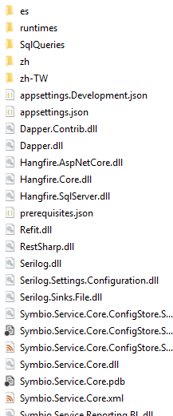

# Manual installation

## Requirements

- You need the installation package for the RMS Microservice.
- Rights to install an IIS

Install the IIS as described [here](#../symbio/iis-installation).

*If you already have an IIS in use and want to use it, you can skip the installation of the IIS.*
*Then start with the point [Create the IIS Website](#../symbio/iis-installation.md#create-the-iis-website)*

Install the [.NET Core Windows Server Hosting Package](#install-the-net-core-windows-server-hosting-bundle) .NET Core Windows Server Hosting Package after IIS Installation

## Deploy the RMS

After you have successfully installed the IIS, stop the IIS side and move the RMS Microservice files to the folder you configured for the IIS side (Physical path).

To store the files correctly, unpack the installation package and open the folder of the unpacked package, which should look like this.

Now move all files from the folder to the target directory of your RMS Microservices.
If all files are stored in the target directory, continue with the [configuration](./RMSConfiguration.md#reporting-micro-service-and-config-store) of your RMS.

After all files have been saved and the service has been configured, start the IIS page again.

## Install the .NET Core Windows Server Hosting bundle

1. Install the [.NET Core Windows Server Hosting bundle](https://aka.ms/dotnetcore.2.0.0-windowshosting) on the hosting system. The bundle will install the .NET Core Runtime, .NET Core Library, and the [ASP.NET Core Module](https://docs.microsoft.com/en-us/aspnet/core/fundamentals/servers/aspnet-core-module). The module creates the reverse-proxy between IIS and the Kestrel server. Note: If the system doesn't have an Internet connection, obtain and install the [Microsoft Visual C++ 2015 Redistributable](https://www.microsoft.com/download/details.aspx?id=53840) before installing the .NET Core Windows Server Hosting bundle.
2. Restart the system or execute **net stop was /y** followed by **net start w3svc** from a command prompt to pick up a change to the system PATH.

Note: If you use an IIS Shared Configuration, see [ASP.NET Core Module with IIS Shared Configuration](https://docs.microsoft.com/en-us/aspnet/core/hosting/aspnet-core-module#aspnet-core-module-with-an-iis-shared-configuration).