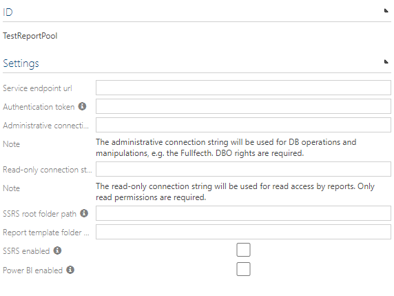

# Symbio Reporting - Configuration

## Requirements

Reporting Connector & Console are already [set up](deploy-connector-console.md).

## Configuration

### Report Pool

In Symbio follow these steps to create and configure a report pool:

1. Login as an admin user to the _sysadmin collection_
2. Switch to _External systems_
3. Select type _Report pool_ and name your new report pool appropriately
4. Edit the settings of the new report pool as described below

| Setting | Meaning |
| ------- | ------- |
| Service endpoint url | Enter the URL of the connector service as noted during its setup. |
| Authentication token | Enter the security:authToken that was defined in the connector service's settings. |
| Administrative connection string | Enter a connection string to the ODS database that allows full access to the database. |
| Read-only connection string | Enter a connection string the the ODS database that allows read-only access to the database. |
| SSRS root folder path | The SSRS root folder path for this connector instance as noted during SSRS worksapce template setup, e.g. SymbioReporting. |
| Report template folder | The name of the template folder in the root path given above as noted during SSRS workspace template setup, e.g. _Template. |
| SSRS enabled | Mark this checkbox if you want to support SSRS reports with this report pool. |
| Power BI enabled | Mark this checkbox if you want to support Power BI reports with this report pool. |

### Connecting a storage to a report pool

In Symbio follow these steps to connect a storage to a report pool:

1. Login as an admin user to the _Collection_ where the storage is located
2. Switch to _Storages_
3. Select the storage to connect to a report pool
4. Select the desired _Report pool_ from the drop down

This will trigger the creation of reports in Symbio (if at least one of SSRS or Power BI has been enabled on the pool, and the workspace contains reports to link to).

### Activating reports in a storage

In Symbio follow these steps to activate reports in a storage:

1. Login as an admin user to the _storage_
2. Switch to the _admin area_ of the storage
3. Select _Reporting_ under _Configure_
4. Select the report that should be activated and the mark the _Activated_ checkbox

The report is now available in the reporting dropdown:

