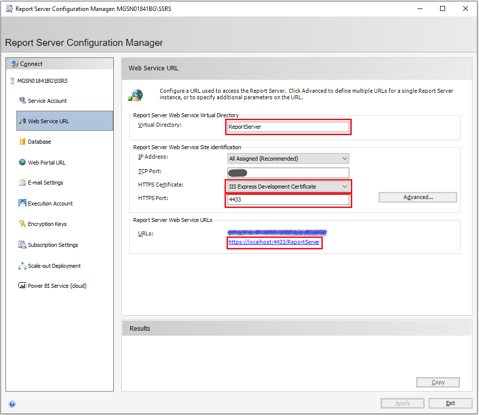
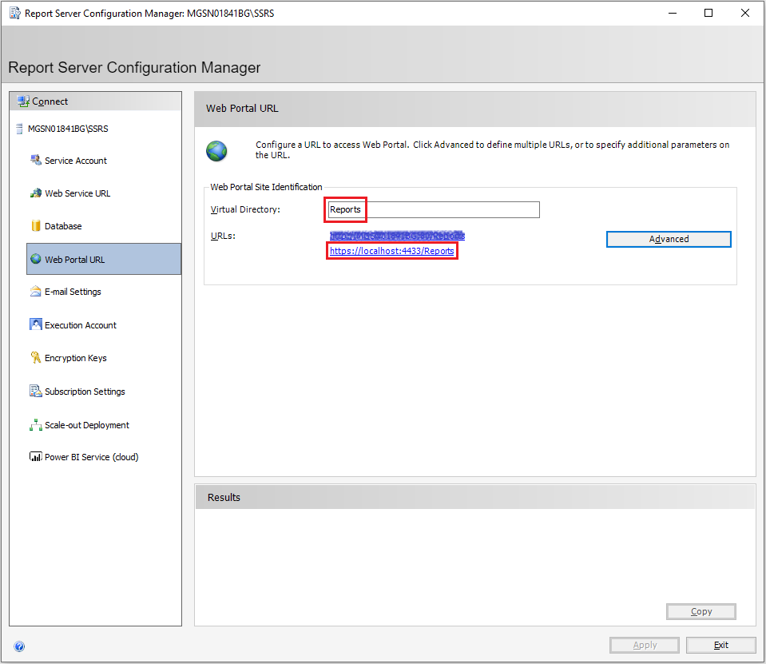

# SQL Server Reporting Services

## Requirements

Symbio requires at least a version of SQL Server 2014 to host SSRS.
SQL Server 2016 and up is recommended, though.

## Setup

Choose appropriate settings and keep an eye on the parts listed below.

### Web Service URL

Please secure your Report Service with an HTTPS endpoint, choose a valid and accepted certificate, and note the resulting URL for later use. Remember that this URL must be available to the [Reporting Connector](deploy-connector-console.md#connector) (for managing workspaces).

### Database

This is the internal SSRS management database, _this is **not** the ODS Database!_

### Web Portal URL

Please secure your Report Service with an HTTPS endpoint and choose a valid and accepted certificate. Remember that this URL must be available to browsers in your organization (for displaying reports).

