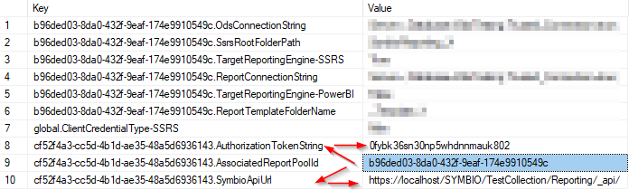

# FAQ

## What is an "ODS" database?

**ODS** stands for **Operational Data Store**, see https://en.wikipedia.org/wiki/Operational_data_store for details.

Symbio Reporting uses the ODS database to store its data in a way friendly to reporting while Symbio Core has its data organized in a different way to better support its interactive and presentational usage patterns.

The ODS database contains a snapshot of a past state of Symbio Core. There are several mechanisms to keep it in synch so it is not older than a specified time span.

## How to setup an ODS database?
  
The Symbio Reporting ODS database is a normal SQL Server database independent of other Symbio databases and SSRS' ReportServer databases. One ODS database can be used for several Symbio storages as the data within is separated by tenant.

For administrative and read-only connection strings the creation of corresponding users is advised:
- **OdsReader** for the read-only connection string should be a member of the role *db_datareader*
- **OdsWriter** for the administrative connection string should be a member of the roles *db_datawriter* and *db_owner*

## How to keep the ODS database and Symbio Core in synch?

The **Reporting Connector** listens to change events sent by Symbio Core. These are stored in the ODS database for later processing.

The **Reporting Console** provides two mechanisms to update the ODS database:

- **Fullfetch** creates a new snapshot of Symbio Core and updates the ODS database to that snapshot. This is typically done once a week during the weekend, either triggered manually or scheduled for automatic execution using a task scheduler.
- **CRUD** collects the change events stored in the ODS database and applies them to the stored data. This is typically scheduled to be executed once per hour using a task scheduler.

## What are appropriate rights for the IIS Application Pool account used for the Reporting Connector
  
The application pool account needs to be able to read and execute the content of the app's directory. Additionally, it needs to be able to write log files. Setting "Full Access" to the app's directory and inheriting that to all files and sub folders will ensure all necessary permissions are available.

## What to set "global:sqlCommandExecutionTimeoutInSeconds" to?
  
This value is typically set to 7200 (i.e. two hours) to ensure that large amounts of CRUD jobs can be executed in one console CRUD command run without getting an SQL Server timeout error.

If you don't have many CRUD events and/or are running CRUD commands regularly using scheduled tasks (e.g. every hour/every 15 minutes) then you can try to use a lower value for this setting.

## Which connection string is used for what purpose?

### Administrative connection string

The administrative connection string will be used for DB operations and manipulations, e.g. a fullfecth. DBO rights are required.

### Read-only connection string

The read-only connection string will be used for read access by reports. Only read permissions are required. 

## How do I monitor the correct operation of the Symbio Reporting system?

**Reporting Connector** and **Reporting Console** write log files of their operation. These files should be checked regularly for errors.

## How to start investigation, if I suspect data to be wrong or missing?

### Check the logs

- Symbio Logs: Are there any warnings or errors concerning the REST/Reporting API?
  - In a "**Event HTTP request call**" for the configured *Service Endpoint URL* of the Report Pool (External System in Symbio SysAdmin):
    - (401) Unauthorized may indicate that the *authentication token* settings of **Reporting Connector** and *Report Pool* configuration don't match.
    - (500) Internal Server Error may indicate a misconfiguration of the **Reporting Connector** (or the corresponding *Report Pool* in Symbio Core), check its log files for details.
- Reporting Connector Logs: Are there any errors (marked as [FTL] or [ERR]) in the log?
  - "Could not access config store..." indicates a possible misconfiguration of the config store in the appsettings.config file and/or missing permissions in the target store.
  - "Could not establish connection..." may indicate a problem with connecting to SSRS, details following. This might indicate wrong credentials or URL in "global:ssrs..." settings in the appsettings.config file of the Reporting Connector.
- Reporting Console Logs: Are there any errors (marked as [FTL] or [ERR]) in the log?
  - CommandLineParser errors indicate wrong usage of the console's command line parameters. Based on the given details and the console help command, ensure that correct arguments are provided.
  - "ODS database connection string not found" indicates that the Symbio storage is not correctly connected to the report pool: disconnect any existing pool and the reconnect it.
  - Schema/Column-related error messages may normally be solved by running the ApplySchema command.

### Check connectivity

If error messages indicate a connection problem, try the following (depending on where an error was logged):

#### Symbio Core

- Can Symbio Core access the Reporting Connector? Try to open the configured *Service Endpoint URL* of the Report Pool (External System in Symbio SysAdmin) in a browser on the server machine hosting Symbio Core.
  - Can the account Symbio Core is running under do the same?
  - Does the time update on refresh?
  - Is the version number correct?

- Can Symbio Core access the targeted SSRS instance (see Reporting Connector configuration)? Try to open the ReportPortal URL in a browser on the server machine hosting Symbio Core.
  - Can the account Symbio Core is running under do the same?

- Can the Reporting Connector access Symbio Core? Try to open the Symbio Core URL in a browser on the server machine hosting the Reporting Connector.
  - Can the account the Reporting Connector is running under do the same?

#### Reporting Connector

- Can the Reporting Connector access the targeted SSRS instance (see Reporting Connector configuration)? Try to open the ReportServer URL in a browser on the server machine hosting the Reporting Connector.
  - Can the account the Reporting Connector is running under do the same?

- Can the Reporting Connector access the ODS database? Try to connect to the ODS database using a command line tool or SQL Server Management Studio on the server machine hosting the Reporting Connector.
  - Can the account the Reporting Connector is running under do the same?

#### Reporting Console

- Can the Reporting Console access Symbio Core? Try to open the Symbio Core URL in a browser on the machine running scheduled Reporting Console tasks.
  - Can the account scheduled tasks are running under do the same?

- Can the Reporting Console access the Reporting Connector? Try to open the configured *Service Endpoint URL* of the Report Pool (External System in Symbio SysAdmin) in a browser on the machine running scheduled Reporting Console tasks.
  - Can the account scheduled tasks are running under do the same?
  - Does the time update on refresh?
  - Is the version number correct?

- Can the Reporting Console access the ODS database? Try to connect to the ODS database using a command line tool or SQL Server Management Studio on the machine running scheduled Reporting Console tasks.
  - Can the account scheduled tasks are running under do the same?

*The fullfetch-open-list command of the Reporting Console is non-modifying and can be used to test the connectivity to Symbio Core and the ODS database.*

#### Solving connectivity issues

- Check all configured URLs: Are they correctly qualified?
- Does the firewall allow access to these URLs?
- May the configured accounts access these URLs?

### Check token validity

- On the SysAdmin page of Symbio Core, under "External Systems", select the connected Report Pool and hit Ctrl+Alt+D.
  - Note the displayed *ContextKey* and the name of the Report Pool.
- On the Admin page of the connected storage, click on the tile "Automation".
  - Expand the the automation task node "data, Rest-API endpoint".
  - Select the automation token node with same name as the connected Report Pool.
    - Is Application Role correct?
    - Is Validity correctly set?
    - Is the token Permitted everywhere?
    - Does the PowerShell command snippet under "Information" work?
    - Note the value under ID.
- Connect to Report Connector Config Store.
  - Look for rows with a value equal to the noted *ContextKey*.
    - The key of these rows should be "some-id.AssociatedReportPoolId".
  - Look for rows with keys corresponding to "some-id.SymbioApiUrl" and "some-id.AuthorizationTokenString".
    - These should match the URL of the Symbio storage and the noted token ID.
      

### SSRS correctly setup and connected?

- On the SysAdmin page of Symbio Core, under "External Systems", selected the connected Reporting Pool and hit Ctrl+Alt+D.
  - Note the displayed *ContextKey*, the Report Pool's "SSRS root folder path" and "Report template folder"
- Navigate to the SSRS ReportPortal website
  - Does the configured root folder exist?
    - Does the configured root folder contain the configured template folder?
      - Does the configured template folder contain a working data source?
      - Does the configured template folder contain reports?
        - Can the report "ProcessesHierarchyDetails" be opened with errors and displaying an empty result?
    - Does the configured root folder contain a folder for the connected Report Pool (the name is equal to the noted *ContextKey*)?
      - Does the Report Pool folder contain a working data source?
      - Does the Report Pool folder contain reports?
- On the Symbio Admin Page of the connected storage, click the tile "Reporting".
  - Are the same reports listed here?
  - Have they been activated?
  - Is there URL containing the ReportPortal root folder path + *ContextKey* as seen on the SSRS portal?
- Navigate to the Reports/reports facet of the connected storage.
  - Does the "Report" dropdown contain the activated reports?
