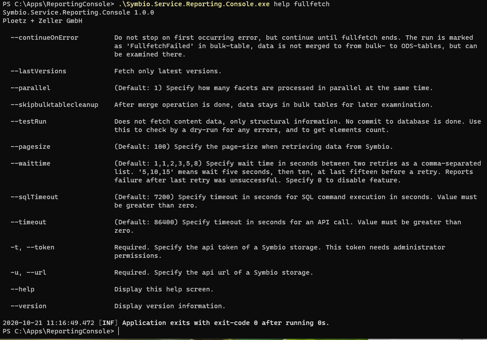
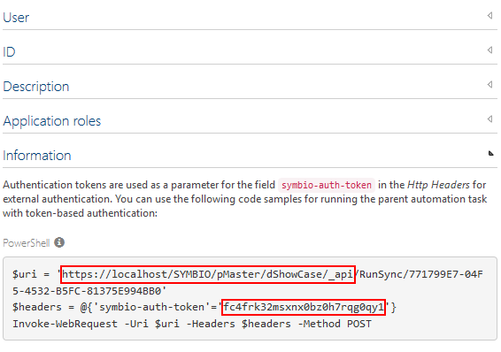

# Symbio Reporting - Operation

## Requirements

The Console application is already [set up](reporting-console.md).

## Using the Console application on the command line

### General Usage

Open a command line interface (e.g. _PowerShell_) and type ```Symbio.Service.Reporting.Console.exe help``` and press _Enter_ to get a general list of commands:


For a detailed information on a command, type ```Symbio.Service.Reporting.Console.exe help <command>``` and press _Enter_. E.g., for detailed help on _Fullfetch_ command:



### Short description of commands

#### fullfetch

Creates a snapshot of the current data in Symbio usable for reporting. 
Depending on the size of the Symbio database and the complexity of Symbio configuration, a run may take from some minutes up to several hours.
The fetched data is stored in the ODS database, optimized for reports.
As a fullfetch snapshot is always complete and does not rely on dependencies, CRUD events are reset and all accumulated changes rely then on this snapshot.
During a fullfetch operation, all other operations are blocked by a tenant lock. You can do several operations in parallel on different tenants though.
You can use the _schedule-fullfetch_ command to set up a scheduled task.

#### crud

Used to be run between fullfetches to keep ODS database uptodate.
Any changes in the database are accumulated by the _Reporting Connector_ and stored as events in the ODS database. You use this command to apply all changes
so far at once to the ODS database. 
You can use the _schedule-crud_ command to set up a scheduled task for this command.

#### applyschema

Any changes in configuration of Symbio (e.g., when new or custom attributes are defined), the changed schema of the Symbio database must be transferred to the ODS database.

#### clearods

Deletes tenant-specific data from the ODS tables. After this command has executed, reports will not show any data. You need to run a _fullfetch_ again.

#### clearbulk

While fetching data during _fullfetch_ command, intermediate data is stored in so called _bulk_ tables. If merging of these intermediate data sets fails and is not automatically cleaned, you can do so with this command.

#### schedule-fullfetch and schedule-crud

These commands allow you to create scheduled tasks for the corresponding _fullfetch_ and _crud_ commands to execute them periodically. These commands
are very simple and just create basic tasks, you should inspect and modify settings according to your needs in _Windows Task Scheduler_ after creation.

#### fullfetch-open-list

Shows a list of unfinished (due to errors) _fullfetch_ operations. The listed _bulkId_ can then be used either in _clearbulk_ command to delete those intermediate bulk sets, 
or to call _fullfetch-open-merge_ command to finish interrupted operation if state is _MergeFailed_.

#### fullfetch-open-merge

If there were problems during _fullfetch_ merge operation and operation state is _MergeFailed_, you can use this command to try merge operation again.

#### releaselock

If a command crashed and you get "table locked" errors afterwards on execution of other commands, you can remove the table lock. Take care that no long-term operation is in-progress.


### First Steps

Upon connecting a storage or after changes to the configuration of the storage you should execute the following commands in that order

1. ```Symbio.Service.Reporting.Console.exe applyschema -t <auth-token> -u <API-URL>```
2. ```Symbio.Service.Reporting.Console.exe fullfetch -t <auth-token> -u <API-URL>```

Both commands need at least the API URL of the Symbio storage to work on and the token that has been created for use by the selected report pool. To retrieve them, follow these steps:

1. Login to the Symbio storage as an admin user
2. Go to the _admin area_ and select _Automation_
3. Open the entry _data, Rest-API endpoint_ and select the connected report pool
4. In the _Information_ section copy URL and token as seen below:



To run the command with token and URL (as copied from the example above) write the following:

```
Symbio.Service.Reporting.Console.exe <command> -u https://localhost/SYMBIO/pMaster/dShowCase/_api -t fc4frk32msxnx0bz0h7rqg0qy1
```

