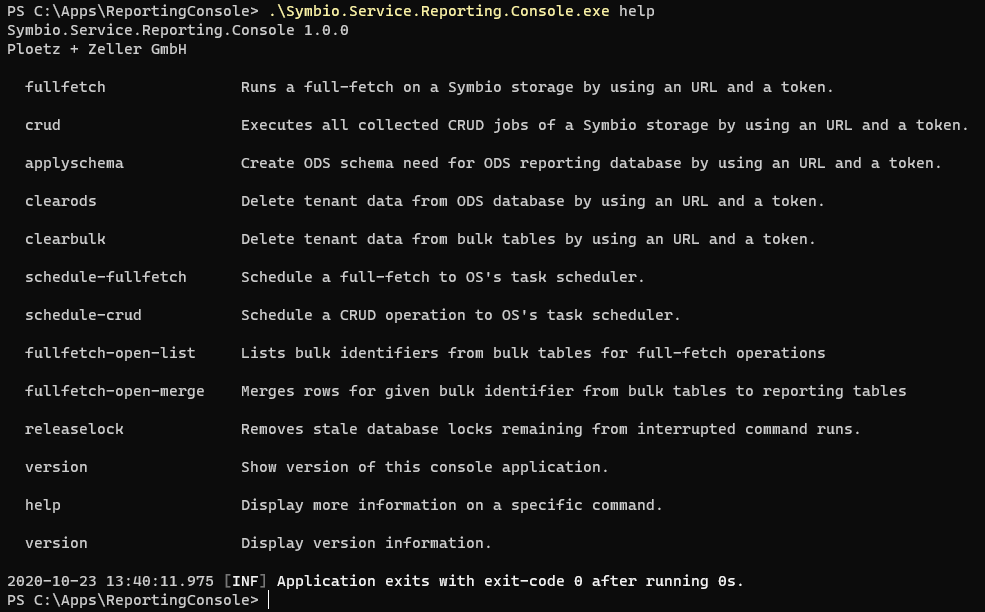

# Symbio Reporting - Operation

## Requirements

The Console application is already [set up](deploy-connector-console.md#console).

## Using the Console application on the command line

### General Usage

Open a command line interface and type ```dotnet Symbio.Service.Reporting.Console.dll help``` and press _Enter_ to get a general list of commands:



Open a command line interface and type ```dotnet Symbio.Service.Reporting.Console.dll help <command>``` and press _Enter_ to get detailed info on a command:


### First Steps

Upon connecting a storage or after changes to the configuration of the storage you should execute the following commands in that order

1. ```dotnet Symbio.Service.Reporting.Console.dll applyschema```
2. ```dotnet Symbio.Service.Reporting.Console.dll fullfetch```

Both command need at least the API URL of the Symbio storage to work on and the token that has been created for use by the selected report pool. To retrieve them, follow these steps:

1. Login to the Symbio storage as an admin user
2. Go to the _admin area_ and select _Automation_
3. Open the entry _data, Rest-API endpoint_ and select the connected report pool
4. In the _Information_ section copy URL and token as seen below:


To run the command with token and URL (as copied from above) write the following:

```
dotnet Symbio.Service.Reporting.Console.dll <command> -u https://localhost/SYMBIO/pMaster/dShowCase/_api -t fc4frk32msxnx0bz0h7rqg0qy1
```

### Common Tasks

Generally, you want to integrate changes made in Symbio on a regular basis into the ODS database. This is done by using the _crud_ command. It is a good idea to _schedule-crud_ for each connected storage so you don't need to execute that manually. Choose an appropriate interval, e.g. 15 minutes.

The same is true for a _fullfetch_, consider to _schedule-fullfetch_ with an interval of one week for each connected storage.

### Additional Parameters for Troubleshooting

#### --timeout

The --timeout parameter is available for
* applyschema
* fullfetch & schedule-fullfetch
* crud & schedule-crud

It defines (in seconds) how long the console will wait for Symbio to respond. For big databases and/or busy systems it will be necessary to increase this value by providing this parameter. Consider using *--timeout 1200* if you get timeout errors during your operations. This will increase the timeout from the default value to 1200 seconds / 20 minutes.
