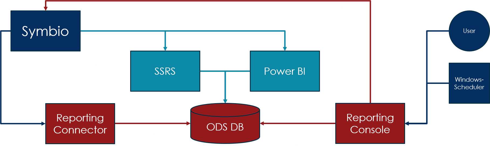

# Symbio Reporting

## Overview

The Symbio reporting service consists of several components that together realize a rich integrated reporting solution.

- __Symbio__ provides the data which will be saved in a specialized _ODS database_. Symbio also displays the reporting results within its own UI. You can manage which storage connects to which reporting service by setting up and assigning different _Report Pools_. Within Symbio you can also manage which reports are active and which will be hidden from users.
- The __Reporting Connector__ is what a _Symbio Report Pool_ connects to and that receives events from _Symbio_ describing the changes that were made to elements (like changes to names, descriptions, additions of new symbols to a diagram, removal of relations, etc.). The connector stores the received events in the operational part of the _ODS database_. It also provides _Symbio_ with the actual report links for configured reporting systems (i.e. _SSRS_ or _Power BI_).
- The __Reporting Console__ is responsible for getting an initial data dump (_fullfetch_) from _Symbio_ that is saved in the data part of the _ODS database_. It also realizes the conversion of events collected by the _Reporting Connector_ into updates (_crud_: create & update) of the data part of the _ODS database_. The _Reporting Console_ operations are triggered by an _admin user_ (for manual and maintenance tasks) or by the _Windows Task Scheduler_ (for recurring tasks).
- The __ODS DB__ contains operational and actual reporting data for reports to work on. This data is available in a format optimized for reporting, in contrast of the data stored in _Symbio_ databases that is optimized for business and process management tasks.
- __SSRS__, the _SQL Server Reporting Services_, provides an enviroment for defining, managing, and running reports. It is mainly intended for on-premise use.
- __Power BI__ provides an environment for defining, managing, and running reports, and is primarily intended for cloud use.

## Requirements

To use Symbio Reporting, the following requirements must be fullfilled:

- Symbio set up and running
- SQL Server or Azure SQL set up and running
- Either SSRS (requires SQL server) or Power BI set up and running
- An ODS database on SQL Server or Azure SQL created and running, with appropriate logins for read (reporting) and write (connector & console) access
- The Reporting Connector set up and running as web service on IIS or as an Azure App Service
- The Reporting Console set up on an appropriate machine

The following communication directions must be available for the system to work:

- Symbio to Reporting Connector (to send events on data changes)
- Symbio to SSRS/Power BI (to retrieve report results)
- Reporting Connector to Symbio (to setup reports)
- Reporting Connector to ODS DB (to read & write operational data)
- Reporting Console to Symbio (to read data)
- Reporting Console to ODS DB (to read & write data)
- SSRS/Power BI to ODS DB (to read data)
