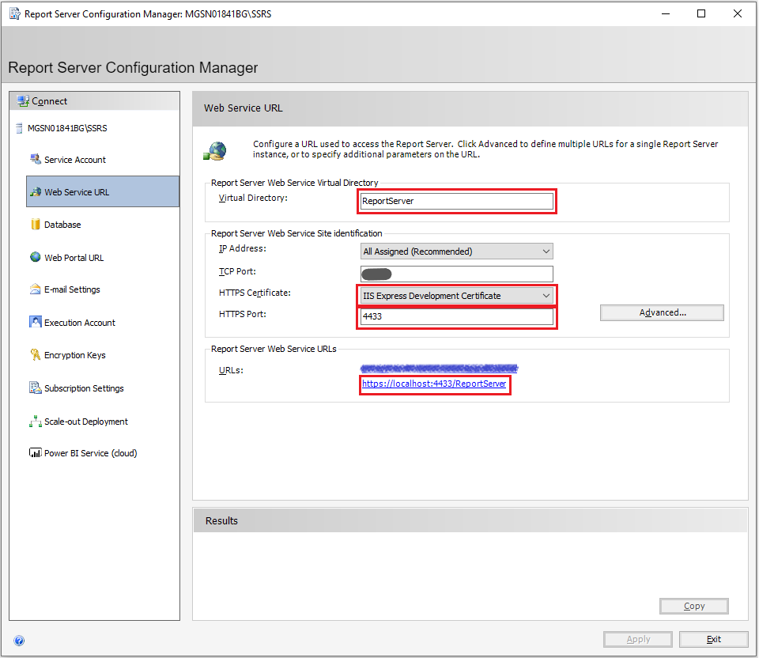
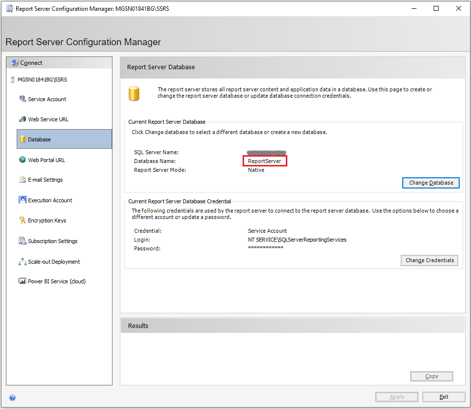
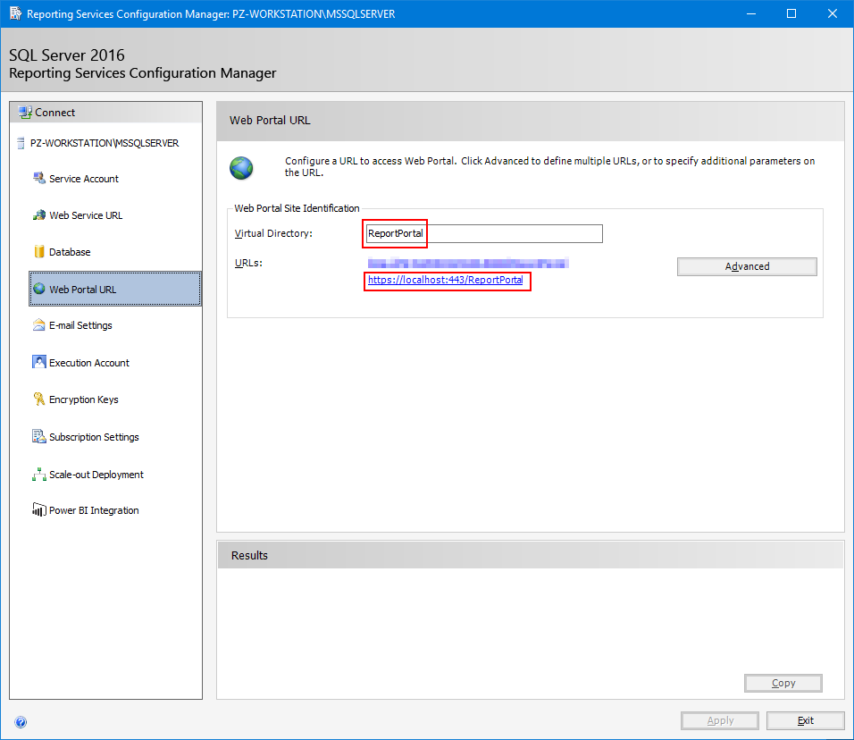
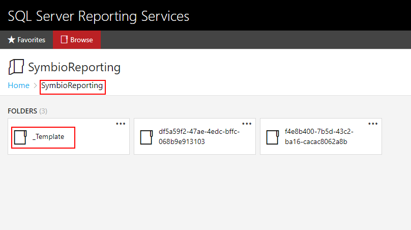
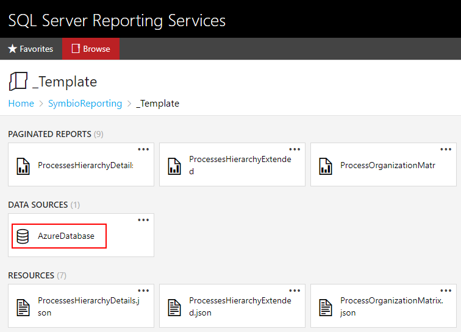

# SQL Server Reporting Services - Installation

## Requirements

Symbio requires at least a version of SQL Server 2014 to host SSRS.
SQL Server 2016 and up is recommended, though.

## Setup

Choose appropriate settings and keep an eye on the parts listed below.

### Web Service URL

Please secure your Report Service with an HTTPS endpoint, choose a valid and accepted certificate, and note the resulting URL for later use. Remember that this URL must be available to the [Reporting Connector](reporting-connector.md) (for managing workspaces).

### Database

The Report server stores all report server content and application data in a database. This is the internal SSRS management database, _this is **not** the ODS Database!_.
You may keep on all default settings here if you want.

### Web Portal URL

Please secure your Report Service with an HTTPS endpoint and choose a valid and accepted certificate. Remember that this URL must be available to browsers in your organization (for displaying reports).

## Workspace Template

The [Reporting Connector](reporting-connector.md) is expecting a template directory in SSRS that will be used to create workspaces for different report pools configured in Symbio.

It is recommended that you create one root folder in SSRS per Reporting Connector that will use that SSRS instance. In the image below this root folder has been named _SymbioReporting_. If you create a root folder (which is optional), please note its name (or path using forward slashes if you create a deeper nested structure).

In your Reporting Connector's root folder create a template folder and note its name. In the example below this folder has been named *Template*. For each report pool in Symbio, the connector will create a copy of the template folder and assign it the ID of the report pool as its name.

Upload the report files (\*.rsd) and report annotation files (\*.json) into the template folder.

Create a data source named _AzureDatabase_, choose the type of the connection (SQL Server or Azure SQL), set the connection string for the ODS database, and use the credentials of a login with read-only access to the ODS database.

