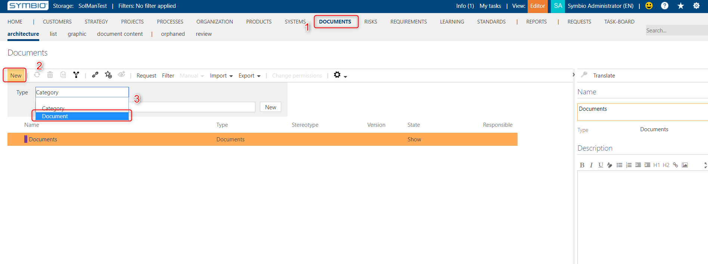
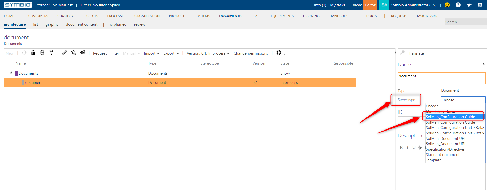
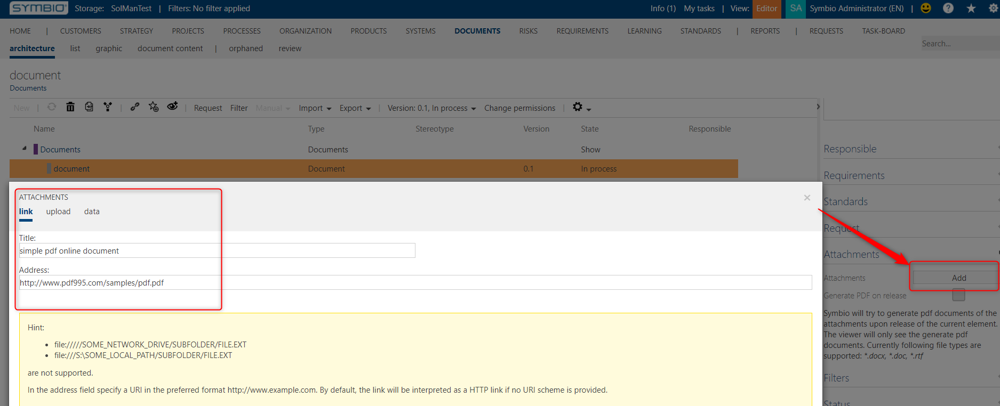
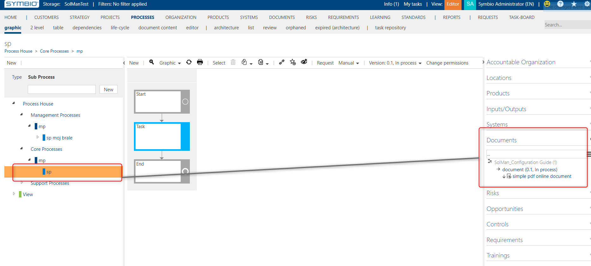

# Synchronizing documents
---

# Synchronizing documents to SAP Solution Manager

The interface can synchronize documents that are attached to either main process, sub process or a task in the diagram.
In order to synchronize a document there are several steps to accomplish this:

1. Create a document
2. Attach a document to the element in the process structure
3. Synchronize the structure to SAP Solution Manager

## 1. Create a document

You can create a document in the documents facet:

There are two attributes you have to set for the document to be able to synchronize to SAP Solution Manager.
On the linking action when Symbio storage and SAP Solution Manager branch are linked, all of the document types that are in the scope of the SAP Solution Manager solution of the branch that is being linked will be inserted into Symbio like *document stereotypes*.
They all have the prefix SAP Solution Manager.
You have to choose one of those stereotypes for your document so that it can be synchronized.

Then you have to add an attachment to the document.
Only links will be synchronized, either to the online documents or to the physical documents.

## 2. Attach a document to the element in the process structure

You can synchronize the document attached on the sub process, main process and task by attaching the document to it.

## 3. Synchronize the structure to SAP Solution Manager

Synchronize the sub process as usual.

In SAP Solution Manager you should see the attached document.

## 4. Document connection deletion

If the document connection is removed in Symbio, the document connection will also be removed in SAP Solution Manager.

# Documents SAP Solution Manager to Symbio

The documents are synchronized from SAP Solution Manager to Symbio in two ways:

1. If the document is attached to the Scenario, Process, Process Step Reference or Process Step Original, on Scope Sync these document will be synced to Symbio. (Note that only URL and Template document types are supported)

2. On Library Sync, the newly created user processes will be updated, and the documents attached to the elements of these processes will be added or removed, depending on what is done on the SAP Solution Manager side.

