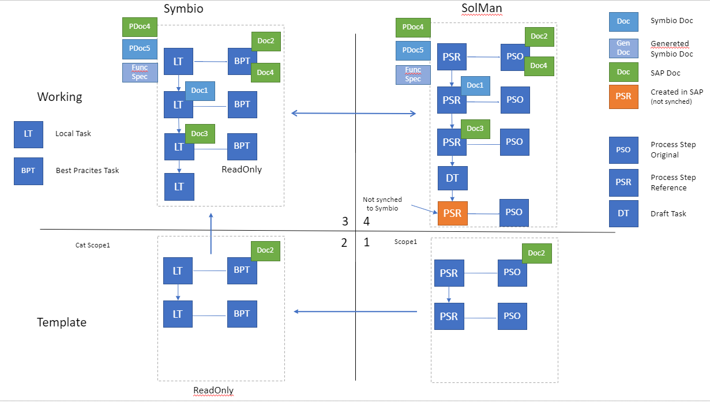

# Synchronizing documents

The interface provides synchornization of documents from Symbio to SAP Solution Manager, and also from the SAP Solution Manager to Symbio. Keep in mind that this is not bidirectional sync. One document will not be synced from both sides, changed are possible only in owner system. The schema of the document synchronization can be seen on the following chart:

---
## Synchronizing documents to SAP Solution Manager

The interface can synchronize documents that are attached to eather main process, sub process or a task in the diagram.
In order to synchronize a document there are several steps to acomplish this:
1. Create a document and select stereotype from Solution Manager 
2. Attach a document to the elemet in the process structure
3. Synchronize the structure to SAP Solution Manager

### 1.Create a document and select SolMan stereotype

You can create a document in the documents facet:

There are two attributes you have to set for the document to be able to synchronize to SAP Solution Manager.
On the linking action when Symbio storage and SAP Solution Manager branch are linked, all of the documents that are in the scope of the SAP Solution Manager solution of the branch that is being linked will be inserted into symbio like document stereotypes.
They all have the prefix SAP Solution Manager.
You have to choose one of those stereotypes for your document so that it can be synchronized.

Then you have to add an attachment to the document.
Both links to online documents and the physical documents can be synchrnoized.

### 2.Attach a document to the elemet in the process structure

You can synchronize the document attached on the sub, main process and task by attaching the document to it.

### 3.Synchronize the structure to SAP Solution Manager

Synchronize the sub process regularly.

In SAP Solution Manager you should see the attached document.

### Administrative Attributes

On a document in Symbio you can see two administrative attributes: *Symbio ownership* and *Solution Mangaer Document ID*.
 
 

 When document is created in Symbio, it will have attribute *Symbio ownership* set to **true**. For the documents that come from SAP Solution Manager this value will be **false**.
 Attribute *Solution Mangaer Document ID* is the ID of that document in SAP Solution Manager.

| Symbo Ownership  | Solution Manager Document ID  | Behavior  |
|:----------------:|:-----------------------------:| ----------|
| true             | has ID                        | This document is from Symbio, and it is already sychronized to Solution Manager. On every synchronization this document will be updated. |
| true             | without ID                    | This document is from Symbio and it is not yet synchronized to Solution Manager. Next time whe document is synced it will get an ID attribute.|
| false            | has ID                        | This is a document that came from the Solution Manager. On synchronization only document reference will be synced. |
| false            | without ID                    | This is a special case when document is created before the Symbio was connected to the interface. This document will have both attributes set on its first synchornization. |

## Synchronizing documents to Symbio form SAP Solution Manager

The interface can sync documents from SAP Solution Manager to Symbio. The documents that are attached to the Process Step Originals, Proces Step References, Scenario or Process will be synchronized to Symbio. 

Documents synced from SAP Solution Manager will be stored in a catergory called **SAP Documents**.
They will have *Symbio ownership* attribute set to **false** and *Solution Mangaer Document ID* set to **ID of the document in the SAP Solution Manager**.

The documents are synced from SAP Solution Manager in two cases:

1. On the update of global elements all document elements that are attached to Process Step Originals, Process Step References, Scenarios or Processes will be synchronized.
2. On the synchronization of the selected scope, document related to that scope will be synchronized.

Documents from SAP Solution Manager that are synchronized to Symbio are owned by SAP Solution Manager and therefore they are read-only in Symbio.