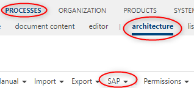
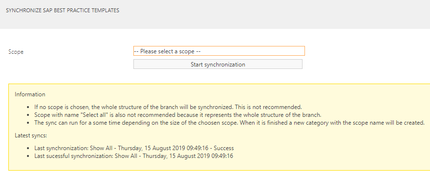
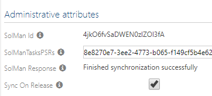

# Introduction to SAP Solution Manager Connector

In this article it is explained what is SAP Solution Manager Connector service, what are its core functionalities and what is the recommended way to use it.

## Introduction   

SAP Solution Manager Connector service is a tool that does the data synchronization between Symbio and SAP Solution Manager applications. The synchronization is possible in both ways, from SAP Solution Manager to Symbio and from Symbio to SAP Solution Manager, but it not bidirectional and it follows certain synchronization rules. Although the service itself can run independently, it has to be configured in Symbio in order for someone to use it.

## Features overview

In this section, main features of the service are explained:

1. **Synchronize processes for SAP Solution Manager to Symbio**

    It is possible to synchronize process structure from SAP Solution Manager to Symbio. Users are able to select a SAP Solution Manager scope, and synchronize it to Symbio. When synchronizing scope some library elements that are connected to the structure or diagram elements will also be synchronized.

2. **Synchronize Library elements from SAP Solution Manager to Symbio**

    SAP Solution Manager library elements such as *Logical Component Groups*, *Process Step Originals*, *Executable* and *Documents* can be synchronized to Symbio. This kind of synchronization is independent from the Scope synchronization, so one can choose wether to synchronize Processes, Library elements or both.

3. **Synchronize Symbio process to SAP Solution Manager**

    SAP Solution Manager connector can synchronize Symbio process structure to SAP Solution Manager. Unlike the Scope synchronization from SAP Solution Manager, here it is only possible to synchronize a single Symbio subprocess with its hierarchy in one synchronization. Users can synchronize subprocess manually or it can be synchronized on every release in Symbio.

4. **Document synchronization**

    It is possible to synchronize document from SAP Solution Manager to Symbio, and from Symbio to SAP Solution Manager. More details about the document synchronization can be seen here. {Link to documents}

## How to use interface (basic)

Under processes facet, in the architecture view, there is SAP menu bar.

Under SAP menu bar, there are 3 relevant menu items for the SAP Solution Manager Connector:

1. *Synchronize SAP Step Library Objects to Symbio* button

    This button should be used when you want to synchronize all SAP Solution Manager branch library objects (Process Step Originals, Executables, Roles, Documents) to Symbio. When you click the button, a dialog will appear:

    

    In this dialog, you can start the synchronization process for the library object.
    There is also some additional information:

    *Last synchronization*: Time of the latest SAP Solution Library object synchronization - Result of the synchronization process

    *Last successful synchronization*: Time of the latest SAP Solution Library objects successful synchronization

    If you do not close the window after synchronization has started, a message with the synchronization result will appear, once the process has finished.

    If synchronization is already in progress, a message will appear and you will not be able to synchronize until the previous process is completed.

2. *Synchronize SAP practice templates* button

    This button should be used when you want to synchronize the SAP Solution Manager processes to Symbio. Along with the process structure, library elements that are connected to the objects in the process structure will also be synchronized. When you click the button, a dialog will appear:

    

    In this dialog, you must choose a scope that you want to synchronize. If you want to synchronize everything you can use the predefined Scoped named 'Show all'. Once you have selected the Scope you wish to synchronize, you can start the synchronization process.

    There is also some additional information:

    *Last synchronization*: The name of the Scope - Time of the latest SAP Solution Library object synchronization - Result of the synchronization process

    *Last successful synchronization*: The name of the Scope - Time of the latest SAP Solution Library objects successful synchronization

    If you do not close the window after synchronization has started, a message with the synchronization result will appear, once the process has finished.

    If synchronization is already in progress, a message will appear and you will not be able to synchronize until the previous process is completed.

3. *Synchronize subprocess to SAP Solution Manager* button

    When you have selected a subprocess in Symbio, by clicking this button you will trigger the synchronization of that subprocess and its hierarchy to SAP Solution Manager.

    The same effect can be achieved by releasing the subprocess which has the attribute 'Sync on release' set to true:

    

## Recommended way to use the SAP Solution Manager Connector

