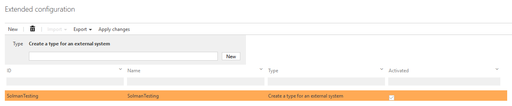
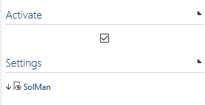
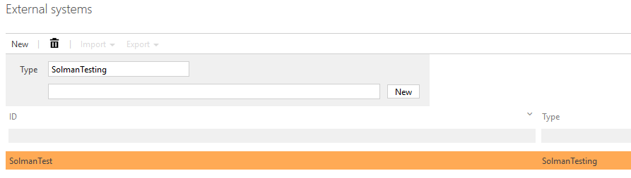
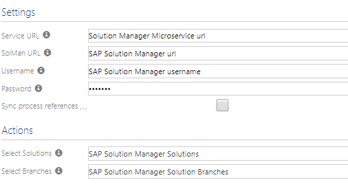
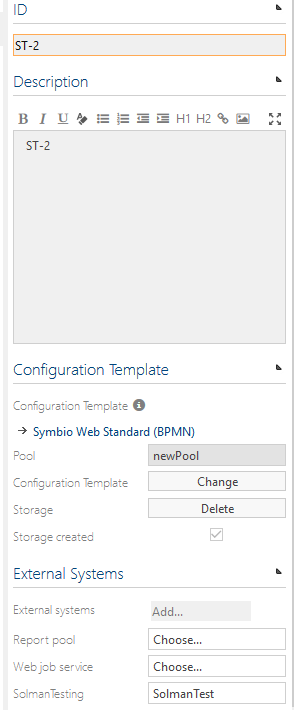
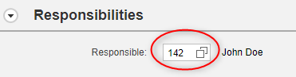
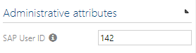

# SAP Solution Manager Connector Configuration

This document contains information on how to configure Symbio to use **SAP Solution Manager Connector** service.

## Configure Symbio to use the service   

1.  Go to Symbio System Administration home and switch to Editor mode.
2.  Go to the Administration menu, and navigate to the Extended configuration.
3.  Create new *Type for an external system*, and for the settings upload the SAP Solution Manager **.syex** file from the XmlFiles/Bin folder of the service project. See Versioning page to see which .syex file to use.

    
    

4.  **Important**: Check the &quot;Activate&quot; checkbox and click on the &quot;APPLY CHANGES&quot; button.
5.  Go to the External Systems page.
6.  Create an new instance of the external system type that you created in Step 3.

    

7.  In the Service URL field enter the URL of the SAP Solution Manager Connector micro-service.
8.  In the SAP Solution Manager URL field enter the base URL of the SAP Solution Manager API.
9.  In the Username field enter your username for the SAP Solution Manager API.
10. In the Password field enter your password for the SAP Solution Manager API.
11. Enable the option to synchronize process references. When sub processes are synchronized from Symbio to SAP Solution Manager this option will decide if it will synchronize all sub process references and their diagrams as well or not. In case it is disabled the sub process references will be represented as empty sub processes in SAP Solution Manager. 
12. If everything is configured correctly you can now select a SAP Solution Manager solution from the dropdown list. If not, then please check url and password again.
13. After you have selected the solution, you can select a branch and the configuration is done.

    

14. Navigate into the storage collection, open Admin menu, open Extended Configuration and click on the &quot;APPLY CHANGES&quot; button. 
15. Create a Symbio storage. 
16. When storage is created, switch into Editor mode, open Admin menu, open Features menu, and enable the BestPracticeTasks feature.  
17. Go back to the storage collection. You can select your SAP Solution Manager external system for you storage. During this process Symbio will be linked to the micro-service, and auth token will be created.  

    

18. When linking process is completed, enter the storage, switch into Editor mode, open Admin menu, open Extended Configuration and click on the &quot;APPLY CHANGES&quot; button.
19. If storage is not new (already has some data), the converter file "Update CreationID for diagram elements" should be executed. **IMPORTANT NOTE: Be aware that this converter can take a up to a few hours to finish. No synchronization should be done until the converter is finished.**

## Configure user mapping (Solution Manager to Symbio)

From the **Release 194** of the **SAP Solution Manager Connector** service it is possible to set the Responsible user for processes in Solution Manager to Symbio synchronization. This option is available for *Scenario*, *Process* and *Diagram* elements. To enable this option, users have to be manually mapped using these instruction steps:

1. Make sure that **SAP Solution Manager Connector** is connected to your Symbio storage and that all configuration steps are done.

2. In your Solution Manager, check the Responsible user and get its "Team Member ID":

     

3. In your Symbio storage go to User management page. Find the corresponding user that you want to map. For this user, set the value of the attribute "SAP User ID" to the value you got in the step 2:

     
