# Introduction to SAP Solution Manager Connector

The basics of how you can use the SAP Solution Manager Connector service, are explained in the following section.

## How to use interface (basic)

The user has to have the architect rights to be able to use the Solution Manager connector.

Under *PROCESSES* facet, in the *architecture* view, there is **SAP** menu bar item.

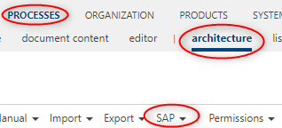

Under **SAP** menu bar, there are 3 relevant menu items for the SAP Solution Manager Connector:

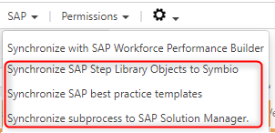

1. *Synchronize SAP Step Library Objects to Symbio* button

    This button should be used when you want to synchronize all SAP Solution Manager branch library objects (Process Step Originals, Executables, Roles, Documents) to Symbio. When you click the button, a dialog will appear:

    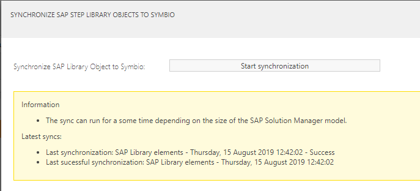

    In this dialog, you can start the synchronization process for the library object.
    There is also some additional information:

    *Last synchronization*: Time of the latest SAP Solution Library object synchronization - Result of the synchronization process

    *Last successful synchronization*: Time of the latest SAP Solution Library objects successful synchronization

    If you do not close the window after synchronization has started, a message with the synchronization result will appear, once the process has finished.

    If synchronization is already in progress, a message will appear and you will not be able to synchronize until the previous process is completed.

2. *Initial import of SAP process structure* button

    This button should be used when you want to synchronize the non best practice SAP Solution Manager processes to Symbio. Along with the process structure, library elements that are connected to the objects in the process structure will also be synchronized. These processes would be in version 1.0 Released, but a user is able to create a new version and edit the processes. 
    
    When you click the button, a dialog will appear. In this dialog, you must choose a scope that you want to synchronize. You should choose the Solution Manager scope which contains your non best practice processes. Once you have selected the scope you wish to synchronize, you can start the synchronization process.

    There is also some additional information:

    *Last synchronization*: The name of the scope - Time of the latest latest successful synchronization of processes - Result of the synchronization process

    *Last successful synchronization*: The name of the scope - Time of the latest successful synchronization of processes

    If you do not close the window after synchronization has started, a message with the synchronization result will appear, once the process has finished.

    If synchronization is already in progress, a message will appear and you will not be able to synchronize until the previous process is completed.

3. *Synchronize SAP practice templates* button

    This button should be used when you want to synchronize the SAP Solution Manager processes to Symbio. Along with the process structure, library elements that are connected to the objects in the process structure will also be synchronized. When you click the button, a dialog will appear:

    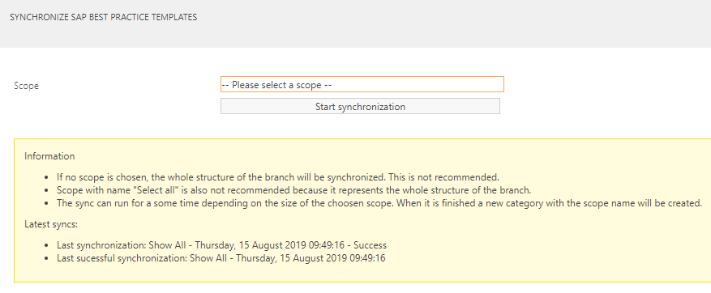

    In this dialog, you must choose a scope that you want to synchronize. If you want to synchronize everything you can use the predefined Scoped named 'Show all'. Once you have selected the Scope you wish to synchronize, you can start the synchronization process.

    There is also some additional information:

    *Last synchronization*: The name of the Scope - Time of the latest successful synchronization of processes - Result of the synchronization process

    *Last successful synchronization*: The name of the Scope - Time of the latest successful synchronization of processes

    If you do not close the window after synchronization has started, a message with the synchronization result will appear, once the process has finished.

    If synchronization is already in progress, a message will appear and you will not be able to synchronize until the previous process is completed.

4. *Synchronize subprocess to SAP Solution Manager* button

    This button should be used when you want to synchronize sub process from Symbio to SAP Solution Manager. It is important to select a sub process you want to synchronize and then click on the button "Synchronize sub process to SAP Solution Manager"
	
    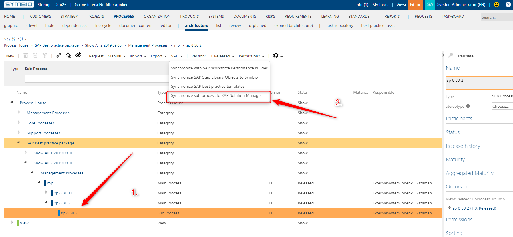
	 
    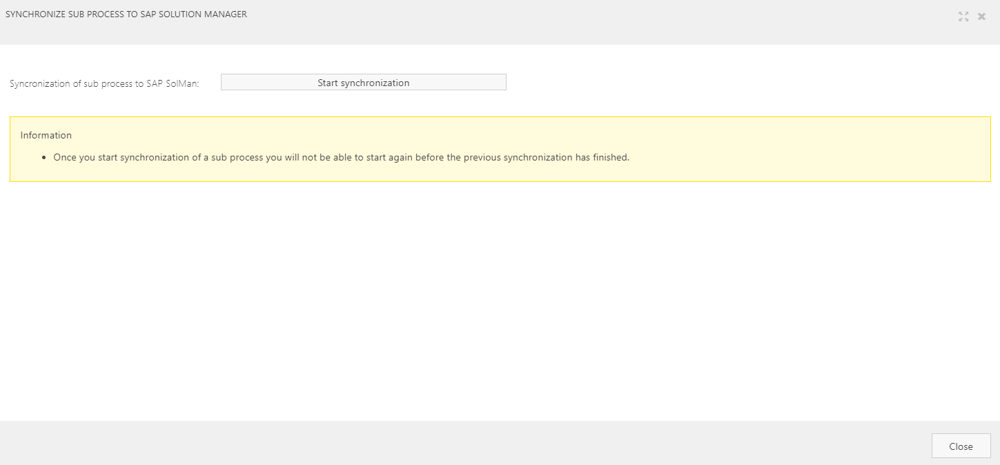
    If you select another element that is not a sub process you will get the following message:
	
    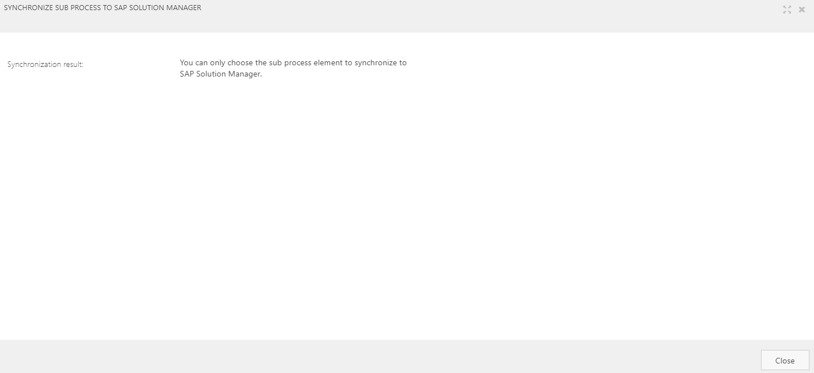
	
    When you click on the start synchronization button the synchronization is started and the button will be hidden.
	
    When the synchronization is finished you will get the following message:
	
    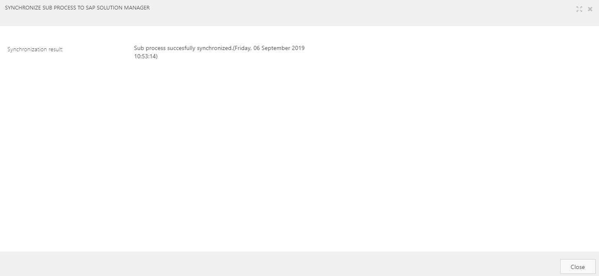
	
    The is a rule that if you start a synchronization of a sub process you will not be able to start a new one until the started synchronization is finished. The following message will appear:
	
    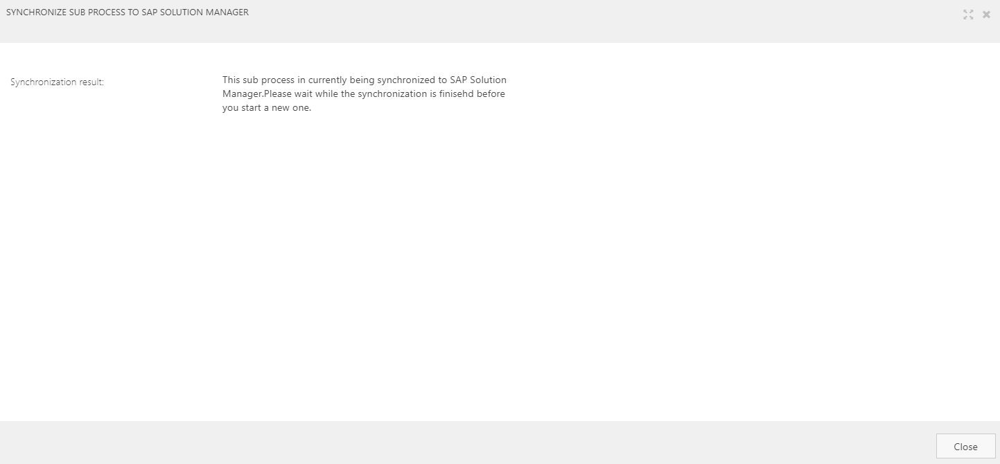
	
    If in the process of synchronation there is an error a messag will appear on the window:
	
    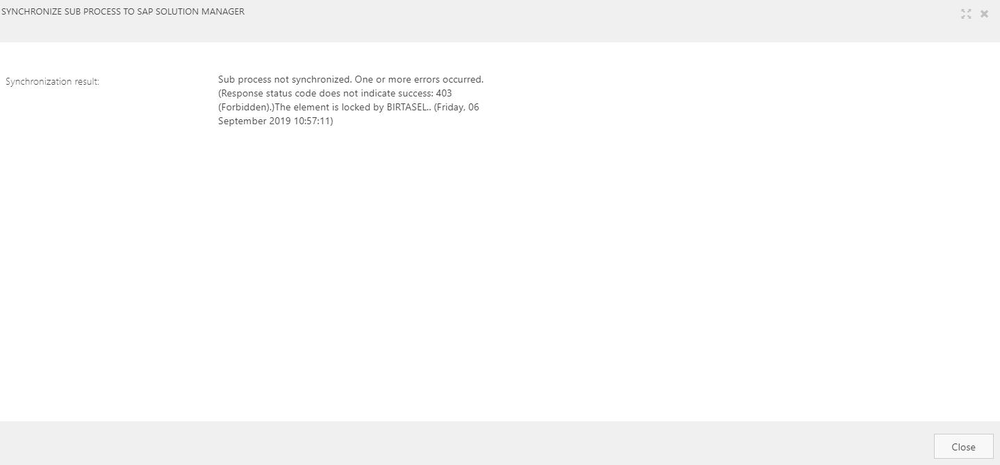
	
    Also the messages about the synchronization status will be written in the detail content of the sub process( if it is not released)
	
    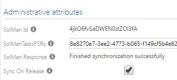
	
    When you release a sub process and the attribute called Sync to SAP Solution Manager is checked then automaticaly after the release the sub process will be synchronized to SAP Solution Manager
