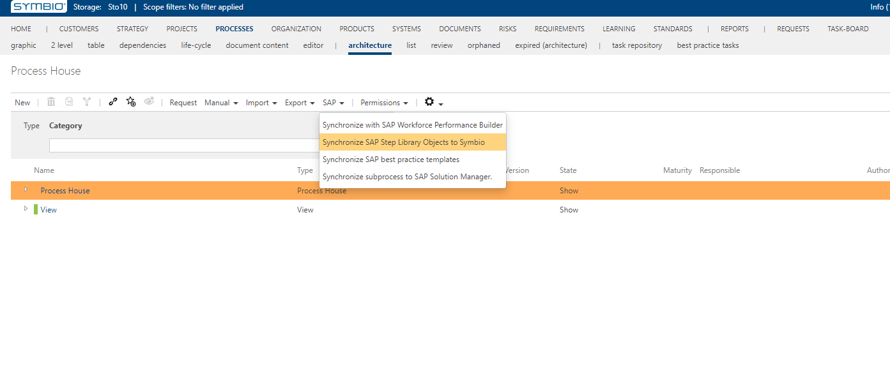

# Limitations and precaution 

Here the limits of SAP Solution Manager connector will be listed and explained.
Limits can be some actions from the end user that can lead to data loss.

## 1. Deleting attached Best practice task to a task in Symbio

In Symbio an sub process is created with simple content.

There are two possibilities, to attach an best practice task to a task or to not.

### Task has a bpt attached in Symbio
 

Then the sub process is synchronized to SAP Solution Manager.

 
### Task doesn't have a best practice task attached

Then the sub process is synchronized to SAP Solution Manager.
The task on the SAP Solution Manager side will have a reference to the dummy process step original that represents a placeholder for all tasks that are synchronized to SAP Solution Manager and do not have a Best practice task attached.

***
In both cases now that the sub process has been synchronized to SAp Solution Manager, an SAP user can change the targets/references of the task. Specially if the task is attached to the dummy process step original. That leads to the first limitation:
***After synchronizing an task with or without a best practice task attached to it, it is recommended that the connection between the task and best practice tasks does not change.***
If it changes ( best practice task is deleted), and a new synchronization of a sub process task occurs from Symbio to SAp Solution Manager there can be data loss on SAp Solution Manager side if somebody in the meantime has done some changes of references on SAP Solution Manager side.

There is also a notification about this in Symbio.

## 2. Changing target on process tep reference in SAP Solution Manager

When you have synchronized a sub process that has a task two things can happen.
### Task has a bpt attached in Symbio
 In this case once synchronized the task will also have a process step reference referencing the process step original that represents the corresponding best practice task.
 
### Task doesn't have a best practice task attached
 In this case a Dummy process step reference will reference to a dummy process step original, which acts like a placeholder that should be changed with a real process step original.
 
 In both cases on SAP Solution Manager side you can change the task reference to  a process step original.
 That can be done by selecting the task and right click. Then clicking change target. Then you choose the real process step original and now the task will reference a real process step original.
 
 
 But this change isn't automatically synchronized to Symbio. It can be done by consolidating SAP Solution Manager and Symbio by clicking on the "Synchronize SAP Step Library Objects to Symbio". This button synchronizes all global elements and then checks if there were any changes regarding the connections between tasks and best practice tasks and changes the connection if necessary.

   
 But if the consolidation is not done and the same sub process is synchronized to SAP Solution Manager again, all the changes made on SAP Solution Manager side in the mean time will be deleted which would lead to data loss.
 So if you want your target changes to be noticed on Symbio side you first have to consolidate before synchronizing the process again to SAP Solution Manager. The consolidation takes some time so it is recommended that first all targets are changed on SAP Solution Manager side, and then consolidation will take care of every change.
 
## Document synchronization
Documents can be created on both sides. When synchronizing an sub process that has a Symbio document attached then the document wil also be synchronized.
When synchronizing global elements from SAP Solution Manager to Symbio the SAp Solution Manager documents will be synchronized.
Documents can also be deleted on both sides.
### Deleting a document on Symbio side.
 SAP Solution Manager document cant be deleted in Symbio. But a connection between a process facet element (sub process, main process and task) and a document ( both documents from Symbio and SAP Solution Manager) can. This means that if you delete a document, and synchronize a sub process to SAP Solution Manager, this document will be deleted on the SAP Solution Manager side also.
 
### Deleting a document on SAP Solution Manager side
 When deleting a document on SAP Solution Manager side same thing happens as with deleting Best practice tasks. You have to consolidate the changes back to Symbio not to get overridden by the new Symbio synchronization.
 If you delete a document on SAP Solution Manager side( both a document created in Symbio or SAP Solution Manager) the connections between process facet elements (main process, sub process and task) are going to be deleted.