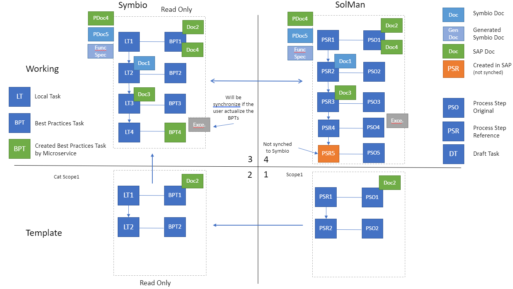

# Introduction to SAP Solution Manager Connector

In the following article, the recommended way to use the service is explained. Of course, you are free to use the service in a way that best suit your needs.

## Recommended way to use the SAP Solution Manager Connector

The recommendation is to use interface following the synchronization process that contains of four steps:

1. Synchronize the SAP Best Practice template processes from SAP Solution Manager to Symbio
2. Copy processes to specific processes in Symbio
3. Edit processes to best suit your needs
4. Synchronize modified processes back to SAP Solution Manager 

The following picture represent the whole process with four steps:

### 1. Synchronize the SAP Best Practice template processes from SAP Solution Manager to Symbio

First step should be, to synchronize some processes from SAP Solution Manager to Symbio. You can synchronize either a small scope or the full process structure. These elements are readonly in Symbio. The main idea is that these processes serve as a template, so user can edit them in Symbio and adjust to the real company processes.

### 2. Copy processes to specific processes in Symbio

Second step is to copy the processes in Symbio, from the SAP Best Practice package group to the dedicated companies processes. By copying these elements to the new processes, these elements become available for editing in Symbio.

### 3. Edit processes to best suit your needs

Once you have your processes copied in Symbio, now you are available to change them. You can use Symbio to add new elements, edit the current ones, remove some elements. You can use the library elements from SAP Solution Manager, that can also be synchronized to Symbio, or you can add new element that are created in Symbio. In this way you adjust SAP Solution Manager processes, and create your own, which are based on the SAPs ones.

### 4. Synchronize modified processes back to SAP Solution Manager 

Finally, when processes are edited and ready to be used, you can synchronize it back to SAP Solution Manager. If configured this synchronization can occur on process release in Symbio, or architect can synchronize it manually.