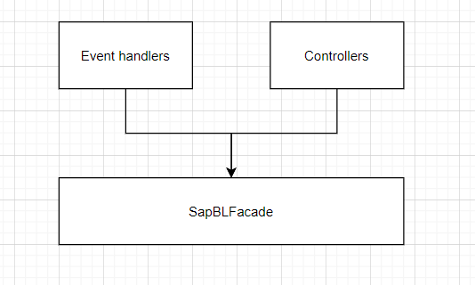
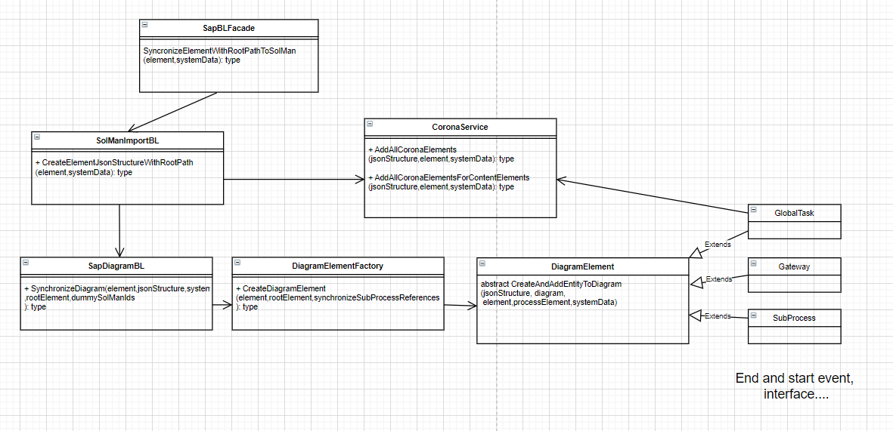
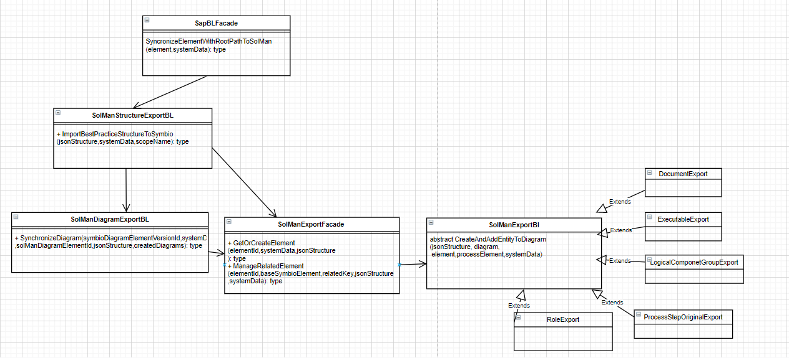

# SAP Solution Manager microservice architecture

SAP Solution Manager connector solution has 4 projects:

 * SolManConnector (main project)
 * SapSolManTest
 * SapSolManIntegrationTest
 * MockServiceSolMan

MockServiceSolMan is a mock SolMan APi which is used by SapSolManIntegrationTest. 

SolManConnector is the main project. It is a .net core 3.1 application.
It uses the symbio-service-core application as a submodule.
## Accessing SolManConnector

SolManConnector can be called in two ways:

 * With event handlers (they come from symbio-service-core)
 * With mvc controllers 
Event handlers are triggered on linking and unlinking and on sub process releasing.
Controllers are called from the IFrame that opens from Symbio. This IFrame has the view from SolManConnector.
All the calls that come are processed by the SapBLFacade.

Some important folders in the project are:

 * SapSolManService
 * SymbioServiceBL
 * SapSolManBL
 * Import logic
	* Structure import
	* Diagram import
	* Corona elements import
 * Export logic
	* Structure export
	* Diagram export
	* Library export
	* Consolidation
SapSolManService and SymbioServiceBL are folders that contain logic to call the SAP Solution Manager API/Symbio API and deserialize/serialize data from requests/responses.

SapSolManBL holds the main logic.

## Import logic
Import logic deals with importing data from Symbio to SAP Solution Manager.
Currently it is possible to import only a single sub process with its diagram and parent hierarchy.

The diagram shows the import architecture.

The starting point is the SAPBlFacade. It calls the SolManImportBl which is responsible for the creation of structure that will be imported to SAP Solution Manager.

SolManImportBl  calls SapDiagramBL class which is responsible for the diagram creation.
For every shape in the diagram SapDiagramBL calls DiagramElementFactory which creates an instance of the DiagramElement class. 
DiagramElement class is the base class for all classes that represent shapes.

SolManImportBl  and SapDiagramBL can call the CoronaService which is responsible for creating and instance of type ICoronaCreator which is representing a specific corona type to be created for the import into SAP Solution Manager.

## Export logic

Export logic deals with exporting data from SAP Solution Manager to Symbio.
Export includes:

 * Export of library elements
 * Export of structure
 * Consolidation

The diagram shows the export architecture.

The starting point is the SAPBlFacade. It calls the SolManStructureExportBL which is responsible for the creation of structure that will be exported from SAP Solution Manager.

SolManStructureExportBL calls SolManDiagramExportBL that si responsible for creation of the diagram for the export. 

SolManStructureExportBL and  SolManDiagramExportBL can call SolManExportFacade that is responsible for creation of the corona(related) elements.
SolManExportFacade  calls SolManExportBl which is the base type for all related elements.
