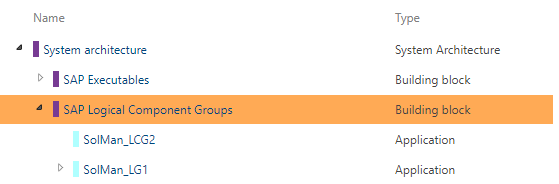
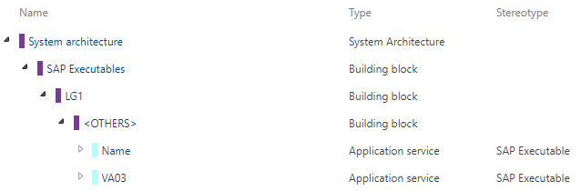
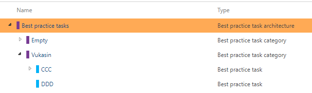
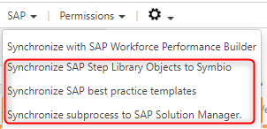

# Synchronize SAP Solution Manager Library Objects to Symbio

This article will explain you how are SAP Solution Manager library objects synchronized and represented in Symbio and how are they relevant to the process synchronization.

***
## Applications (Logical Component Groups)

**Applications** are the Symbio equivalent to SAP Solution Managers, *Logical Component Groups*. All the *Logical Component Groups* for the selected 
SAP Solution Managers Solution, will be imported in Symbio during the ***Linking process***. After they are imported in Symbio, these elements are readonly
and cannot be deleted or modified.

These elements can be reimported manually by clicking the ***Synchronize SAP Step Library Objects to Symbio*** in the Processes architecture view, under the SAP menu.

***
## Application services (Executables)

**Application services** are the Symbio equivalent to SAP Solution Managers, *Executables*. All the *Executables* from the SAP Solution Manager branch or scope, will be imported by clicking the ***Synchronize SAP Step Library Objects to Symbio*** in the Processes architecture view, under the SAP menu. Also if they are connected to the *Process Step Original* which is part of the Scope synchronization they will be imported to Symbio. They are connected to an **Application**, just like *Executable* is connected to *LCG*. After they are imported in Symbio, these elements are readonly and cannot be deleted or modified.

These elements can be reimported manually by clicking the ***Synchronize SAP Step Library Objects to Symbio*** in the Processes architecture view, under the SAP menu.

***
## Best Practice Tasks (Process Steps)

All the *Process Steps Originals* from SAP Solution Manager are imported to Symbio by clicking the ***Synchronize SAP Step Library Objects to Symbio*** in the Processes architecture view, under the SAP menu. They are imported as **Best Practice Tasks**, and after the import they are readonly. **Best Practice Tasks** are connected to the **Application**, just like the connection between *Process Steps* and *Logical Component Groups* in SAP Solution Manager. Also if the *Process step* has a reference to an *Executable*, a **Best Practice Task** has a connection to **Application service**. **Best Practice Task**, can be connected to a **Local** or **Global Task** in Symbio. If a **task** is connected to the **Best Practice Task**, it will be
synchronized as a reference to the *Process Step*, otherwise it will be linked to the **Default Process Step Original**. 

These elements can be reimported manually by clicking the ***Synchronize SAP Step Library Objects to Symbio*** in the Processes architecture view, under the SAP menu.

Additionally, if a synchronized *Task* has an attached *Best Practice Task*, the *Application* and *Application service* that are attached to that *Best Practice Task* are also visible in the detail content of the *Task*:

***
## Synchronize SAP Step Library Objects to Symbio button

