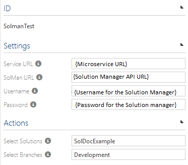

# SAP Solution Manager Interface Set-up Documentation

This document contains information on how to set-up **SAP Solution Manager** service and configure Symbio so it can use it.

## 1. Service set-up   


1. Create a SQL Server database which will be used by the service as a configStore.
2. In that database create a table dbo.settings with columns: Key(nvarchar(1024), null) and Value(nvarchar(max), null).
3. In appsettings.json set the following configuration:
```json
{
    "ConfigStoreConnection": "Server=[SERVERNAME];Database=[DATABASENAME];Trusted_Connection=True;",
    "ConfigStoreTableName": "settings",
    "Serilog": {
        "MinimumLevel": "Verbose",
        "WriteTo": [
            {
                "Name": "File",
                "Args": {
                  "path": "Logs\\log.txt",
                  "rollingInterval": "Day"
                }
            }]
    },
    "AllowedHosts": "*"
}
```
4. (Optional) Set sensitive data in user secrets. (in development "ConfigStoreConnection").
5. (Optional) Change Serilog settings in appsetting.json if needed.


## 2. Setting SAP Solution Manager run on premise 
Step two is needed only if the SAP Solution Manager microservice is isntalled on premise.
Here it will be explained how to set up the SAP Solution Manager microservice on IIS to run on an on premise solution.
Prerequisites for setting SAP Solution Manager interface on premise:
1. Running symbio instance(1904 or higher)
2. Valid relational database connection string for a database the microservice can use. An empty database has to be created manually.
3. Accessible SAP Solution Manager instance ***https://{ip}:{port}/sap/opu/odata/sap/processmanagement/*** with provided valid certificate
4. Provided valid cefitficate for SAP Solution Manager interface. Who is responsible for this?
5. For the machine where the microservie will run we need .Net Core Hosting bundle (for .Net core 2.2 applications) installed
6. Powershell version 5 or higher (so we can run the install script)

### 2.1 Get zip file of a microservice build

You can get it on the ftp server: ***https://symbioworld.com/download/symbio/solmanconnector.zip***

### 2.2 Configure the parameters json to create application site

Download the parameters json from here:
http://operations.symbioworld.com/
Parameters.json will be used by the powershell sciprt called Install.ps1. 

Open the paramaters.json

The following parameters should be changed:
```json
"SourcePath": - path to your zip file of the microservice 
"BaseTargetPath": - path to where the script will unziped
"InstanceName" : - should be Symbio-Service-SolMan
"IISSettings":
        "SiteName": - should be Symbio-Service-SolMan
        "ApplicationPoolName": - should be Symbio-Service-SolMan
        "ApplicationPoolUser": - should be the current user example (INT\username)
        "ApplicationPoolPassword": - should be the user password
        "Bindings": 
            "Protocol": "https"
            "Port": - use available port
            "HostName": - give it a wanted hostname
            "CertificateHash": - provide the certificate hash you want to use ( found in the iis -Server Certificates. It should be in local machine , personal or trusted root )
            "CertificateCN" : - provide name of certificate (found in the iis -Server Certificates)
            
"AppSettings":-
    "ConfigStoreConnection": - give right connection string to the database( you have to create the database yourself)
```
        
### 2.3 Run the scipt
Turn on powershell.
Navigate to the folder where you scipt is.
Run the command :
Set-ExecutionPolicy
Provide the parameter called Execution policy : unrestricted.

Then run the following line:
 ./Install.ps1 -ParametersFile symbio-service-solman.parameters.json
 
 This will create the application pool and site for the microservice.
 
 To check if the site is working your can call this request from your browser
 ***https://{domain}:{port}/api/values***.
 it should return a simple response just to make sure its working.
 
### 2.4 Set the SAP Solution Manager certificate to be trusted
 The client should provide te valid certificates for the SAP Solution Manager microservice and for the SAP Solution Manager API.
 
 If for some reason the client cant provide the certificates, in order for the microservice to work he has to comunicate with SAP Solution Manager api.
 SAP Solution Manager API could have a certificate that is not trusted so you  have to export it to your computer and then put it into the MMC -> Certificates-> Trusted Root Certification Authorities. This way the connection will be safe.
 
 
## 3. Set up Symbio to use the service   

1.  Go to Symbio System Administration home and switch to Editor mode.
2.  Go to the admin menu, and navigate to the Extended configuration.
3.  Create new type for an external system, and for the settings upload the SAP Solution Manager.syex file from the XmlFiles/Bin folder of the service project (if file is missing run the build.ps1 in XmlFiles to create the file).
4.  **Important**: Check the &quot;Activate&quot; checkbox and click on the &quot;APPLY CHANGES&quot; button.
5.  Go to the External Systems page.
6.  Create an new instance of the external system type that you created in Step 3.
7.  In the Service URL field enter the url of the SAP Solution Manager interface microservice.
8.  In the SAP Solution Manager URL field enter the base url of the SAP Solution Manager API.
9.  In the Username field enter your username for the SAP Solution Manager API.
10. In In the Password field enter your password for the SAP Solution Manager API.
11. If everything is configured correctly you can now select a SAP Solution Manager solution from the dropdown list.
12. After you have selected the solution,  you can select a branch and the configuration is done.
13. When you select storage collection, open Admin menu, open External Configuration an click on the &quot;APPLY CHANGES&quot; button.    
14. Now, when you create new storage, you can select your SAP Solution Manager external system in External Systems. During this process Symbio will be linked to the microservice, and auth token will be created.   
15. When storage is created, switch to an Editor mode, open Admin menu, open External Configuration an click on the &quot;APPLY CHANGES&quot; button.


**Picutre 1 - New type for external system**   


**Picture 2 - Upload .SYEX file**   


**Picture 3 - Create new instance of SAP Solution Manager external system type**   


**Picture 4 - Enter settings for SAP Solution Manager external system type**   




**Picture 5 - Configure storage**  


