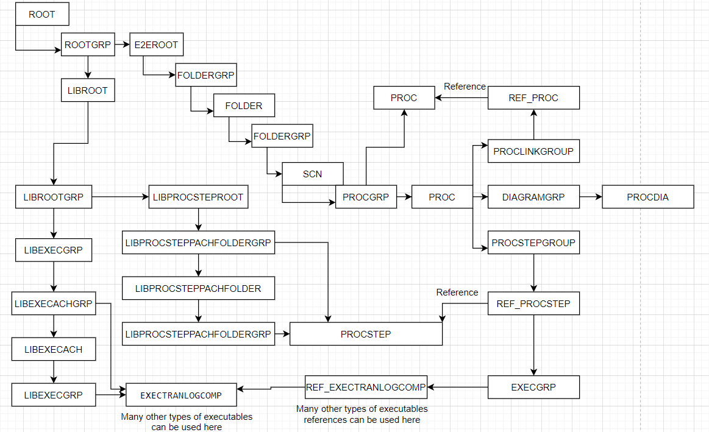
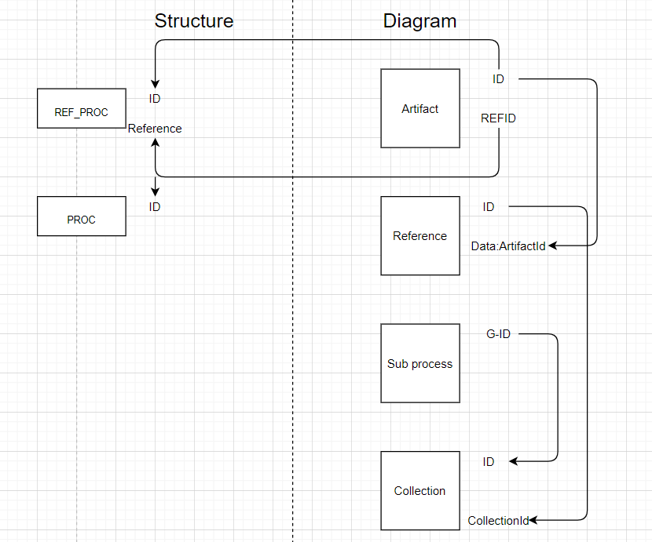

# SAP Solution Manager 7.2 API explained

In this document there will be only additional information about the API that don't exist in the official documentation but are very important. Official documentation for the Solution Manager API can be found [here](https://wiki.scn.sap.com/wiki/display/SM/Process+Management+API#ProcessManagementAPI-ProcessManagementAPI).

## Endpoints

Here the list of all important endpoints will be listed:

 1. Branch Content-GET ( getting whole structure of SAP Solution Manager Branch, including library elements )
 2. Branch Content Importer-PUT (inserting/updating/deleting the structure)
 3. Solution -GET (getting all solutions of the SAP Solution Manager system)
 4. Branch - GET (getting all branches of specific solution)
 5. Scope- GET ( getting all scopes of the branch)
 6. LogicalComponentGroup-GET (getting all logical component groups of the solution)
 7. Document- ( has and GET and POST method for dealing with documents)

## Branch content model

Branch content json has four important nodes:

 1. NODES - structure element definitions
 2. NODE-STRUCTURE - parent-children relationship
 3. Graphic - collection of all diagrams
 4. ELEMENT-NAMES - names of all nodes

In the picture below an model that represents the structure of the BranchContent will be shown.

What is important to notice is that in SAP Solution Manager APi the structure is represented with and additional hidden levels that have the suffix GRP witch means that this is only a container level that groups the children by type. This level is not visible in the UI but it exists in the json that is retrieved in the json response.

**Important thing about branch content is that there is no way still to request a specific node by its id. Only the whole structure can be requested for.**

## Branch Content Graphic
Graphic node hold the collection of all diagrams. 
It has two important nodes:

 1. Diagram
	 1. ATTRIBUTES - attributes of the diagram
	 2. ENTITIES - shapes
	 3. LINKS - arrow shapes, predecessor - successor definitions
	 4. COLLECTIONS
 2. ROLES - collection of lanes used in diagrams

Detail model of the graphic node can be found in the API documentation on page
 35 On page 41 you can see an json example of the graphic node.

## Task reference model

When a task is referencing and PSR and PSO these elements have to be properly connected.

## Sub process reference model

When a sub process shape in a diagram references another sub process the model is complex. There are four shapes that have to be created in order to sub process reference to work properly.

 1. Artifact
 2. Reference
 3. Sub process
 4. Collection

Note that if you have an interface or an empty sub process shape, only Sub Process element has to be created.

Below is the picture of the connections between the elements.

At the end the Artifact id should reference the REF_PROC node in the structure, and the Artifact Ref id should reference the id of the PROC node.

**Note that this functionality is not working properly on the SAP Solution Manager API. It will not break anything but it will not show the referenced sub process when the structure is imported.** 
