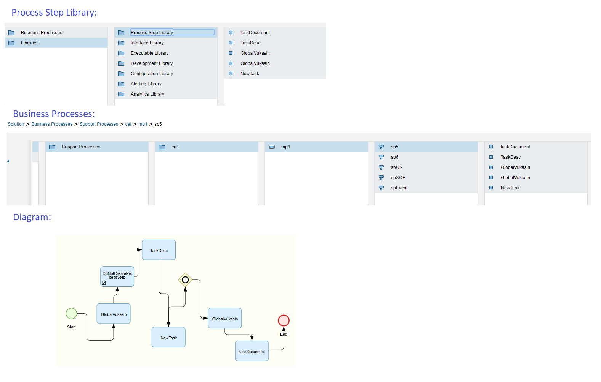

# Symbio to SolMan diagram synchronization

In this article you will be introduced with the basics of how Symbio diagram elements are synchronized to Solution Manager.
***
## Synchronizing basic elements from Symbio to SolMan

### Events

All events from Symbio will be synchronized to adequate SolMan event:

    1. StartEvent => StartEvent
    2. IntermediateEvent => IntermediateEvent
    3. EndEvent => EndEvent

### Gateways

**Symbio Gateway AND** will be synchornized as a *SolMans Gateway Parallel*: 

---

---

**Symbio Gateway OR** will be synchornized as a *SolMans Gateway Inclusive*. Since SolMan does not have *Condition* elements, conditions will be written on the connector arrows:

---

---

**Symbio Gateway Either-OR** will be synchornized as a *SolMans Gateway Exclusive*. Since SolMan does not have *Condition* elements, conditions will be written on the connector arrows:

---

---

### Local tasks

**Local task** created in Symbio will be synchornized to SolMan as a *draft tasks*.

### Global tasks

Symbio **Global task** can be synchronized in SolMan in two ways: as a *draft task* or as a *process step*.
There is a checkbox option in the Detail Content, which if it is checked will be a sign for microservice to synchronize global task as a process step, otherwise, global taks will be synchronized as if it is a local task, so as a draft task. The defaulte value for the checkbox is true:

---

---

If checkbox is selected, Process Step will be created in ProcessStepLibrary, and reference to the Process Step will be created in the diagram. Also the new Process Step in Solman will be created for every instance of a global task in the diagram:

---

---

You can see in the example above the draft task "DoNotCreatProcessStep". Actually in Symbio, that is the Global Task, that has the flag for ProcessStep creation set to false. So because of that, it will be synchronized
as if it is a local task, so no Process Step nor its reference will be created.

##### Documants attached to global tasks

If you attach a link document to the Global task in Symbio, it will also be synchornized with the global task. 
Be aware that this is only available if you create a process step, so the that checkbox has to be set to true:

---

---

