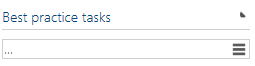

# Symbio to SolMan diagram synchronization

In this article you will be introduced with the basics of how Symbio diagram elements are synchronized to Solution Manager.
***
## Synchronizing basic elements from Symbio to SolMan

### Events

All events from Symbio will be synchronized to adequate SolMan event:

 1. StartEvent => StartEvent
 2. IntermediateEvent => IntermediateEvent
 3. EndEvent => EndEvent

### Gateways

**Symbio Gateway AND** will be synchronized as a *SolMans Gateway Parallel*: 

---

---

**Symbio Gateway OR** will be synchronized as a *SolMans Gateway Inclusive*. Since SolMan does not have *Condition* elements, conditions will be written on the connector arrows:

---

---

**Symbio Gateway Either-OR** will be synchronized as a *SolMans Gateway Exclusive*. Since SolMan does not have *Condition* elements, conditions will be written on the connector arrows:

---

---

### Tasks

Both **Local task** and **Global task** in Symbio can be synchronized in Solution Manager in two ways: as a *draft task* or as a *process step*.

If a [Best Practice Task](BestPracticeTasks.md) is attached to the task element, microservice will synchronize that task as a Process Step.

---

---

If Best Practice Task is **not** connected to a task, a *draft task* will be created in the Solution Manager.

If Best Practice Task is attached, a reference to the Process Step will be created in the diagram.
A reference will have the name of the task and the description of the task, but also a reference to the original Process Step which will remain unchanged.

##### Documents attached to global tasks

If you attach a link document to the Global Task in Symbio, it will also be synchronized with the Global Task. 
Be aware that this is only available if you are creating a reference to the Process Step, so a connected Best Practice Task is required.

---

---

