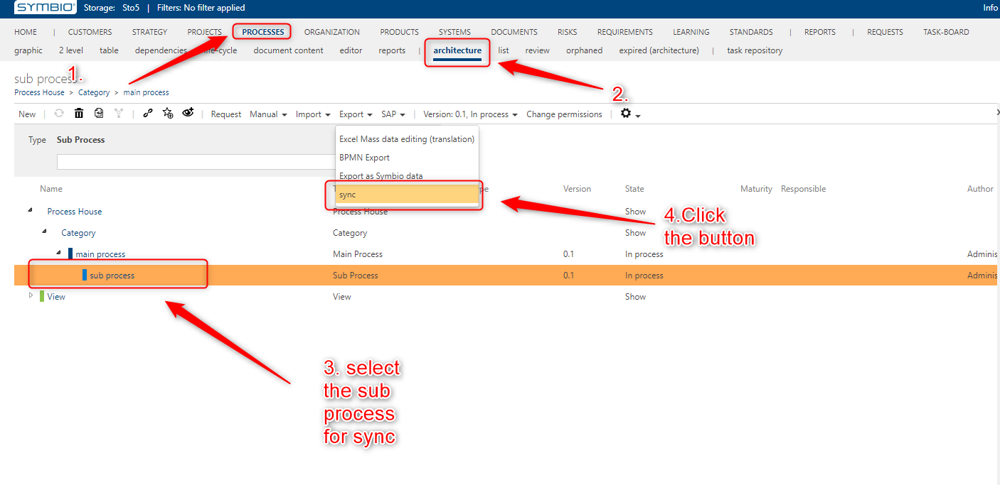
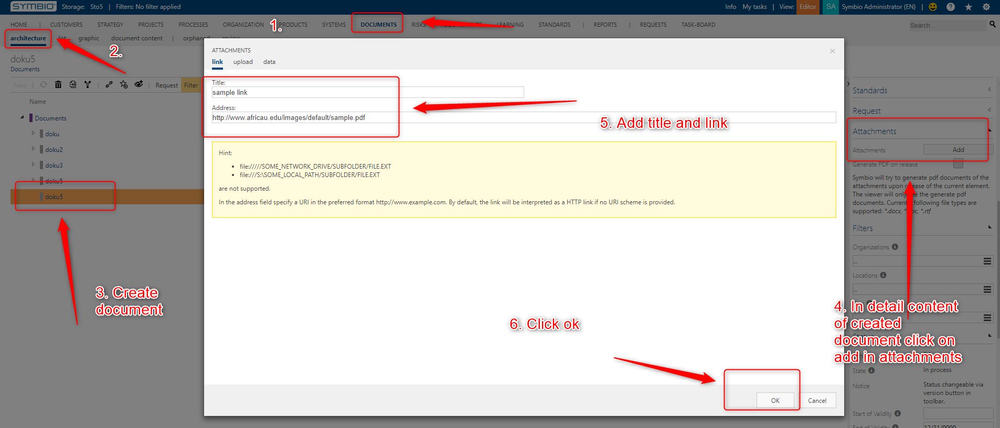
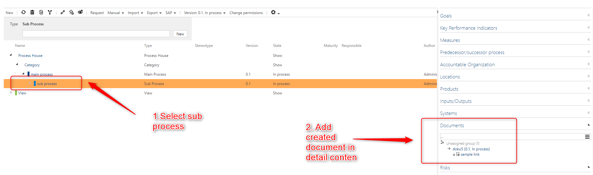
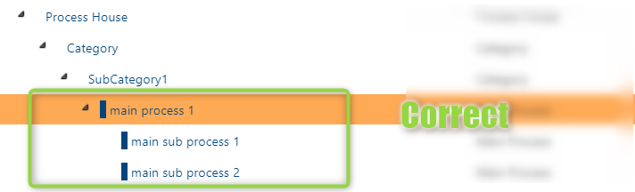
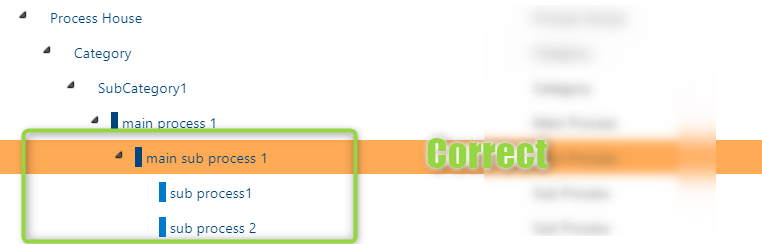
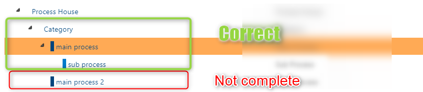
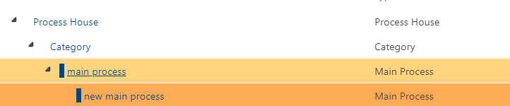

# Symbio to SAP Solution Manager synchronization

In this article you will be introduced with the basic rules of how to create the structure of the elements in Symbio in order for the synchronization to work properly.
Also the way ow to synchronize will be explained, with special cases of deletion and movement of elements in Symbio.
***
## Synchronizing structure from Symbio to SAP Solution Manager

In the new SAP Solution Manager interface the synchronization will be possible only for one sub process at a time. 
The synchronization will occur in three cases:
 1. When manualy selecting the sub process and clicking on a button for synchronization
 2. When releasing a sub process to state "released"
 3. When the sub process that is already synchronized in deleted from Symbio

The process will synchronize the selected the sub proceee and all of its root path ( all parent main processes and categories) 
***
### Synchronization steps
When you have succesfull linked the symbio storage with the SAP Solution Manager interface, create a strcutrue you want to syncronize in the processes facet.
Once you have the sub processes that you want to syncronize, go to architecture.
Select the sub process you want to synchronize, and select the button in the export dropdown menu.
***

***
Once the button is clicked the synchronization is started. 
In a few seconds you can navigate to the SAP Solution Manager branch and check if the structure is synchronized.
***

***

#### Synchronization of documents

Documents can be synchronized if they are attached to sub processes or main processes as corona elements. 
First create a document in documents -architecture. Add an attachment to the document that contains the ulrr to an online document.
***

***
Go to processes-architecture. Select the sub process and add the created document to it.
***

***
Synchronize the sub process, and the document will be shown.
***

***
The document will be synchronize only if:
1. In has the link attached to it.
2. If the link is a url to an online document.
 
#### Deletion

If you delete the sub process then it will be removed in SAP Solution Manager as well.
If you remove the main process or category then nothing will change in SAP Solution Manager. You have to manualy synchronize the new stucrue again. Adn you have to look the  **Recommendations for creating structure in symbio for synchronization** section to see if the structure can be synchronized.

#### Moving of elements 

If you move a sub process, main process or category you have to manualy sync the sub processes if you want to view the new structure in SAP Solution Manager.

## Recommendations for creating structure in symbio for synchronization

Because Symbio and SAP Solution Manager have some differences in the way or representing the structure, not all structure from Symbio can be synchronized to SAP Solution Manager. Below there will be recommended structures that are possible so synchronization, and then the structure that should be avoided if you want to sync the structre to SAP Solution Manager.
For the synchronization to work there always has to be a sbu process at the bottom of the structure.

### Recommended structure

 1.	A category can have multiple categories as a child elements  

2.	A category can have multiple main processes as child elements  

3.	A main process can have multiple main processes as a child elements  

4.	A main process can have multiple sub processes as a child elements  

### Structures that should be avoided
1.	A category should not have a sub process as a child  

2.	A main process should not have a main process and sub process as child elements  

3.	Elements of type “Scenario” will not be synchronized  

4.	Main processes that do not have a sub process as a child or a leaf will not be synchronized  

### Special case

We have the following structure: 
 
The sub process is selected and synchronization between Symbio and SAP Solution Manager is done.
The sub process is deleted in Symbio. 

Instead a new main process is put. 

The synchronization now is not possible. Once the synchronization of a main process that has a sub process has been done it is not possible that this main process has main processes as children any more. 

This is because a main process can be represented in SAP Solution Manager with two types depending if it has sub processes as children.

The recommended action is to delete the main process also and start creating this part of the structure from the beginning