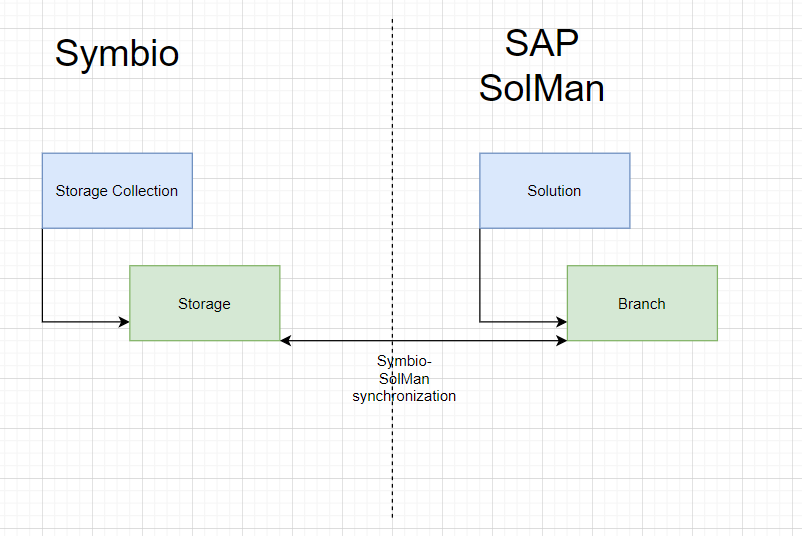
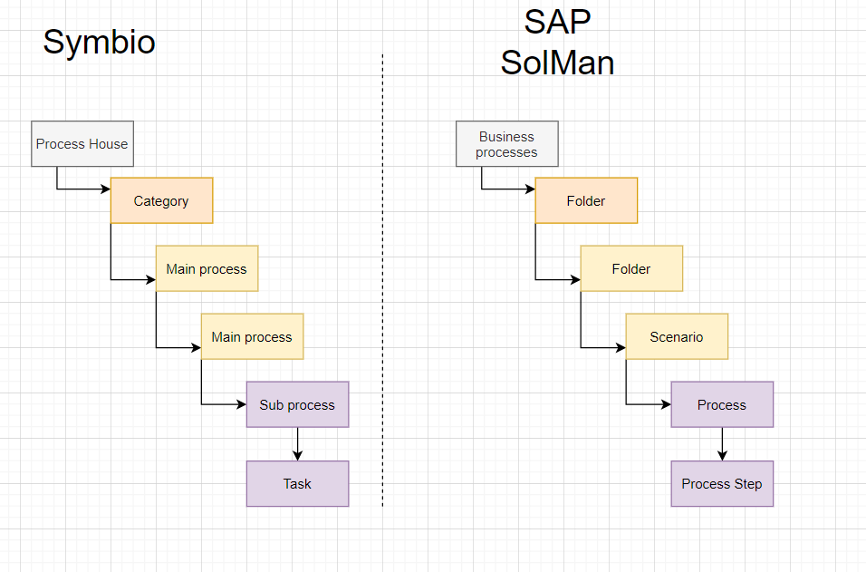
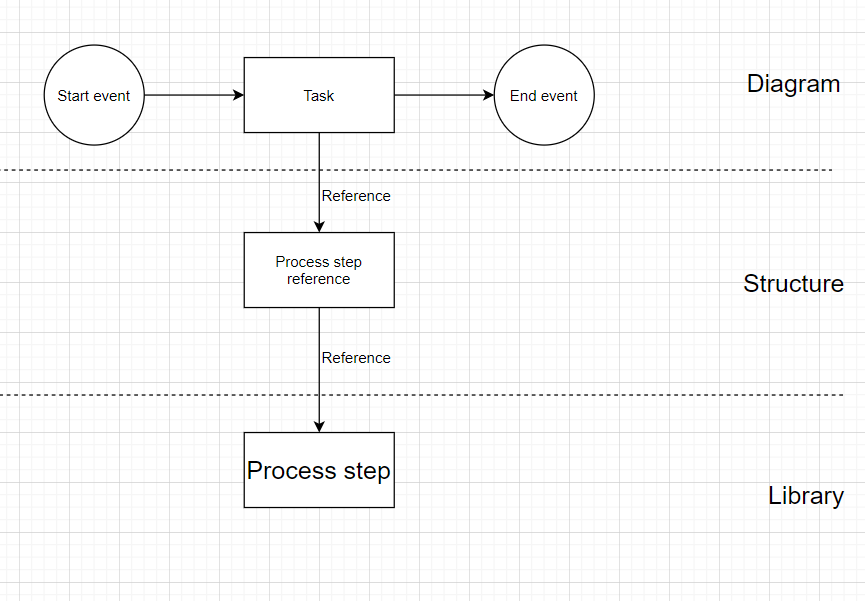

# Symbio to SAP Solution Manager mapping of the elements

This document contains information on comparing Symbio and SAP Solution Manager elements.
##Mapping of Storage collection and Storage
In SAP Solution Manager, Storage Collection would be represented as a Solution. A storage would be represented as a Branch.

The synchronization between Symbio and SAP Solution Manager is done between one Storage and one Branch.
Once the connection between Storage and Branch is established, no other Branch should be connected to the same Storage.
The synchronization should be one with relation 1-1.

## Mapping of process structure

Mapping of the process structure includes elements that can be created in the process facet tree view.
 

Main process can be either a folder or a scenario.
That depends of his direct children. If a main process has sub processes as children then it is a scenario.
If a main process has main processes as children the it would be a folder.
It is not possible to map a main process that has a sub process and a main process as direct children. This is because on SAP Solution Manager side it is not possible to have a scenario under a scenario.
Also a Symbio scenario can be mapped into SAP Solution Manager and will be ignored during the synchronization.

## Mapping of task element
Task shape in a sub process diagram can be directly connected to the best practice task. In SolMan the connection between the task(shape) in the diagram and the process step is more complex.
 

The task shape will reference a Process step Reference (PRS) that is included in the SolMan structure. Then the PSR will reference the real Process Step Original (PSO) that is located in the Library part of SAP Solution Manager.

## Mapping of the library elements
In SAP Solution Manager the library elements are similar to the corona connections in Symbio. Elements like system application and application services are stored in the library in SAP Solution Manager.
The table shows the mapping between these elements. 

| Symbio| SAP Solution Manager          
| ------------- |:-------------:|
| Application      | Logical component group | 
| Application service      | Executable      |   
| Best practice task| Process step Original      |    
|Document| Document      |   
| Role| Lane      |   
