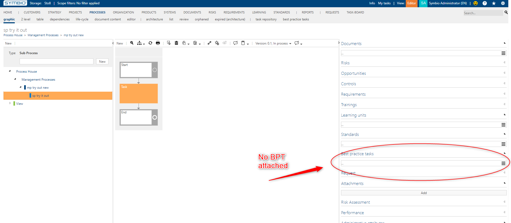
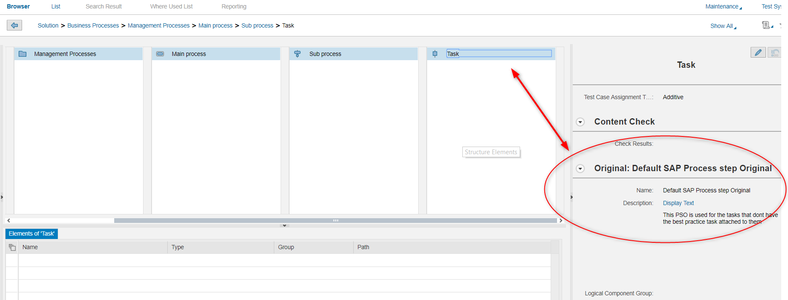
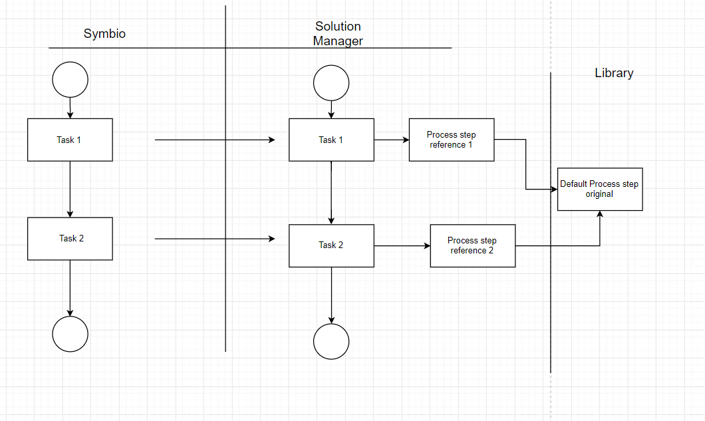
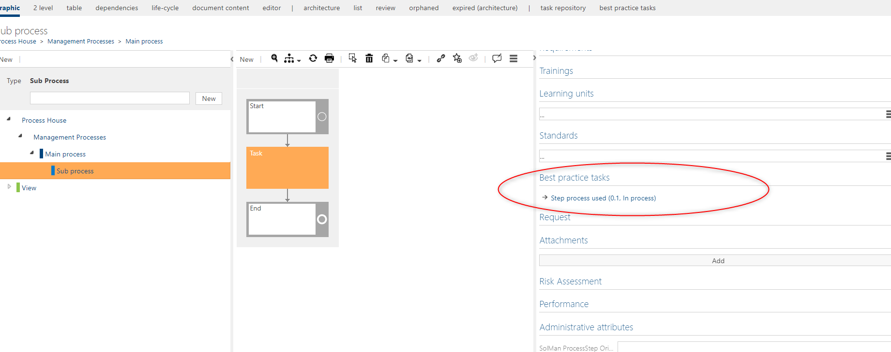
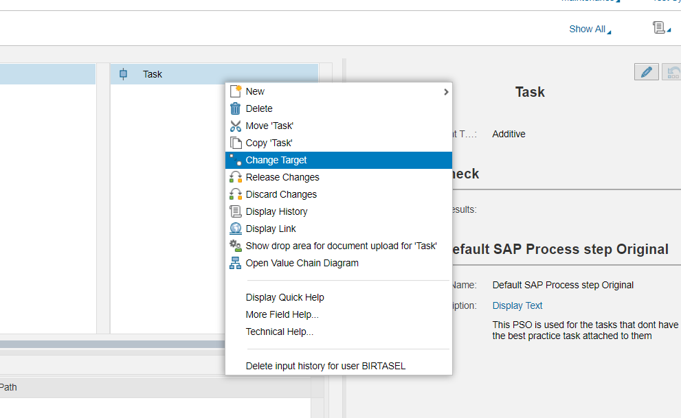
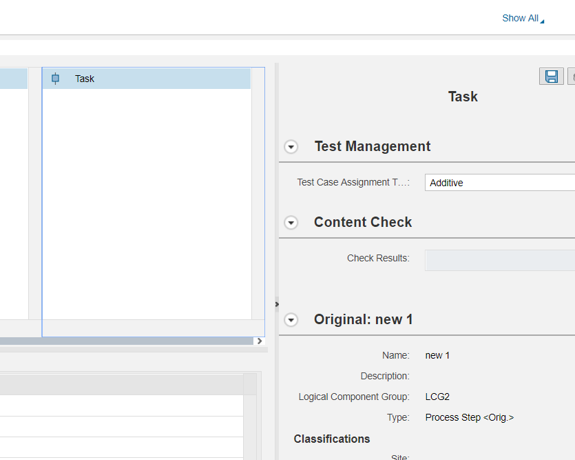
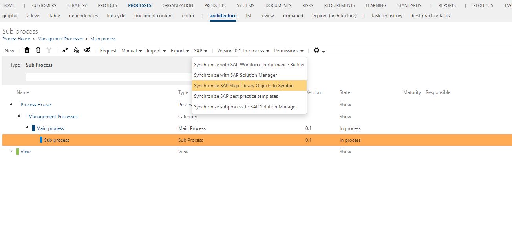
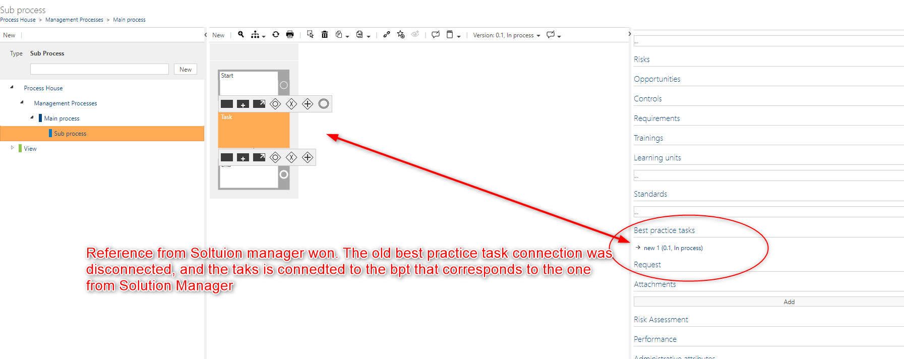

# Task reference consolidation rules
---
Synchronization tasks between Symbio and Solution Manageris a complex operation. Here, all the rules for that synchronization will be described. 
The main point of the consolidation is to keep the consistent state between task references in Symbio in Solution Manager. The users in both systems can changes the references, so the first rule to note is:
**Solution Manager is the owner of the process step references**.

This means that is a task in Solution Manager has a reference, this reference cannot be overridden but the task reference that comes from Symbio.

## Scenarion 1:Synchronize task without best pratice task to Solution Manager

In Symbio you have an task that doesnt have a best practice task attached.

You want to synchronize this sub process to Solution Manager.
When the synchronization starts the tasks that do not have the best practice task attached will be provided with a special Default Process step original. All the tasks that don't have a best practice task will reference the same default process step original.

Graphical representation of the synchronization:

From this moment there are two possible cases. 
### Case 1: Symbio user attached a Best practice task to a task

A user in Symbio attached a Best practice task to a task. Then he synchronizes this to Solution Manager. 

This will change the task reference on the Solution Manager side.
If again the Best practice task is changed and the synchronization from Symbio to Solution Manager is done, the reference will change.

### Case 2: Solution Manager user attached a process step original to a task
Sombody in Solution Manager changes the target of the process step reference and chooses a real process step original instead. 

If he want to consolidate this back to Symbio, for now he can to click on a "Synchronize SAP Step library Object to Symbio" button that will look for the differences between the references of tasks from Symbio and Solution Manager. If there is difference the reference from Solution Manager will win.

Now the task will also have another custom attribute called SolMan process step original id, that stores the id of the Solution Manager reference form the latest consolidation that happened. Now if somebody changes the best practice task attached to the task and tries to synchronize this to Solution Manager, he will fail to do so. Now that a task has been consolidated, it will not be possible to synchronize change of the reference to Solution Manager. if somebody from Soltuon Manager changes the reference and consolidates again, this will change the best practice task attached.

**Important notice**

If on both sides the references change, and the user doesn't click the "Synchronize SAP Step library Object to Symbio" button to consolidate the change from Solution manager to Symbio, then when synchronizing from Symbio to Solution Manager the Symbio reference will win. So if the user wants his changes to be consolidated to Symbio, he has to click on the button, or this changes will be lost the next time he synchronizes a sub process from Symbio to Solution Manager.

Also the default process step original will never be consolidated, and will never exist in Symbio. 

## Scenarion 2:Synchronize task with best practice task to Solution Manager

When a user creates a task and attaches a best practice task to it, and then synchronize that sub process to Solution Manager the task reference will be synchronized to Solution Manager.
Until the user consolidates he can change the reference from Symbio to SolMan. Once he has consolidated the change will not be possible from SolMan.