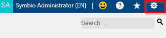
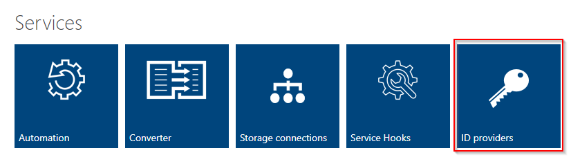
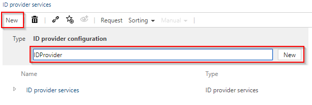
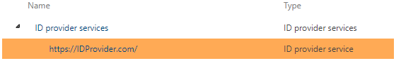
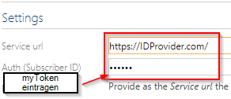

# Create ID Provider

Navigate to a database in Symbio. Then click on the cogwheel at the top
right into the admin area of Symbio.

Here you will find a tile with the name "ID Providers". Click on them.

Now you are in the overview of your ID provider. Click New and choose a
name for your ID provider.

Click on "New" to create it. In the next step, please select the
provider you have created and enter the URL and token from chapter 1.1
on the right side of the detail content.

