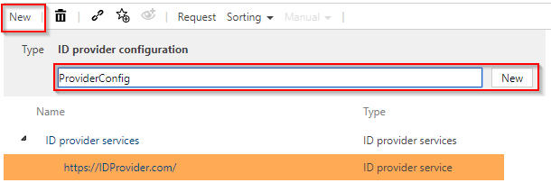
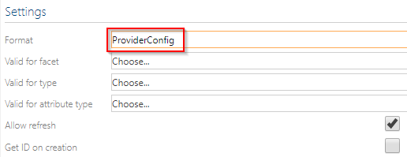
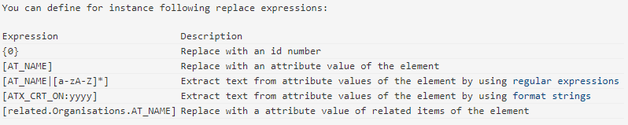
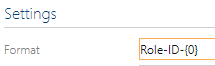
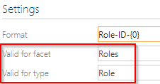
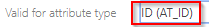

# Create ID Provider Configuration

There is a configuration to configure the ID provider, for example,
which facets and objects it affects. A configuration is created under
the service. Select the service and click on "New" to create the
configuration. 

If you select this created configuration, you can define in the detail
content how this ID should look like and which facets or objects it
concerns.

## Format

This item describes how the composite unique ID should look like.

In this field you can use various placeholders to create an individual
ID. You will find hints and examples below in the detailed
content.

To illustrate this, a prefix "Role-ID-" is selected and "{0}" is set
behind it.

Thus, for example, this prefix is always used with each newly created ID
for a role, followed by an ascending number.

## Facet und Type

You can also configure under "Facet" and "Type" for which facet and
underlying object this ID should be generated. For example, roles.

## Valid for Attribute Type

The field "Valid for Attribute Type" defines for which attribute this ID
is entered in a role. In this example, the created ID is to be written
to the ID attribute of the object.

It could also be written in the name field or some others. Clicking on
the field displays all options.

## Allow refresh

Select this option if you want to allow this ID to be updated
automatically after changing the connected objects in the
ID.

## Get ID on Creation

This option should be selected if you want an ID to be assigned
automatically when a new object is
created.

