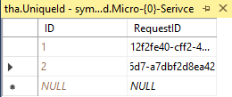
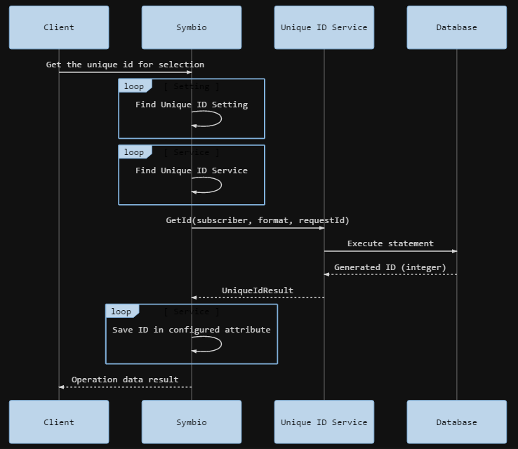

# Introduction
The Unique ID service provides HTTP endpoints to get an unique identifier for a given request id. The request id is in form of a `GUID` and in case of Symbio the request id is corresponding to the origin key of the entity.

In Background the service use a database to generate unique identifier in a given number range. The number range is a format to generate the unique identifier string. For each number range a database table will be generated in the form of:

| ID     | RequestID                             |
| -------|---------------------------------------|
| 1      | 12f2fe40-cff2-4425-b0ae-ffe604fc2d26  |
| 2      | 4a70fded-e658-4e7a-87d4-10a677a71840  |
| 3      | 0bd1f281-0343-4089-96d7-a7dbf2d8ea42  |

The name of the table depends on the given subscriber identifier and the format of the number range.

The following diagram shows the procedure of generated unique identifier for a selected proxy in Symbio.

