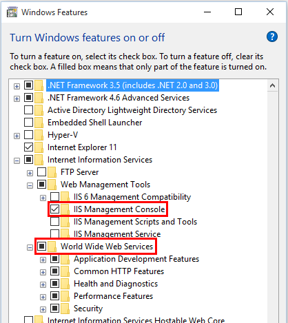
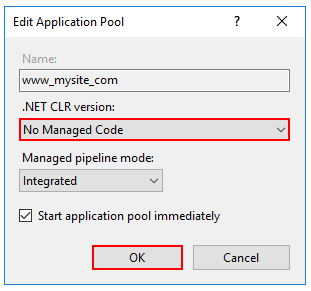

# Manual installation
## Internet Information Services (IIS)

Enable the Web Server (IIS) role and establish role services.
- Windows Server

### Windows desktop operating systems

Navigate to **Control Panel** > **Programs** > **Programs and Features** > **Turn Windows features on or off** (left side of the screen). Open the group for **Internet Information Services** and **Web Management Tools**. Check the box for **IIS Management Console**. Check the box for **World Wide Web Services**. Accept the default features for **World Wide Web Services** or customize the IIS features to suit your needs.

### Windows Server operating systems

For server operating systems, use the **Add Roles and Features** wizard via the **Manage** menu or the link in **Server Manager**. On the **Server Roles** step, check the box for **Web Server (IIS)**.

On the **Role services** step, select the IIS role services you desire or accept the default role services provided.

Proceed through the **Confirmation** step to install the web server role and services. A server/IIS restart is not required after installing the Web Server (IIS) role.

Install the [.NET Core Windows Server Hosting Package](#NetCore) .NET Core Windows Server Hosting Package after IIS Installation

## Create the IIS Website

1. On the target IIS system, create a folder to contain the application's published folders and files, which are described in [Directory Structure](https://docs.microsoft.com/en-us/aspnet/core/hosting/directory-structure).
2. Within the folder you created, create a logs folder to hold application logs (if you plan to enable logging). If you plan to deploy your application with a *logs* folder in the payload, you may skip this step.
3. In **IIS Manager**, create a new website. Provide a **Site name** and set the **Physical path** to the application's deployment folder that you created. Provide the **Binding** configuration and create the website.
4. Set the application pool to **No Managed Code**. ASP.NET Core runs in a separate process and manages the runtime.
5. Configure the IIS Application Pool to load the user profile. This setting is in the Process Model section under the Advanced Settings for the application pool. Set Load User Profile to True. This will store keys under the user profile directory, and protected using DPAPI with a key specific to the user account used for the app pool.

6. Open the **Add Website** window.

   

7. Configure the website.

   

8. In the **Application Pools** panel, open the **Edit Application Pool** window by right-clicking on the website's application pool and selecting **Basic Settings...** from the popup menu.

   

9. Set the **.NET CLR version** to **No Managed Code**.

   

   Note: Setting the **.NET CLR version** to **No Managed Code** is optional. ASP.NET Core doesn't rely on loading the desktop CLR.

10. Confirm the process model identity has the proper permissions.

    If you change the default identity of the application pool (**Process Model** > **Identity**) from **ApplicationPoolIdentity** to another identity, verify that the new identity has the required permissions to access the application's folder, database, and other required resources.

## Deploy the Unique ID micro service

Deploy the Unique ID micro service to the folder you created on the target IIS system. Web Deploy is the recommended mechanism for deployment. Alternatives to Web Deploy are listed below.

Confirm that the published app for deployment isn't running. Files in the publish folder are locked when the app is running. Deployment can't occur because locked files can't be copied.

# Install the .NET Core Windows Server Hosting bundle
1. Install the [.NET Core Windows Server Hosting bundle](https://aka.ms/dotnetcore.2.0.0-windowshosting) on the hosting system. The bundle will install the .NET Core Runtime, .NET Core Library, and the [ASP.NET Core Module](https://docs.microsoft.com/en-us/aspnet/core/fundamentals/servers/aspnet-core-module). The module creates the reverse-proxy between IIS and the Kestrel server. Note: If the system doesn't have an Internet connection, obtain and install the [Microsoft Visual C++ 2015 Redistributable](https://www.microsoft.com/download/details.aspx?id=53840) before installing the .NET Core Windows Server Hosting bundle.
2. Restart the system or execute **net stop was /y** followed by **net start w3svc** from a command prompt to pick up a change to the system PATH.

Note: If you use an IIS Shared Configuration, see [ASP.NET Core Module with IIS Shared Configuration](https://docs.microsoft.com/en-us/aspnet/core/hosting/aspnet-core-module#aspnet-core-module-with-an-iis-shared-configuration).