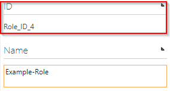

# How to use ID Provider

With the Symbio ID Provider it is possible to assign unique IDs. These
IDs are predefined by the administrator. For example, navigate to a role
and select it. A key symbol appears in the detail content.

Clicking on this icon assigns an ID and displays it after a
refresh.

