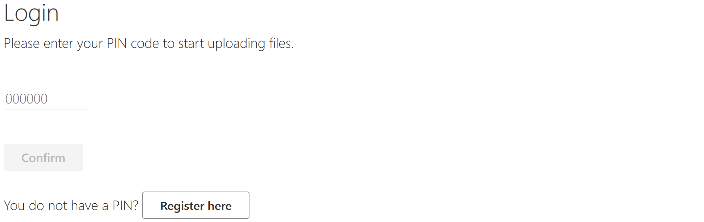
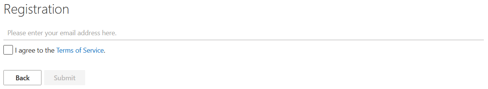

# Login and Registration

Before you can start importing Visio files to Symbio, please make sure to have your PIN at hand.

Enter your PIN and click on "**Confirm**". If you do not have a PIN yet, please start the registration process on the [Homepage](https://visio.symbioweb.com/) by clicking on "**Register here**". The registration itself requires a valid email address and your agreement to the general [Terms and Services](https://visio.symbioweb.com/nutzungsbedingungen.html).

You will receive an email containing the PIN after you registered successfully. Please contact [support](https://www.symbioworld.com/en/service/support/) if you didn’t receive an email.

**Note**: The PIN will be needed for future logins.
