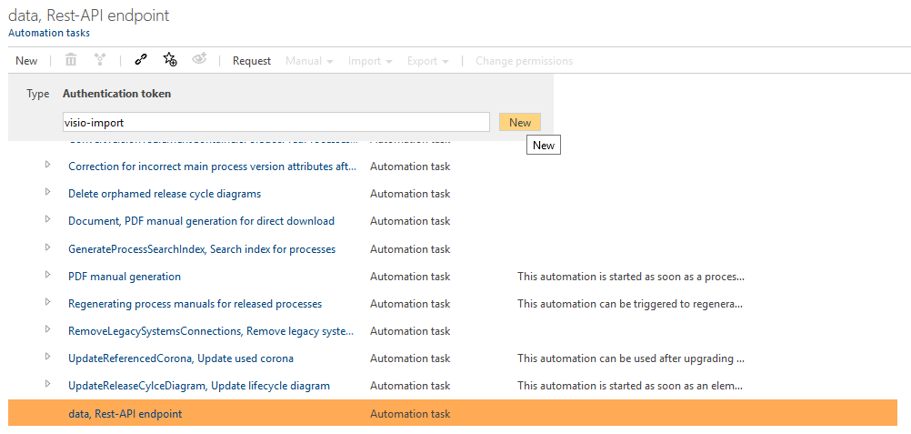
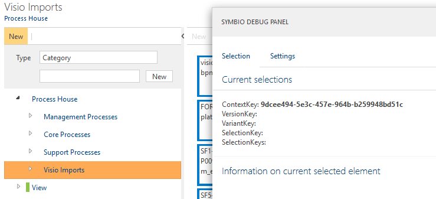
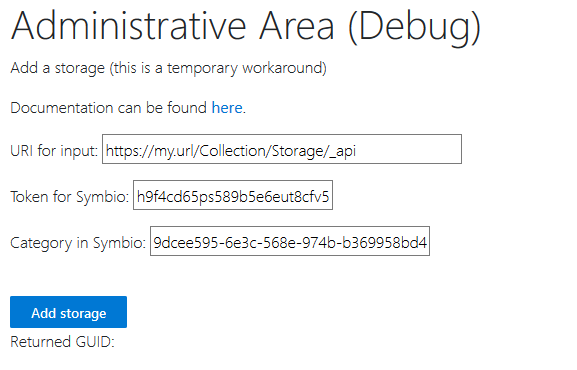
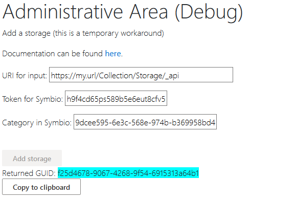

# Generate Upload Token

First, navigate to the 'Automation Tasks' overview. (Admin settings panel > Services > Automation Tasks)  
Select the 'data, Rest API endpoint' task and create a new 'Authentication token' for it.

Select the token and copy the ID displayed on the right.  
Then scroll down to 'Application roles'. Expand it and check the 'Administrator' box.  
If you want to change the token's lifespan (default is 3 months), you can do so in the collapsed 'Validity' field further down below the ID field.

Besides the token an URL is needed for the import. The URL is the base URL to your Symbio instance appended with '_api'. (For example "https://my.url/Collection/Storage/_api".)  
You can also retrieve the URL from token's 'Information' section, just remove everything after '_api' from the URL.

The last thing we need is the GUID for the category or main process in Symbio we want the import to end up in.
Go to your Symbio installation and create a new category/main process or select an existing one and press `ctrl + alt + d`.

Select the 'ContextKey' GUID from there and copy it.

The Token, the URL and GUID are added to the Tool using the [Website](https://visio.symbioweb.com/pzdebug).

Once all information is submitted, the page returns a new GUID. Copy it and distribute it to the users who want to import processes.
(You can distribute one such import token to all users.)
The user will be prompted to enter this token as final step in the import process.

