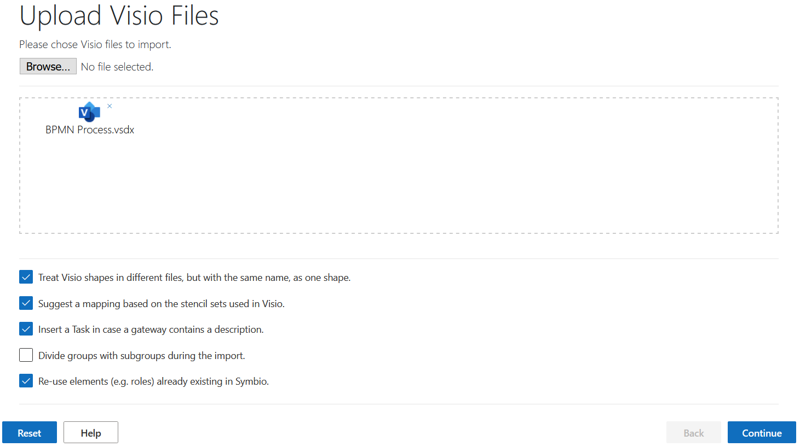
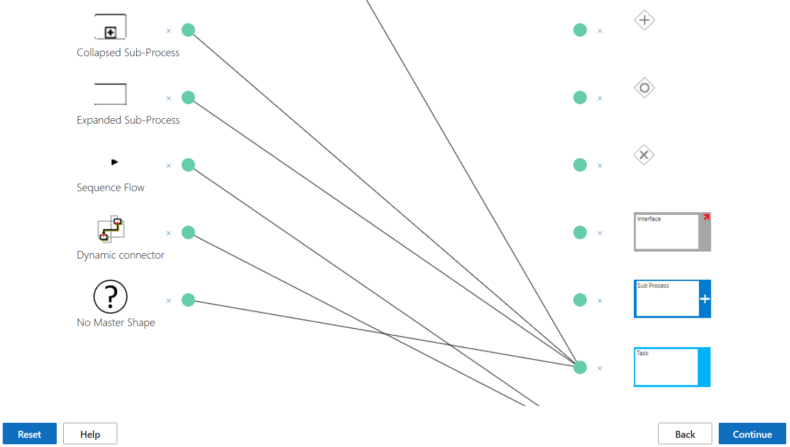
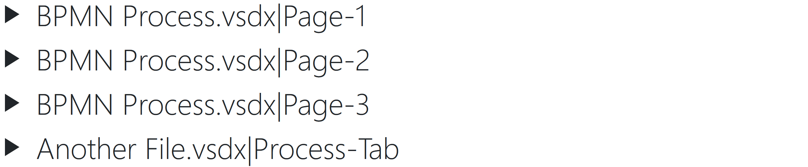
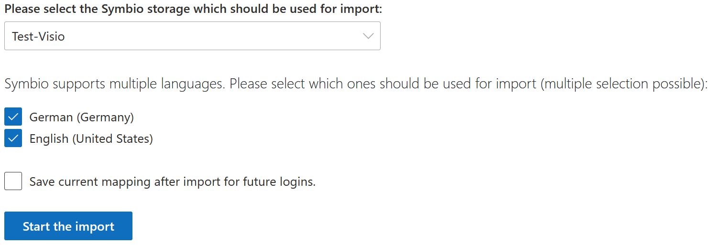

# Using the Visio Importer

The import process requires four steps. First ".vsdx" files need to be uploaded. Then shapes used in Visio must be mapped to shapes used in Symbio. A preview is generated in the third step so that you can verify their mapping. Lastly, you can import the mapped processes to your Symbio instance.

At any stage in the process you can use the "Reset" button in the bottom left to abort the current activity and return to the upload page with all inputs (including uploaded files) reset.

## Step 1: File Upload

Drag ".vsdx" files into the framed area or add files using the "Browse..." button. You can add any number of files with the ".vsdx" extension. If your file is not displayed please check if the extension corresponds to ".vsdx". ".vsd" files must be converted. (Open in Visio, then save using "Save as" with the correct extension). Other file extensions are not supported.

For every added file a small preview is displayed with the Visio icon and the name of the file. You can remove files again by clicking the small 'x' at the top right of the preview.

Once you have added the files you want to map, you can select several options via the checkboxes below the upload area. The default settings cover most use cases, so it is advised to not change this unless you have a specific use case requiring a change. More information about the individual checkboxes can be found in the "**Help**" menu (button in the bottom left).

You can now continue to the mapping by pressing the "**Continue**" button in the bottom right.

## Step 2: Mapping

The mapping page allows to connect Visio shapes with Symbio shapes. Visio shapes of the file(s) are listed on the left, while possible Symbio shapes are listed on the right. To connect two shapes, click the respective green button right next to the shape, one after the other. This draws a line between the two, so you can see what is already connected. A Visio shape can have only one connection, whereas a Symbio shape can be connected to multiple Visio shapes. If you want to remove a connection, click the small 'x' next to the green button.

If the importer recognizes certain Visio shapes (and the respective option was set on the previous page), a mapping will be suggested. Previously used mappings are loaded as well if you stored the mapping of previous process imports during the fourth step.

In case you use the standard BPMN gateways in Visio, map the gateway shape to the generic Symbio gateway and not directly to And, Or or Xor. The importer will then automatically detect the gateway. If no BPMN gateway was used in Visio, please map directly to And, Or or Xor gateways.

At the very bottom of the right list (with Visio shapes) a "No Master Shape" element is present. Sometimes shapes in Visio do not have a master shape and therefore do not appear in the list. If this is the case, you can still use this "No Master Shape" option to map these shapes. In most cases you can ignore the "No Master Shape".

## Step 3: Preview

This page lists every tab of every file you uploaded (as "Filename|Tabname"). Click on an item to expand it and view a preview of how the process would be imported into Symbio.

If any connections are missing or elements do not appear, check the original Visio file if the shapes are correctly connected, or go back to the mapping page (using the "**Back**" button in the bottom right) and revise your mapping to include more shapes.

## Step 4: Import

Start by selecting the Symbio storage you want to import into. The page will then load and present the languages your Symbio storage uses. Select the languages for which you want the importer to add descriptions and titles. For languages not selected, Symbio will insert the default names (e.g. "Task"). At least one language must be selected. After selecting the languages you want to use, you can choose whether you want to save the mapping by checking the checkbox above the upload button. That mapping will then be tied to your account and suggested the next time you map.

Press "**Start the import**" to start the import of the Visio files. Once the page says that the import was successful, you can close the page (there is no need to log out) and view your processes in Symbio. In case you want to import further Visio files, use the "**Reset**" button in the bottom left to return to the first page and start the import process anew.
