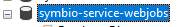
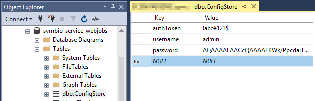
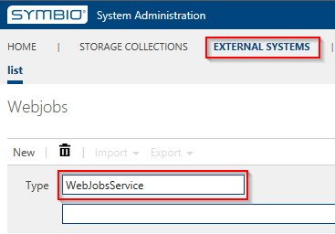
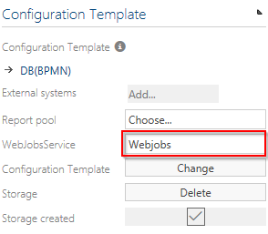
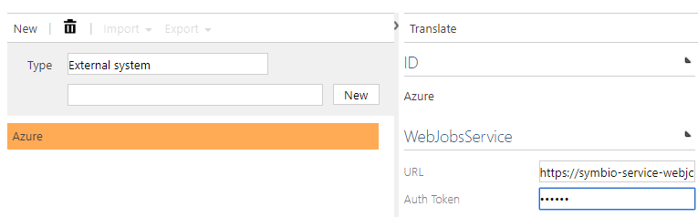

# Web Jobs Scheduler

## Installation

### System Requirements WJMS
- OS-Version: Windows Server 2012 or comparable/ higher
- Dot Net Core Versions: 2.1.3 or comparable/ higher
- IIS-Version: 7.5 or comparable/ higher
- Processors: 4 or higher
- Memory: 4 or higher

### Required Software WJMS
- SQL-Server 2016 or higher
- IIS has to be installed, same preliminaries as Symbio
- .NET Core has to be installed (2.1.4 or later)
- .NET Core Windows Server Hosting (2.1.4 or later)

### Other requirements for WJMS
- The WJMS user set up in the IIS has to own appropriate rights

### Installation
1. download and install NET Core Windows Server Hosting (2.1.4 or later) [here](https://www.microsoft.com/net/download/dotnet-core/2.1)
1. download artifact or ask support for package
1. extract it to the installationfolder of the service
1. create new site in IIS (bindings depending on server structure)
1. Adjust AppPool Basic Settings: No Managed Code
1. create database in SQL Server named after the service 
1. create sql login with owner rights for created database
1. adjust app settings.json by removing 3rd argument of serilog, remove Azure block and set AzureAD to false that it looks like this:

    ```
    {
      "ConnectionStrings": {
        "DefaultConnection": ""
      },
      "Serilog": {
        "Using": [ "Serilog.Sinks.Console", "Serilog.Sinks.Debug"],
        "MinimumLevel": "Debug",
        "WriteTo": [
          { "Name": "Console" },
          { "Name": "Debug" }
        ],
        "Enrich": [ "FromLogContext", "WithMachineName", "WithThreadId" ],
        "Properties": {
          "Application": "symbio-service-webjobs-test"
        }
      },
      "MailSettings": {
        "UseDefaultCredentials": false,
        "Username": "",
        "Password": "",
        "EnableSsl": false,
        "MailFromAddress": "noreply@symbioworld.com",
        "MailFromName": "Symbio Web",
        "Host": "smtp.sendgrid.net",
        "Port": 25,
        "DeliveryMethod": "Network",
        "Timeout": 100000
      },
      "AzureAd": {
        "Enabled": false,
        "Instance": "",
        "Domain": "",
        "TenantId": "",
        "ClientId": "",
        "CallbackPath": ""
      },
      "DisableAuthorization": false
    }
    ```

1. set sql connectionstring to database in appsettings.json
1. TrustServerCertificate=True in connectionstring if there is self signed or no certificate
1. call service within browser so that the tables will be created
1. fill configstore table with Key "token , username and password" and the values <br>  Please note that the password hash value needs to be overwritten in next steps.
1. restart site in IIS
1. call servicelink/register and type in name and clear password to get hashed password. after that save the hash result in configstore table for password value
1. in Symbio navigate to external systems on SysAdmin page
1. create WebJobService by using user-defined value and URL plus authToken fro configstore table

1. in each collection link all existing storages to that WebJob service<br>


## Configuration

### SQL Database
The WebJobs service needs a SQL database to store its settings and job data. A valid connection string has to be configured in the `appsettings.json` file of the service.

```
{
  "ConnectionStrings": {
    "DefaultConnection": "Server=localhost;Database=symbio-service-webjobs;Integrated Security=true"
  }
}
```

### External System

The WebJobs service needs to be added as an external system. For basic authentication an authorization token has to be provided. The token can be an arbitrary string.



In addition to that the same token string has to be preconfigured inside the config store table of the WebJobs service.


## Dashboard

Queued and failed jobs can be managed in the Hangfire dashboard. To reach the dashboard simply call the URL of the service.

By default Hangfire allows access to Dashboard pages only for local requests, which will be problematic once the service runs in a managed environment like an Azure App Service. To grant access to the dashboard different means of authentication/authorization were added to the service and can be configured via appsettings.json.

### Disabling Authorization
Authorization can be disabled by setting ```DisableAuthorization``` to ```true```. This should only be used in an isolated test environment and is not recommended for productive use.

```json
{
  ...
  "DisableAuthorization": false
}
```

### Azure Active Directory Authentication
To authenticate users with an Azure Active Directory register the service as an application as described in the [official documentation](https://docs.microsoft.com/en-us/azure/active-directory/develop/quickstart-v1-add-azure-ad-app). Set the appropriate settings in ```appsettings.json```.

```json
{
    ...
    "AzureAd": {
        "Enabled": "true",
        "Instance": "https://login.microsoftonline.com/",
        "Domain": "<Service URL>",
        "TenantId": "<Directory ID>",
        "ClientId": "<Application ID>",
        "CallbackPath": "/signin-oidc"
    },
    ...
}
```

### Forms Authentication
To use forms authentication the following prerequisites must be fulfilled:
* ```DisableAuthorization``` is set to ```false```
* ```AzureAd.Enabled``` is set to ```false```
* The login credentials for the administrator user of the Hangfire dashboard are already stored in the config store table used by the service.


The password is stored as a strongly hashed and salted string for security reasons. To create a new password hash use the form at ```http(s)://<Service URL>/register```.
