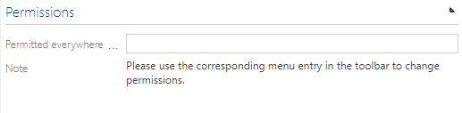

# IsPermittedEverywhere

Please keep in mind that you can set the Symbio authorization token to be permitted everywhere,
with end end date until this permission set is valid.
This permission set may be valid for operations or objects it was not intended for,
and may have an impact on Symbio's behaviour.

