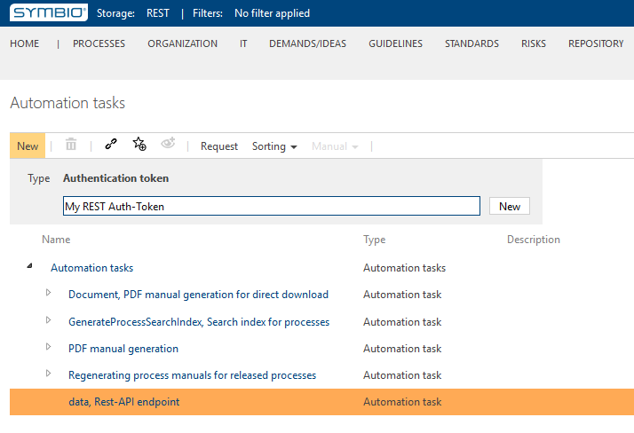
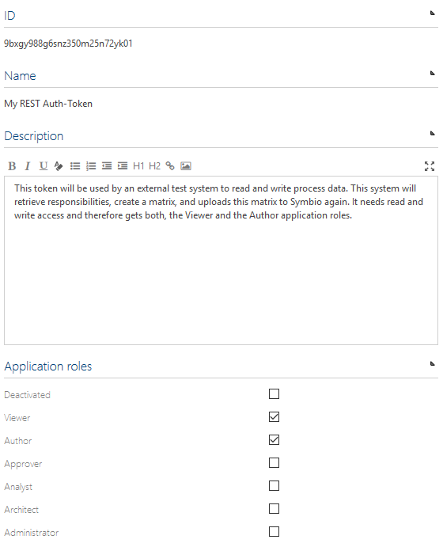

# Symbio REST: Authentication Tokens - How To

## Configuring REST Authentication Tokens

1. Login to the Symbio Database for which you want to create a REST Authentication Token

2. Navigate to the "Admin Page" and select "Automation" there

   `<Base URL>/<Collection>/<Database>/editor/1033/BasePlugin/Facet/Index/Automation.html#/architecture`

3. Select the row "data, Rest-API endpoint", enter a name of your choice, and click "New"

   

4. Configure your new REST Authentication Token

   

5. Mind the token validity at the bottom of the token details, you can set the start and end of validity here

6. Review the provided samples for accessing the REST endpoints, e.g. C#:

```c#
var uri = "<Base URL>/<Collection>/<Database>/_api/rest/facets";

var request = System.Net.WebRequest.CreateHttp(uri);
request.Method = "POST";
request.AllowAutoRedirect = false;
request.Headers.Add("symbio-auth-token", "9bxgy988g6snz350m25n72yk01");
request.ContentLength = 0;

using (var response = request.GetResponse())
{
    //...
}
```

## Creating a first REST Client Application

To get started with your full-fledged REST client application we demonstrate the first steps towards that goal using a .NET Core console application.

1. Install the .NET Core SDK (if not already installed)

   `https://www.microsoft.com/net/download/windows`

2. Open the Windows command line, change to a desired target directory, and enter the following command:

   `dotnet new console -n symbio-rest-client`

3. Change into the newly created diretory `symbio-rest-client`

4. Expand the `Program.cs` file to read:

```c#
using System;
using System.IO;
using System.Net;
using System.Threading.Tasks;

namespace symbio_rest_client
{
    class Program
    {
        static void Main(string[] args)
        {
            Task
                .Run(async () => await CallSymbio())
                .Wait();
        }

        static async Task CallSymbio()
        {
            var uri = "https://localhost/SYMBIO/1803/REST/_api/rest/facets";

            var request = System.Net.WebRequest.CreateHttp(uri) as HttpWebRequest;
            request.Method = "POST";
            request.Headers["symbio-auth-token"] = "9bxgy988g6snz350m25n72yk01";

            using (var response = await request.GetResponseAsync())
            using (var reader = new StreamReader(response.GetResponseStream()))
            {
                Console.WriteLine(reader.ReadToEnd());
            }
        }
    }
}
```

5. Save your files and run the following command

   `dotnet run`

   You should see something like this on the console:

```json
{
    "count": 19,
    "values": [
        {
            "name": "globaltasks",
            "displayName": "Tasks",
            "views": "https://localhost/SYMBIO/1803/REST/_api/rest/facets/globaltasks/views"
        },
        {
            "name": "inputsoutputs",
            "displayName": "Inputs/Outputs",
            "views": "https://localhost/SYMBIO/1803/REST/_api/rest/facets/inputsoutputs/views"
        },
        {
            "name": "it",
            "displayName": "IT",
            "views": "https://localhost/SYMBIO/1803/REST/_api/rest/facets/it/views"
        },
        {
            "name": "knowledge",
            "displayName": "Guidelines",
            "views": "https://localhost/SYMBIO/1803/REST/_api/rest/facets/knowledge/views"
        },
        {
            "name": "kpi",
            "displayName": "Key Performance Indicators",
            "views": "https://localhost/SYMBIO/1803/REST/_api/rest/facets/kpi/views"
        },
        {
            "name": "locations",
            "displayName": "Locations",
            "views": "https://localhost/SYMBIO/1803/REST/_api/rest/facets/locations/views"
        },
        {
            "name": "measures",
            "displayName": "Measures",
            "views": "https://localhost/SYMBIO/1803/REST/_api/rest/facets/measures/views"
        },
        {
            "name": "milestones",
            "displayName": "Milestones",
            "views": "https://localhost/SYMBIO/1803/REST/_api/rest/facets/milestones/views"
        },
        {
            "name": "organization",
            "displayName": "Organization",
            "views": "https://localhost/SYMBIO/1803/REST/_api/rest/facets/organization/views"
        },
        {
            "name": "processes",
            "displayName": "Processes",
            "views": "https://localhost/SYMBIO/1803/REST/_api/rest/facets/processes/views"
        },
        {
            "name": "requirements",
            "displayName": "Demands/ideas",
            "views": "https://localhost/SYMBIO/1803/REST/_api/rest/facets/requirements/views"
        },
        {
            "name": "risks",
            "displayName": "Risks",
            "views": "https://localhost/SYMBIO/1803/REST/_api/rest/facets/risks/views"
        },
        {
            "name": "roles",
            "displayName": "Roles",
            "views": "https://localhost/SYMBIO/1803/REST/_api/rest/facets/roles/views"
        },
        {
            "name": "standards",
            "displayName": "Standards",
            "views": "https://localhost/SYMBIO/1803/REST/_api/rest/facets/standards/views"
        },
        {
            "name": "standardtypes",
            "displayName": "Standard Types",
            "views": "https://localhost/SYMBIO/1803/REST/_api/rest/facets/standardtypes/views"
        },
        {
            "name": "tags",
            "displayName": "Tags",
            "views": "https://localhost/SYMBIO/1803/REST/_api/rest/facets/tags/views"
        },
        {
            "name": "trainings",
            "displayName": "Trainings",
            "views": "https://localhost/SYMBIO/1803/REST/_api/rest/facets/trainings/views"
        },
        {
            "name": "transactions",
            "displayName": "Transactions/Services",
            "views": "https://localhost/SYMBIO/1803/REST/_api/rest/facets/transactions/views"
        },
        {
            "name": "users",
            "displayName": "User",
            "views": "https://localhost/SYMBIO/1803/REST/_api/rest/facets/users/views"
        }
    ]
}
```