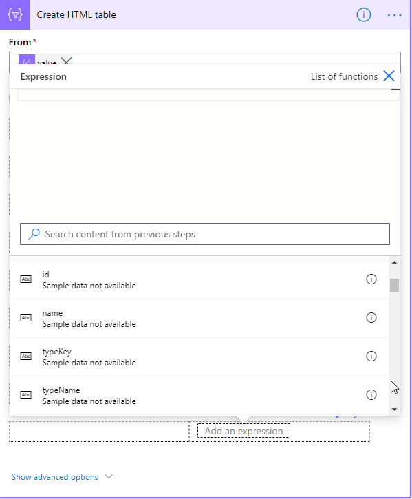

# Power Platform API

Use these APIs to work with Symbio elements inside of the Microsoft Power Platform. This API have a flat response format optimized for the Microsoft environment.

You can access the Swagger definition of these APIs using this URL: https://pz.symbioweb.com/swagger/index.html?url=/swagger/v1/swagger.json - replace "pz.symbioweb.com" with the hostname (and port) of your Symbio instance.

## Format

The format is in form of a very flat object with unique property names for easier selection of the properties inside of the Power Platform editors. The following json is an example of the response:

````json
{
    "value": [
        {
            "id": "3b146a24-d4df-4315-ab22-5f16befe7252",
            "name": "My test",
            "typeKey": "subProcess",
            "typeName": "Sub process",
            "stateKey": "inProcess",
            "stateName": "In process",
            "createdById": "8a753cb8-e7f4-4da5-a5a9-b4594ddd90c2",
            "createdByName": "token",
            "createdOn": "2020-08-28T10:12:19",
            "changedOn": "0001-01-01T00:00:00",
            "identifier": "MT",
            "authorId": "8a753cb8-e7f4-4da5-a5a9-b4594ddd90c2",
            "authorName": "token",
            "properties": {
                "validUntil": "9999-12-31T00:00:00"
            }
        }
    ]
}
```

It is easy to use now e. g. in Power Automate. In the following example you can see the selection a value in a `Create HTML table` action:


