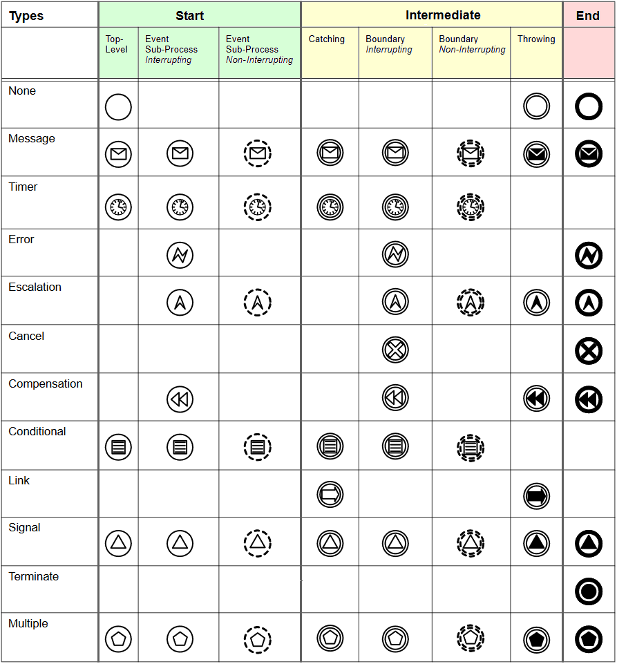

# BPMN events

### Introduction
Events can occur with different continuations, at different locations and with different types.

### Event continuations, that are defined by BPMN are:
- interrupting
- non-interrupting

Any event continuation can be combined with any event location, except <code>non-interrupting</code> and <code>end</code>.

### Event locations, that are defined by BPMN are:
- start
- intermediate
- end

| No. | JSON&nbsp;request&nbsp;/&nbsp;definition | JSON&nbsp;request&nbsp;/ shape | Graphic&nbsp;display | BPMN definition | BPMN&nbsp;display |
|-----|------------------------------------------|--------------------------------|----------------------|-----------------|-------------------|
| 1 | *interrupting:* <code>"properties": {</code> <code>&nbsp;&nbsp;"type": "evStart",</code> <code>&nbsp;&nbsp;"kind": "OBJ"</code> <code>}</code> *non-interrupting:* <code>"properties": {</code> <code>&nbsp;&nbsp;"type": "evStartNonInterrupting",</code> <code>&nbsp;&nbsp;"kind": "OBJ"</code> <code>} </code> | *interrupting:* <code>"properties": {</code> <code>&nbsp;&nbsp;"type": "evStart"</code> <code>}</code> *non-interrupting:* <code>"properties": {</code> <code>&nbsp;&nbsp;"type": "evStartNonInterrupting"</code> <code>}</code> | *interrupting:*  *non-interrupting:*  | *interrupting:* &lt;startEvent&gt; ... &lt;/startEvent&gt;  *non-interrupting:* &lt;startEvent isInterrupting="false"&gt; ... &lt;/startEvent&gt; | *interrupting:*  *non-interrupting:*  |
| 2 | *interrupting:* <code>"properties": {</code> <code>&nbsp;&nbsp;"type": "evIntermediate",</code> <code>&nbsp;&nbsp;"kind": "OBJ"</code> <code>}</code> *non-interrupting:* <code>"properties": {</code> <code>&nbsp;&nbsp;"type": "evIntermediate</code>- <code>NonInterrupting",</code> <code>&nbsp;&nbsp;"kind": "OBJ"</code> <code>}</code> | *interrupting:* <code>"properties": {</code> <code>&nbsp;&nbsp;"type": "evIntermediate"</code> <code>}</code>  *non-interrupting:* <code>"properties": {</code> <code>&nbsp;&nbsp;"type": "evIntermediate</code>- <code>NonInterrupting"</code> <code>}</code> | *interrupting:*  *non-interrupting:*  | *interrupting:* &lt;intermediate- ThrowEvent&gt; ... &lt;/intermediate- ThrowEvent&gt;  *non-interrupting:* &lt;intermediate- ThrowEvent isInterrupting="false"&gt; ... &lt;/intermediate- ThrowEvent&gt; | *interrupting:*  *non-interrupting:*  |
| 3 | *interrupting:* <code>"properties": {</code> <code>&nbsp;&nbsp;"type": "evEnd",</code> <code>&nbsp;&nbsp;"kind": "OBJ"</code> <code>}</code> | *interrupting:* <code>"properties": {</code> <code>&nbsp;&nbsp;"type": "evEnd",</code> <code>}</code>  | *interrupting:*  | *interrupting:* &lt;endEvent&gt; ... &lt;/endEvent&gt; | *interrupting:*  |

### Event types, that are defined by BPMN are:
- none This event does not have a defined *trigger*.
-  throw message;         add <code>"evType": "throwMessage"</code> to <code>"properties"</code> on JSON request definition A *message* is sent to a *participant* when the event has been triggered.
-  catch message;         add <code>"evType": "catchMessage"</code> to <code>"properties"</code> on JSON request definition A *message* arrives from a *participant* and triggers the event.
-  timer;                 add <code>"evType": "timer"</code> to <code>"properties"</code> on JSON request definition A specific *date-time* or a specific *cycle count* triggers the event.
-  throw error;           add <code>"evType": "throwError"</code> to <code>"properties"</code> on JSON request definition An *error* is generatedand when the event has been triggered.
-  catch error;           add <code>"evType": "catchError"</code> to <code>"properties"</code> on JSON request definition The *execution of a business activity creates an error* and triggers the event.
-  throw escalation;      add <code>"evType": "throwEscalation"</code> to <code>"properties"</code> on JSON request definition An *escalation* is generatedand when the event has been triggered.
-  catch escalation;      add <code>"evType": "catchEscalation"</code> to <code>"properties"</code> on JSON request definition A specified *restriction on the execution of a business activity* cannot be complied with and triggers the event.
-  throw cancel;          add <code>"evType": "throwCancel"</code> to <code>"properties"</code> on JSON request definition An *transaction* has to be canceled when the event has been triggered.
-  catch cancel;          add <code>"evType": "catchCancel"</code> to <code>"properties"</code> on JSON request definition A *transaction* cannot be completed and triggers the event.
-  throw compensation;    add <code>"evType": "throwCompensation"</code> to <code>"properties"</code> on JSON request definition A *compensation* is necessary when the event has been triggered.
-  catch compensation;    add <code>"evType": "catchCompensation"</code> to <code>"properties"</code> on JSON request definition A *compensation* occurs and triggers the event.
-  conditional;           add <code>"evType": "conditional"</code> to <code>"properties"</code> on JSON request definition A *condition* becomes *true* and triggers the event.
-  throw link;            add <code>"evType": "throwLink"</code> to <code>"properties"</code> on JSON request definition The *connection* to another section of the same *business process* (e.g. loop start or sequence shortcut start) needs to be initiated when the event has been triggered.
-  catch link;            add <code>"evType": "catchLink"</code> to <code>"properties"</code> on JSON request definition A *connection* to another section of the same *business process* is to be closed (e.g. loop end or sequence shortcut end) and triggers the event.
-  throw signal;          add <code>"evType": "throwSignal"</code> to <code>"properties"</code> on JSON request definition A *signal* to another *business process* needs to be broadcast when the event has been triggered.
-  catch signal;          add <code>"evType": "catchSignal"</code> to <code>"properties"</code> on JSON request definition A *signal* arrives that has been broadcast from another *business process* and triggers the event.
-  terminate;             add <code>"evType": "terminate"</code> to <code>"properties"</code> on JSON request definition All activities in the *business process* should be ended immediately when the event has been triggered.
-  throw multiple;        add <code>"evType": "throwMultiple"</code> to <code>"properties"</code> on JSON request definition *All of multiple* consequences (trigers) occure when the event has been triggered.
-  catch multiple;        add <code>"evType": "catchMultiple"</code> to <code>"properties"</code> on JSON request definition At least *one of several* consequences (trigers) has been encountered and triggers the event.
-  parallel multiple;     add <code>"evType": "parMultiple"</code> to <code>"properties"</code> on JSON request definition *All of several* triggers have been encountered and trigger the event.

### All available combinations of event continuations, locations and types:

