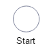
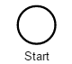
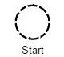
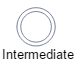
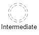
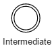
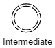
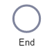
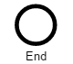

# Events

# Introduction
Events can occur at different locations, with different continuations and with different types.

### Event continuations, that are defined by BPMN are:
- interrupting
- non-interrupting

Any event continuation can be combined with any event location, except <code>non-interrupting</code> and <code>end</code>.

### Event locations, that are defined by BPMN are:
- start
- intermediate
- end

| No. | JSON&nbsp;request&nbsp;/&nbsp;definition | JSON&nbsp;request&nbsp;/ shape | Graphic display | BPMN definition | BPMN display |
|-----|---------------------------|----------------------|-----------------|-----------------|--------------|
| 1 | *interrupting:* <code>"properties": {</code> <code>&nbsp;&nbsp;"type": "evStart",</code> <code>&nbsp;&nbsp;"kind": "OBJ"</code> <code>}</code> *non-interrupting:* <code>"properties": {</code> <code>&nbsp;&nbsp;"type": "evStartNonInterrupting",</code> <code>&nbsp;&nbsp;"kind": "OBJ"</code> <code>} | *interrupting:* <code>"properties": {</code> <code>&nbsp;&nbsp;"type": "evStart"</code> <code>}</code> *non-interrupting:* <code>"properties": {</code> <code>&nbsp;&nbsp;"type": "evStartNonInterrupting"</code> <code>}</code> | *interrupting:*  *non-interrupting:*  | *interrupting:* </code>&lt;startEvent&gt;...&lt;/startEvent&gt;</code>  *non-interrupting:* &lt;startEvent isInterrupting="false"&gt; ... &lt;/startEvent&gt; | *interrupting:*  *non-interrupting:*  |  |
| 2 | *interrupting:* <code>"properties": {</code> <code>&nbsp;&nbsp;"type": "evIntermediate",</code> <code>&nbsp;&nbsp;"kind": "OBJ"</code> <code>}</code> *non-interrupting:* <code>"properties": {</code> <code>&nbsp;&nbsp;"type": "evIntermediate</code>- <code>NonInterrupting",</code> <code>&nbsp;&nbsp;"kind": "OBJ"</code> <code>}</code> | *interrupting:* <code>"properties": {</code> <code>&nbsp;&nbsp;"type": "evIntermediate"</code> <code>}</code>  *non-interrupting:* "properties": {</code> <code>&nbsp;&nbsp;"type": "evIntermediate</code>- <code>NonInterrupting"</code> <code>}</code> | *interrupting:*  *non-interrupting:*  | *interrupting:* </code>&lt;intermediateThrowEvent&gt; ... &lt;/intermediateThrowEvent&gt;</code>  *non-interrupting:* </code>&lt;intermediateThrowEvent isInterrupting="false"&gt; ... &lt;/intermediateThrowEvent&gt;</code> | *interrupting:*  *non-interrupting:*  |  |
| 3 | *interrupting:* <code>"properties": {</code> <code>&nbsp;&nbsp;"type": "evEnd",</code> <code>&nbsp;&nbsp;"kind": "OBJ"</code> <code>}</code> | *interrupting:* <code>"properties": {</code> <code>&nbsp;&nbsp;"type": "evEnd",</code> <code>}</code>  | *interrupting:*  | *interrupting:* </code>&lt;endEvent&gt; ... &lt;/endEvent&gt;</code>  | *interrupting:*  |  |

### Event types, that are defined by BPMN are:
- none
- throw message
- catch message
- timer
- throw error
- catch error
- throw escalation
- catch escalation
- throw cancel
- catch cancel
- throw compensation
- catch compensation
- conditional
- throw link
- catch link
- throw signal
- catch signal
- terminate
- throw multiple
- catchm ultiple
- parallel multiple
