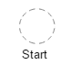
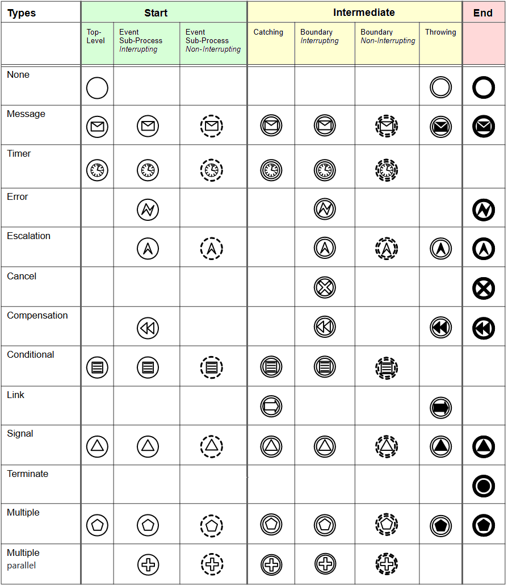

# Events

# Introduction
Events can occur with different continuations, at different locations and with different types.

### Event continuations, that are defined by BPMN are:
- interrupting
- non-interrupting

Any event continuation can be combined with any event location, except <code>non-interrupting</code> and <code>end</code>.

### Event locations, that are defined by BPMN are:
- start
- intermediate
- end

| No. | JSON&nbsp;request&nbsp;/&nbsp;definition | JSON&nbsp;request&nbsp;/ shape | Graphic display | BPMN definition | BPMN display |
|-----|------------------------------------------|--------------------------------|-----------------|-----------------|--------------|
| 1 | *interrupting:* <code>"properties": {</code> <code>&nbsp;&nbsp;"type": "evStart",</code> <code>&nbsp;&nbsp;"kind": "OBJ"</code> <code>}</code> *non-interrupting:* <code>"properties": {</code> <code>&nbsp;&nbsp;"type": "evStartNonInterrupting",</code> <code>&nbsp;&nbsp;"kind": "OBJ"</code> <code>} </code> | *interrupting:* <code>"properties": {</code> <code>&nbsp;&nbsp;"type": "evStart"</code> <code>}</code> *non-interrupting:* <code>"properties": {</code> <code>&nbsp;&nbsp;"type": "evStartNonInterrupting"</code> <code>}</code> | *interrupting:*  *non-interrupting:*  | *interrupting:* &lt;startEvent&gt;...&lt;/startEvent&gt;  *non-interrupting:* &lt;startEvent isInterrupting="false"&gt; ... &lt;/startEvent&gt; | *interrupting:*  *non-interrupting:*  |
| 2 | *interrupting:* <code>"properties": {</code> <code>&nbsp;&nbsp;"type": "evIntermediate",</code> <code>&nbsp;&nbsp;"kind": "OBJ"</code> <code>}</code> *non-interrupting:* <code>"properties": {</code> <code>&nbsp;&nbsp;"type": "evIntermediate</code>- <code>NonInterrupting",</code> <code>&nbsp;&nbsp;"kind": "OBJ"</code> <code>}</code> | *interrupting:* <code>"properties": {</code> <code>&nbsp;&nbsp;"type": "evIntermediate"</code> <code>}</code>  *non-interrupting:* <code>"properties": {</code> <code>&nbsp;&nbsp;"type": "evIntermediate</code>- <code>NonInterrupting"</code> <code>}</code> | *interrupting:*  *non-interrupting:*  | *interrupting:* &lt;intermediateThrowEvent&gt; ... &lt;/intermediateThrowEvent&gt;  *non-interrupting:* &lt;intermediateThrowEvent isInterrupting="false"&gt; ... &lt;/intermediateThrowEvent&gt; | *interrupting:*  *non-interrupting:*  |
| 3 | *interrupting:* <code>"properties": {</code> <code>&nbsp;&nbsp;"type": "evEnd",</code> <code>&nbsp;&nbsp;"kind": "OBJ"</code> <code>}</code> | *interrupting:* <code>"properties": {</code> <code>&nbsp;&nbsp;"type": "evEnd",</code> <code>}</code>  | *interrupting:*  | *interrupting:* &lt;endEvent&gt; ... &lt;/endEvent&gt; | *interrupting:*  |

### Event types, that are defined by BPMN are:
- none
- throw message;         add <code>"evType": "throwMessage"</code> to <code>"properties"</code> on JSON request definition
- catch message;         add <code>"evType": "catchMessage"</code> to <code>"properties"</code> on JSON request definition
- timer;                 add <code>"evType": "timer"</code> to <code>"properties"</code> on JSON request definition
- throw error;           add <code>"evType": "throwError"</code> to <code>"properties"</code> on JSON request definition
- catch error;           add <code>"evType": "catchError"</code> to <code>"properties"</code> on JSON request definition
- throw escalation;      add <code>"evType": "throwEscalation"</code> to <code>"properties"</code> on JSON request definition
- catch escalation;      add <code>"evType": "catchEscalation"</code> to <code>"properties"</code> on JSON request definition
- throw cancel;          add <code>"evType": "throwCancel"</code> to <code>"properties"</code> on JSON request definition
- catch cancel;          add <code>"evType": "catchCancel"</code> to <code>"properties"</code> on JSON request definition
- throw compensation;    add <code>"evType": "throwCompensation"</code> to <code>"properties"</code> on JSON request definition
- catch compensation;    add <code>"evType": "catchCompensation"</code> to <code>"properties"</code> on JSON request definition
- conditional;           add <code>"evType": "conditional"</code> to <code>"properties"</code> on JSON request definition
- throw link;            add <code>"evType": "throwLink"</code> to <code>"properties"</code> on JSON request definition
- catch link;            add <code>"evType": "catchLink"</code> to <code>"properties"</code> on JSON request definition
- throw signal;          add <code>"evType": "throwSignal"</code> to <code>"properties"</code> on JSON request definition
- catch signal;          add <code>"evType": "catchSignal"</code> to <code>"properties"</code> on JSON request definition
- terminate;             add <code>"evType": "terminate"</code> to <code>"properties"</code> on JSON request definition
- throw multiple;        add <code>"evType": "throwMultiple"</code> to <code>"properties"</code> on JSON request definition
- catchm ultiple;        add <code>"evType": "catchMultiple"</code> to <code>"properties"</code> on JSON request definition
- parallel multiple;     add <code>"evType": "parMultiple"</code> to <code>"properties"</code> on JSON request definition

### All available combinations of event continuations, locations and types:

