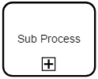

# Sub-processes

Sub-processes can accure with different types.

### The sub-provess types, that are defined by BPMN are:
- none
- loop
- muilti-instance
- compensation
- ad hoc

| No. | JSON&nbsp;request&nbsp;/&nbsp;definition | JSON&nbsp;request&nbsp;/&nbsp;shape | Graphic display | BPMN definition | BPMN display |
|-----|---------------------------|----------------------|-----------------|-----------------|--------------|
| 1 | <code>"properties": {</code> <code>&nbsp;&nbsp;"type": "subProcess",</code> <code>&nbsp;&nbsp;"kind": "OBJ"</code> <code>}</code>  *or:* <code>"properties": {</code> <code>&nbsp;&nbsp;"type": "subProcess",</code> <code>&nbsp;&nbsp;"kind": "OBJ",</code> <code>&nbsp;&nbsp;"processMarker": "none"</code> <code>}</code> | <code>"properties": {</code> <code>&nbsp;&nbsp;"type": "subProcess"</code> <code>}</code>  |  | </code>&lt;subProcess&gt;...&lt;/subProcess&gt;</code>  |  |
