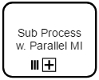
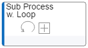
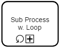
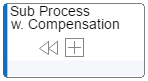
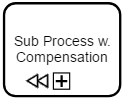
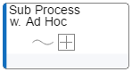
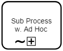
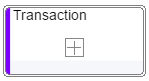
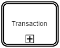
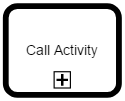

# BPMN sub-processes and call activities

Sub-processes and call activities are non-atomic pieces of *work* within a *business process*. They are - besides the *tasks* - a graphical representation of **Activities**.

Sub-processes can occure with different types.

### The sub-provess types, that are defined by BPMN are:
- none
- loop
- muilti-instance
- compensation
- ad hoc
- transaction

A *sub-process* is a non-atomic (compound) **Activity** that is included within a *business process* or a choreography. It is compound in that it can be broken down into a finer level of detail through a set of sub-**Activities**.

A *transaction* is a *sub-process* that is supported by a special protocol that insures that all parties involved have complete agreement that the activity should be completed or cancelled. The attributes of the activity will determine if the activity is a transaction.

| No. | JSON&nbsp;request&nbsp;/&nbsp;definition | JSON&nbsp;request&nbsp;/&nbsp;shape | Graphic display | BPMN definition | BPMN display |
|-----|---------------------------|----------------------|-----------------|-----------------|--------------|
| 1 | <code>"properties": {</code> <code>&nbsp;&nbsp;"type": "subProcess",</code> <code>&nbsp;&nbsp;"kind": "OBJ"</code> <code>}</code>  *or:* <code>"properties": {</code> <code>&nbsp;&nbsp;"type": "subProcess",</code> <code>&nbsp;&nbsp;"kind": "OBJ",</code> <code>&nbsp;&nbsp;"processMarker": "none"</code> <code>}</code> | <code>"properties": {</code> <code>&nbsp;&nbsp;"type": "subProcess"</code> <code>}</code>  |  | </code>&lt;subProcess&gt; ...  &lt;/subProcess&gt;</code>  |  |
| 2 | <code>"properties": {</code> <code>&nbsp;&nbsp;"type": "subProcess",</code> <code>&nbsp;&nbsp;"kind": "OBJ",</code> <code>&nbsp;&nbsp;"processMarker": "parallelMultiple"</code> <code>}</code> | <code>"properties": {</code> <code>&nbsp;&nbsp;"type": "subProcess"</code> <code>}</code>  |  | </code>&lt;subProcess&gt; ...  &lt;multiInstance-  LoopCharacteristics/&gt; ... &lt;/subProcess&gt;</code>  |  |
| 3 | <code>"properties": {</code> <code>&nbsp;&nbsp;"type": "subProcess",</code> <code>&nbsp;&nbsp;"kind": "OBJ",</code> <code>&nbsp;&nbsp;"processMarker": "loop"</code> <code>}</code> | <code>"properties": {</code> <code>&nbsp;&nbsp;"type": "subProcess"</code> <code>}</code>  |  | </code>&lt;subProcess&gt; ...  &lt;standardLoop- Characteristics/&gt; ... &lt;/subProcess&gt;</code>  |  |
| 4 | <code>"properties": {</code> <code>&nbsp;&nbsp;"type": "subProcess",</code> <code>&nbsp;&nbsp;"kind": "OBJ",</code> <code>&nbsp;&nbsp;"processMarker": "compensation"</code> <code>}</code> | <code>"properties": {</code> <code>&nbsp;&nbsp;"type": "subProcess"</code> <code>}</code>  |  | </code>&lt;subProcess isFor- Compensation="true"&gt; ...  &lt;standardLoop- Characteristics/&gt; ... &lt;/subProcess&gt;</code>  |  |
| 5 | <code>"properties": {</code> <code>&nbsp;&nbsp;"type": "subProcess",</code> <code>&nbsp;&nbsp;"kind": "OBJ",</code> <code>&nbsp;&nbsp;"processMarker": "adHoc"</code> <code>}</code> | <code>"properties": {</code> <code>&nbsp;&nbsp;"type": "subProcess"</code> <code>}</code>  |  | </code>&lt;adHocSubProcess&gt; ... &lt;/adHocSubProcess&gt;</code>  |  |
| 6 | <code>"properties": {</code> <code>&nbsp;&nbsp;"type": "transaction",</code> <code>&nbsp;&nbsp;"kind": "OBJ"</code> <code>}</code>  *or:* <code>"properties": {</code> <code>&nbsp;&nbsp;"type": "transaction",</code> <code>&nbsp;&nbsp;"kind": "OBJ",</code> <code>&nbsp;&nbsp;"processMarker": "none"</code> <code>}</code> | <code>"properties": {</code> <code>&nbsp;&nbsp;"type": "transaction"</code> <code>}</code>  |  | </code>&lt;transaction&gt; ...  &lt;/transaction&gt;</code>  |  |

### BPMN call activity

A *call activity* identifies a point in the *business process* where a global *sub-process* or a global *task* is used. The *call activity* acts as a wrapper for the invocation of a global *sub-process* or a global *task* within the *business process*. 

| No. | JSON&nbsp;request&nbsp;/&nbsp;definition | JSON&nbsp;request&nbsp;/&nbsp;shape | Graphic display | BPMN definition | BPMN display |
|-----|---------------------------|----------------------|-----------------|-----------------|--------------|
| 7 | <code>"properties": {</code> <code>&nbsp;&nbsp;"type": "callActivity",</code> <code>&nbsp;&nbsp;"kind": "OBJ"</code> <code>}</code>  *or:* <code>"properties": {</code> <code>&nbsp;&nbsp;"type": "callActivity",</code> <code>&nbsp;&nbsp;"kind": "OBJ",</code> <code>&nbsp;&nbsp;"processMarker": "none"</code> <code>}</code> | <code>"properties": {</code> <code>&nbsp;&nbsp;"type": "callActivity"</code> <code>}</code>  |  | </code>&lt;callActivity&gt; ...  &lt;/callActivity&gt;</code>  |  |
