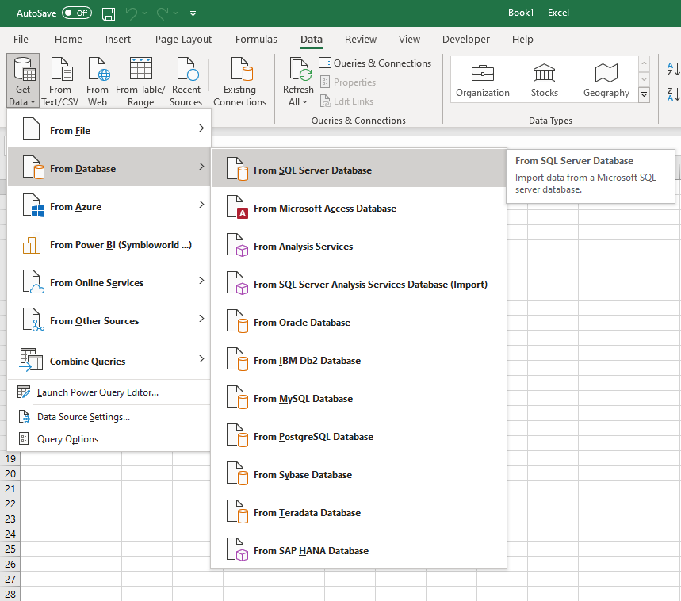
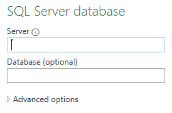
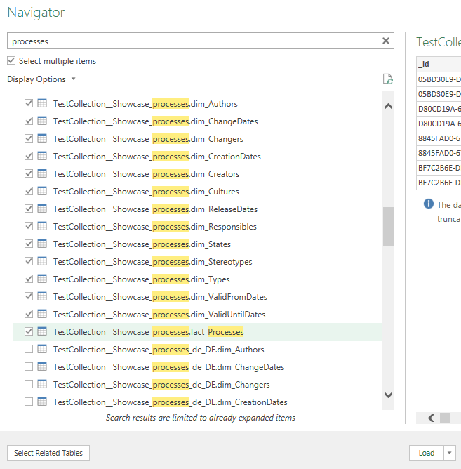
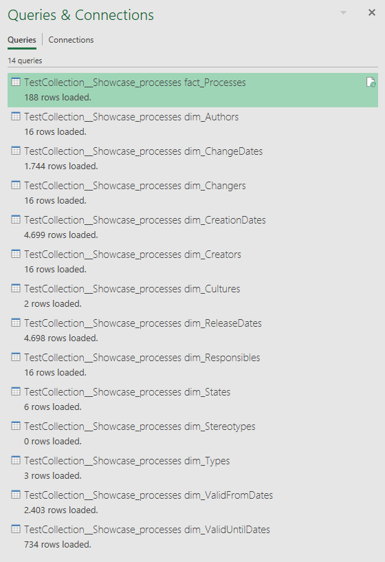
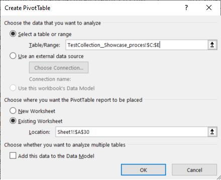
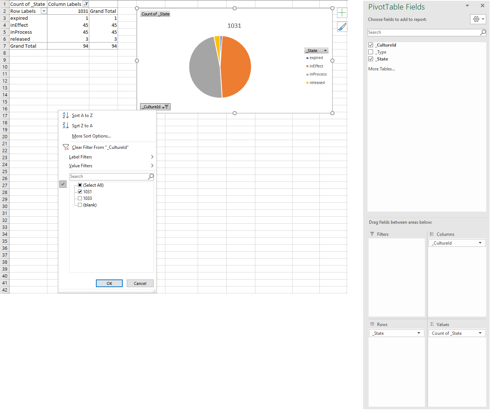
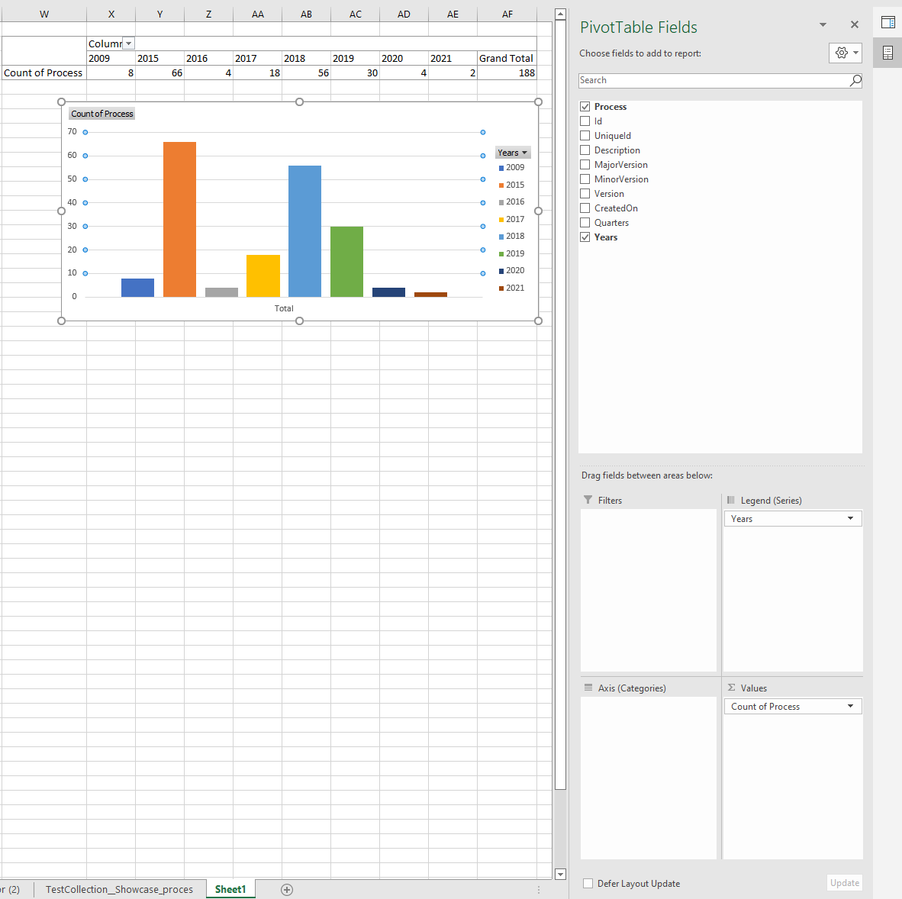

# Report Example within Excel
Since some users might face some difficulties by using PowerBI or they simply would like to create their report in Excel format, here we describe how to do this with a concrete example.

## Load Data
At first load data to a blank file.
1. Open MS-Excel application.
2. Go to 'Data' Tab -> Get Data (in 'Get & Transform Data' Section)
3. Select 'From Database' -> Select 'from SQL Server Database'. See screen shot below:

    ||
    |:--:|
    | <b>Fig.1 Get data into Excel file</b>|

4. Enter the Server name here and the name of the Database. You can find this information in the email with your access data. See screen shot below:

    ||
    |:--:|
    | <b>Fig.2 Connect to SQL Server database from Excel file</b>|

   **Note:** Here you have to copy data from SQL Server since you do not have the option of Direct Query like in Power BI.
5. In the Navigator select all the tables you need to create your report and click on **Load**.
Only select the needed tables to keep your file clear.
If you put the name of the schema (for example *processes.*) into the search bar, only the tables of the regarding models are suggested. (Your access data sent in the email contains the name of the SQL Schema).
 
   **Note:** There is also an option to just check the main table (here: *TestCollection__Showcase_processes.fact_Processes*) of a star-schema and auto-select all related tables of this model. This option is on the bottom-left corner and is called **Select Related Tables**-Button.
Just make sure that you can select multiple items.
   
    ||
    |:--:|
    | <b>Fig.3 Select one of available star-schemas</b>|

6. Then you get the selected star-schema tables loaded into excel sheets and find them listed on the right side of the application under *Queries & Connections*. 

    ||
    |:--:|
    | <b>Fig.4 Loaded star-schema tables within Excel file</b>| 

## Create your first ODS2.0 report in excel
### Example 1
Creating a report in excel is somehow as easy as Power BI. However, to project state of processes into a pie-chart (for example) from our model, you need to create an intermediate level which is the pivot table to project the count of each state into the pivot-table then create the required pie-chart.
And here are the steps in such case:

1. After loading data from SqL Server database into your excel file, create a new worksheet.
2. Select the cell where you want to insert the pivot table, let it be Sheet1.
3. Go to 'Insert' Tab, then click on the 'PivotTable' icon on the left side of Data ribbon.
4. Select the range which you need to pivot data from. In our example you may choose the _State column from fact_processes table and also _CultureId column since this star schema has both cultures, english and german (for further info please check 'Star Schema Model' page in this documentation)
   
   ||
   |:--:|
   | <b>Fig.5 Create Pivot Table</b>|

   **Description:** In this figure the fact table was imported into 'TestCollection_Showcase_proces...' sheet (the name is truncated because excel shortens the names of sheets automatically) and the range includes 3 columns from _CultureId (Column C), _Type (Column D) _State (Column E) since you cannot select a range with a gap like column D although you do not need it but this will not affect the results anyway.

5. Now select _CultureId and drag it into Columns list in the bottom and select _State and add it into Rows list, then make the values be as the count over _State field (Count of _State). Finally insert a pie-chart from charts section in Insert ribbon and it will automatically set the chart for you. See Figure 6 below:
  
   ||
   |:--:|
   | <b>Fig.6 Pie-chart referring to the count of processes based on their state</b>|

   **Note:** _CultureId is now displayed as a drop down list so that you can choose the plot of English and German cultures separately

### Example 2

   In this example we want to plot the count of processes created each year since 2009. 
   In this case you just have to select the range that includes _CreatedOn Date within fact_processes table and Process field in the same fact table. Then in the pivot table you have to create a count over processes and drag Years field into columns list. See Figure 7 below:

   ||
   |:--:|
   | <b>Fig.7 Plot count of processes created each year since 2009</b>|
