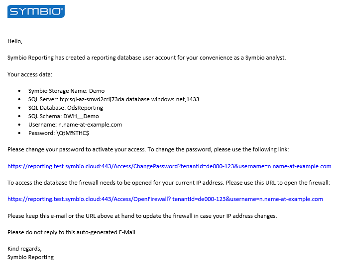
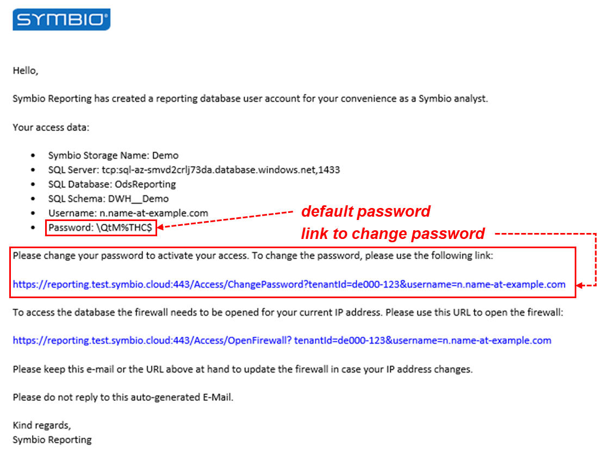
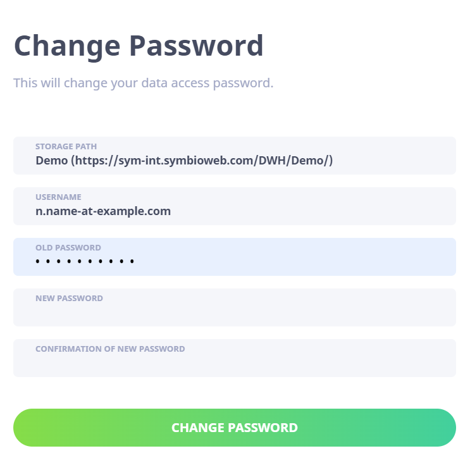
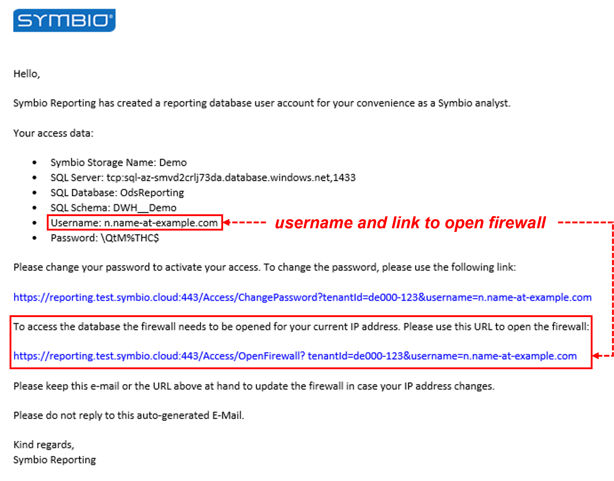
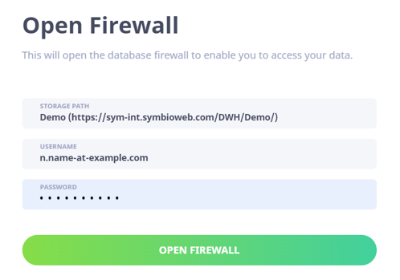

## Activate Account
### E-Mail Content

As soon as your account has been created you will receive an email from Symbio.  This email looks similar to the following example and contains your access data, which you need in order to activate your account. Beside the username and a default password also the names of the SQL Server, Database and Schema are part of this data. You will need this information in to create an report. In the mail you find futhermore the urls to change the password of your account and to open the firewall. 

### Change Password
At first you have to change the default password. In the email you find the required information as the default password, your username and the url.

In order to set a new password open the url form the email, which leads you to a window as you can see in the next picture. Here put in the current password as well as a new password and repeat this new password in order to confirm. Approve the change and use henceforth the new password.

###Open firewall
To access the database you have to open the firewall for your IP address. To do so you need beside the storage path your username and password as well as another url, which you can find also in the mail.

Access the given url and put the required information into the mask as shown below. Confirm that and you are ready to use your account.

If your IP address changes you have to repeate this step for each new IP address.

### Important
If you encounter problems by connecting to the datawarehouse in the cloud, the cause can be that your company IT administrators should first allow connecting to the sql server on TCP 1433 port. To check this ask your admins for further info.
