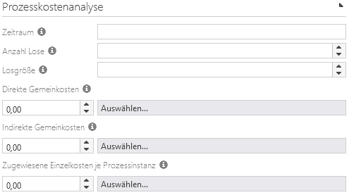
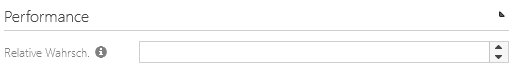
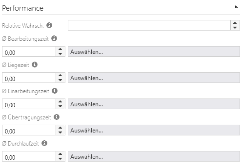
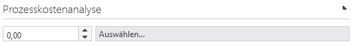
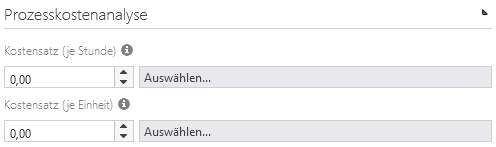

# Bereitstellung von Eingabedaten

## Inhaltsverzeichnis
* [1.0 - Eingabedaten auf Prozess-Ebene](#inputdata-on-diagram)
  * [1.1 - Erläuterung der Eingabedaten auf Prozess-Ebene](#inputdata-on-diagram-terms)
* [2.0 - Eingabedaten auf Ebene der Struktur-definierenden Elemente eines Prozesses](#inputdata-on-structures)
  * [2.1 - Eingabedaten für Ereignisse, Gateways und Conditions](#inputdata-on-structures-events)
  * [2.2 - Eingabedaten für Tasks](#inputdata-on-structures-tasks)
  * [2.3 - Eingabedaten für Prozess-Schnittstellen und Szenarios](#inputdata-on-structures-interfaces)
* [3.0 - Eingabedaten auf Ebene der Glossar-Elemente eines Prozesses](#inputdata-on-glossaries)
  * [3.1 - Eingabedaten für Rollen](#inputdata-on-glossaries-roles)
  * [3.2 - Eingabedaten für Applikationen](#inputdata-on-glossaries-apps)

## <a name="inputdata-on-diagram">1.0 - Eingabedaten auf Prozess-Ebene</a>

### <a name="inputdata-on-diagram-terms">1.1 -Erläuterung der Eingabedaten auf Prozess-Ebene</a>

* **Zeitraum** - Der Betrachtungszeitraum zur Analyse von Prozesskosten. Die Angaben zur Losgröße und die Anzahl der Lose beziehen sich auf den Betrachtungszeitraum.
* **Anzahl Lose** - Die Anzahl Lose multipliziert mit der Losgröße ergibt die Anzahl Prozessinstanzen. Ein Los wird ohne Unterbrechung abgearbeitet. Einarbeitungsaufwand, Transportaufwand und Wartezeiten entstehen nur einmalig für jedes Los.
* **Losgröße** - Ein Los wird ununterbrochen abgearbeitet. Die Anzahl Lose multipliziert mit der Losgröße ergibt die Anzahl Prozessinstanzen.
* **Direkte Gemeinkosten** - Direkte Gemeinkosten (unechte Gemeinkosten) sind die Kosten, die durch die allgemeine Verfügbarkeit des Prozesses entstehen. Sie sind unabhängig von der tatsächlichen Prozessausführung, aber eindeutig dem Prozess zuzuordnen (z. B. Modellbau/Prototyp oder Zulassung, unter Umständen auch Energie oder Miete für nur von diesem Prozess genutzte Ressourcen). Sie sind Fixkosten und werden jeder Berechnung einmalig zugeschlagen.
* **Indirekte Gemeinkosten** - Indirekte Gemeinkosten (echte Gemeinkosten) sind die Kosten, die für die ununterbrochene Aufrechterhaltung des Geschäftsbetriebs notwendig sind, dem Prozess aber nicht direkt zugeordnet werden können (z. B. Versicherung oder Steuern). Sie sind Fixkosten und werden jeder Berechnung einmalig zugeschlagen.
* **Zugewiesene Einzelkosten je Prozessinstanz** - Zugewiesene Einzelkosten sind die Kosten, die einem Prozess auf Basis einer Kostenträgerstückrechnung (z. B. Divisionskalkulation) zugewiesen werden. Sie sind nicht wie die Einzelkosten eines Prozesses aus prozessspezifischen Ressourcenverbräuchen und -nutzungen berechnet, entstehen aber ebenso erst bei der Ausführung des Prozesses. Sie sind variable Kosten und werden jeder Prozessinstanz zugeschlagen.

## <a name="inputdata-on-structures">2.0 - Eingabedaten auf Ebene der Struktur-definierenden Elemente eines Prozesses</a>

### <a name="inputdata-on-structures-events">2.1 - Eingabedaten für Ereignisse, Gateways und Conditions</a>

* **Relative Wahrscheinlichkeit** - Die relative Wahrscheinlichkeit (lokal) zur Analyse von Prozesskosten. Bitte geben Sie die Eintrittswahrscheinlichkeit als Fließkommazahl an. 1,0 entspricht 100%. Die Eintrittswahrscheinlichkeit muss nur für Startobjekte und Objekte direkt nach teilenden Regeln angegeben werden.

### <a name="inputdata-on-structures-tasks">2.2 - Eingabedaten für Tasks</a>

* **Relative Wahrscheinlichkeit** - Die relative Wahrscheinlichkeit (lokal) zur Analyse von Prozesskosten. Bitte geben Sie die Eintrittswahrscheinlichkeit als Fließkommazahl an. 1,0 entspricht 100%. Die Eintrittswahrscheinlichkeit muss nur für Startobjekte und Objekte direkt nach teilenden Regeln angegeben werden.
* **Ø Bearbeitungszeit** - Die Bearbeitungszeit zur Analyse von Prozessleistung. Die Bearbeitungszeit ist die Zeit, während der Ressourcen für die Bearbeitung eines Vorgangs/Werkstücks im Los gebunden werden.
* **Ø Liegezeit** - Die Liegezeit zur Analyse von Prozessleistung. Die Liegezeit ist die Zeit, während der ein Los auf eine Zuteilung von Ressourcen wartet.
* **Ø Einarbeitungszeit** - Die Einarbeitungszeit zur Analyse von Prozessleistung. Die Einarbeitungszeit (oder auch Rüstzeit) ist die Zeit, während der die Voraussetzungen zur Bearbeitung eines Loses geschaffen werden.
* **Ø Übertragungszeit** - Die Übertragungszeit zur Analyse von Prozessleistung. Die Übertragungszeit ist die Zeit, während der ein Los an die nächste Arbeitsstation weitergegeben wird.
* **Ø Durchlaufzeit** - Die Durchlaufzeit zur Analyse von Prozessleistung. Die Durchlaufzeit ist eine Kombination aus Bearbeitungszeit, Liegezeit, Einarbeitungszeit und Übertragungszeit, bezogen auf einen einzelnen Vorgang/Werkstück.

### <a name="inputdata-on-structures-interfaces">2.3 - Eingabedaten für Prozess-Schnittstellen und Szenarios</a>

Erläuterungen siehe [1.1 - Erläuterung der Eingabedaten auf Prozess-Ebene](#inputdata-on-diagram-terms).

## <a name="inputdata-on-glossaries">3.0 - Eingabedaten auf Ebene der Glossar-Elemente eines Prozesses</a>

### <a name="inputdata-on-glossaries-roles">3.1 - Eingabedaten für Rollen</a>

* **Kostensatz (je Stunde)** - Der Kostensatz je Stunde Tätigkeitszeit.

### <a name="inputdata-on-glossaries-apps">3.2 - Eingabedaten für Applikationen</a>

* **Kostensatz (je Stunde)** - Der Kostensatz je Stunde Tätigkeitszeit.
* **Kostensatz (je Einheit)** - Der Kostensatz je Einheit.
